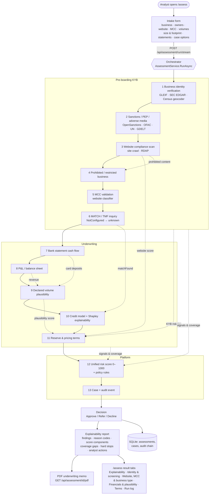

# Full Assessment – Functional Specification

This document describes, end to end, what the **Full assessment** tool (`/assess` in the web UI,
`/api/assessment` in the API) does: what information it collects, the thirteen checks it runs, how
each check turns into findings and score signals, how the final decision is derived, and how the
result is explained, exported and audited.

Each section links to the UI area where the behaviour is visible and to the code that implements
it, so the document can be used as a reference by analysts, product owners and developers.

- [1. Purpose and scope](#1-purpose-and-scope)
- [2. High-level flow](#2-high-level-flow)
- [3. Actors, entry points and outputs](#3-actors-entry-points-and-outputs)
- [4. Intake – what is collected and why](#4-intake--what-is-collected-and-why)
- [5. Execution model](#5-execution-model)
- [6. The thirteen steps](#6-the-thirteen-steps)
  - [6.1 Business identity verification](#61-business-identity-verification)
  - [6.2 Sanctions / PEP / adverse-media screening](#62-sanctions--pep--adverse-media-screening)
  - [6.3 Website compliance scan](#63-website-compliance-scan)
  - [6.4 Prohibited & restricted business check](#64-prohibited--restricted-business-check)
  - [6.5 MCC validation](#65-mcc-validation)
  - [6.6 MATCH / terminated-merchant inquiry](#66-match--terminated-merchant-inquiry)
  - [6.7 Bank statement cash-flow analysis](#67-bank-statement-cash-flow-analysis)
  - [6.8 P&L / balance sheet analysis](#68-pl--balance-sheet-analysis)
  - [6.9 Declared volume plausibility](#69-declared-volume-plausibility)
  - [6.10 Credit decision & explainability](#610-credit-decision--explainability)
  - [6.11 Reserve & pricing recommendation](#611-reserve--pricing-recommendation)
  - [6.12 Unified risk score & policy rules](#612-unified-risk-score--policy-rules)
  - [6.13 Case creation & audit](#613-case-creation--audit)
- [7. Decision derivation](#7-decision-derivation)
- [8. Coverage, unknowns and hard stops](#8-coverage-unknowns-and-hard-stops)
- [9. Explainability report](#9-explainability-report)
- [10. PDF underwriting memo](#10-pdf-underwriting-memo)
- [11. Persistence, history and audit](#11-persistence-history-and-audit)
- [12. Streaming protocol and failure handling](#12-streaming-protocol-and-failure-handling)
- [13. Presets and worked examples](#13-presets-and-worked-examples)
- [14. Data sources and limitations](#14-data-sources-and-limitations)
- [Appendix A – Field-to-check matrix](#appendix-a--field-to-check-matrix)
- [Appendix B – Glossary](#appendix-b--glossary)

---

## 1. Purpose and scope

Merchant onboarding normally means an analyst runs a dozen separate checks (registry lookup,
sanctions screening, website review, MCC review, statement analysis, credit model, pricing …) and
then reconciles them by hand. The Full assessment collects every input **once**, runs all checks
**in a fixed order**, feeds each result forward into the checks that depend on it, and produces:

1. a single decision – **Approve / Refer / Decline** – with score, tier and the policy rule that decided it;
2. a complete, human-readable explanation of *why*, down to individual reason codes, score weights and model feature contributions;
3. an explicit list of what could **not** be verified (coverage gaps) and what an analyst should do next;
4. a downloadable PDF underwriting memo;
5. a persisted, auditable record and (optionally) a case in the review queue.

Out of scope: post-boarding monitoring (transaction anomalies, chargeback ratios, website drift).
The tool is a **pre-boarding** decisioning workflow.

## 2. High-level flow



Solid arrows are the execution order; dotted arrows show results that feed forward into later
steps. Every step is isolated: a failure is recorded on that step and the run continues.

## 3. Actors, entry points and outputs

| Actor / channel | Entry point | Output |
|---|---|---|
| Analyst (browser) | `/assess` – intake form, live progress, result tabs, history, PDF button | Decision card, six report tabs, PDF download |
| Analyst (browser) | `/assess/{id}` – reopen a stored assessment | Same view for a historical run |
| Integrator | `POST /api/assessment/run` (JSON or multipart) | `AssessmentResult` JSON |
| Integrator | `POST /api/assessment/run/stream` | NDJSON event stream (see §12) |
| Integrator | `GET /api/assessment`, `GET /api/assessment/{id}`, `GET /api/assessment/{id}/pdf` | History, stored result, PDF |
| Downstream systems | Case queue (`/cases`), audit trail (`/audit`), webhooks (`case.*`) | Case with the decision payload, hash-chained audit events |

Code: `src/MerchantIntelligence.Api/Controllers/AssessmentController.cs`,
`web/mcc-validator/src/app/features/assessment/`.

## 4. Intake – what is collected and why

The intake form is grouped into six sections. Every field has an **ⓘ hover hint** on `/assess`
stating exactly where the value is used; the same information is consolidated in
[Appendix A](#appendix-a--field-to-check-matrix). Full hint text lives in
`web/mcc-validator/src/app/features/assessment/field-hints.ts`.

### 4.1 Business identity
Legal name (required), trading name / DBA, registration number / LEI, tax ID, address, city,
region, postal code, country (ISO-2), website URL, business description.
Used by: identity verification (§6.1), screening (§6.2), website scan (§6.3), prohibited-business
check (§6.4), MCC validation (§6.5), MATCH (§6.6).

### 4.2 Beneficial owners & principals
Repeatable rows: full name, date of birth, nationality, role, ownership %.
Used by: screening (§6.2) – each owner is screened as an individual; DOB and nationality
corroborate or discount list matches. Passed to MATCH as principals. Role and % are documentation
only.

### 4.3 Processing profile
Declared MCC, annual card volume, average ticket, highest ticket (all required), delivery days,
card-not-present share, subscriptions flag, free-trials flag, existing-relationship flag.
Used by: credit model (§6.10 – MCC, volume, tickets, existing relationship are direct model
features), plausibility (§6.9), pricing (§6.11), MCC validation (§6.5), default policy rules
(§6.12 – volume > 5 M and highest ticket > 10 k force Refer).

### 4.4 Size & footprint
Employees, years in business, prior-year revenue, website product count, physical location.
Used only by volume plausibility (§6.9). All optional; a blank field simply skips that metric.

### 4.5 Financial documents (optional)
Bank statement (upload CSV/PDF or paste CSV) and P&L / balance sheet (upload CSV/TXT/PDF or paste
`label,amount` lines). Used by §6.7, §6.8 and, through them, §6.9. When absent the corresponding
steps are **Skipped** and listed as coverage gaps.

### 4.6 Case
Analyst (actor, required), external reference, "open a case" toggle. Used by §6.13 and the audit trail.

### 4.7 Validation
Client-side: required fields, MCC 1–9999, volume ≥ 0, average ticket > 0, CNP share 0–1.
Server-side (`AssessmentController`): website must be an absolute http(s) URL, highest ticket ≥
average ticket, uploads ≤ configured size, the credit model must be loaded. Invalid input returns
`400` before any step runs.

## 5. Execution model

`AssessmentService.RunAsync` (`src/MerchantIntelligence.Platform/Assessment/AssessmentService.cs`):

1. Generates an assessment id (`ASMT-…`) and records `startedAt`.
2. Emits the ordered **step catalogue** (13 steps, all `Pending`).
3. For each step in order: mark `Running` → invoke the underlying service → mark `Succeeded`
   (with a one-line summary and duration) or `Failed` (with the error message). Steps whose input
   is absent are marked `Skipped` with the reason (e.g. "No website supplied").
4. Results of earlier steps are handed to later ones (dotted arrows in §2).
5. After step 12 the decision and explainability are built; step 13 opens the case; the result is
   persisted and an `assessment.completed` audit event is written.

A step failure never aborts the run and never counts as "clear" – see §8.

UI: the **progress card** on `/assess` shows each step with Pending / Running / Succeeded /
Failed / Skipped status, its summary and duration; the same list appears in the **Run log & raw**
tab and in the PDF "Check execution log".

## 6. The thirteen steps

Each subsection states: inputs → processing → outputs → how it feeds the decision → where to see it.

### 6.1 Business identity verification
*Step id `verification` · service `BusinessVerificationService` (`MerchantIntelligence.Kyb/Registry`)*

- **Inputs:** legal name, trading name, registration number, address fields, country.
- **Processing:** queries public registries (GLEIF LEI, SEC EDGAR; OpenCorporates / Companies House
  if keys are configured). The best record is chosen by fuzzy name similarity (trading name counts
  at 95 %), registration-number match, address similarity and jurisdiction agreement. The address
  is geocoded (US Census) and checked for virtual-office / mail-drop patterns.
- **Outputs:** status `Verified` / `PartialMatch` / `NotFound` / `Inconclusive`, confidence %,
  entity age, matched record, flags such as `NAME_MISMATCH`, `REGISTERED_ADDRESS_MISMATCH`,
  `REGISTRATION_NUMBER_MISMATCH`, `JURISDICTION_MISMATCH`, `NEW_ENTITY`, `INACTIVE_ENTITY`,
  `VIRTUAL_OFFICE_ADDRESS`, `ENTITY_NOT_FOUND`.
- **Feeds:** the KYB risk tier (max severity of its flags) → **KYB component, weight 20 %** of the
  unified score; `businessVerified` and entity age → `NEW_ENTITY` reason code and the
  `NEW_ENTITY_HIGH_VOLUME` rule.
- **Unavailable handling:** if *every* registry call fails the check is reported as *Unavailable*,
  excluded from the score and listed as a coverage gap (not treated as unverified).
- **See:** `/assess` → **Identity & screening** tab → "Business verification"; PDF "Check outcomes"
  row *Business identity*.

### 6.2 Sanctions / PEP / adverse-media screening
*Step id `screening` · `SanctionsScreeningService` (`MerchantIntelligence.Kyb/Sanctions`)*

- **Inputs:** legal name and trading name (as organisations), each owner (as an individual with
  DOB / nationality), country.
- **Processing:** fuzzy name match against the OpenSanctions consolidated list, OFAC SDN and UN
  Security Council list (PEP dataset optional). Match score adjustments: birth-year agreement
  +8 % / disagreement −15 %; country agreement +5 % / disagreement −5 %; person-vs-organisation type
  mismatch −10 %. Adverse media is searched via GDELT for each subject.
- **Outputs:** per-subject hits with score and reasons, list status (rows loaded / errors),
  adverse-media article counts, flags `SANCTIONS_MATCH`, `PEP_MATCH`, `ADVERSE_MEDIA`, overall risk tier.
- **Feeds:** **Screening component, weight 15 %**. `SANCTIONS_MATCH` is a **hard stop** (score
  capped at 150, rule `HARD_STOP_SANCTIONS` → Decline). `PEP_MATCH` → rule `PEP_EDD` → Refer.
- **Unavailable handling:** if no list could be loaded the check is *Unavailable* (coverage gap).
  If lists loaded but the adverse-media lookup failed (e.g. GDELT rate limit) the row reads
  *"Lists clear · media unavailable"*, the media signal is fed as unknown, severity is at least
  Medium and an analyst action is added – it is never shown as "Clear".
- **See:** **Identity & screening** tab → "Sanctions / PEP / adverse media" (hits, lists, articles).

### 6.3 Website compliance scan
*Step id `website` · `WebsiteComplianceScanner` (`MerchantIntelligence.Kyb/Compliance`)*

- **Inputs:** website URL, business description, MCC, legal name. Skipped if no URL.
- **Processing:** crawls the home page and linked policy pages; checks TLS, privacy / terms /
  refund / delivery policies, contact details, currency, payment marks, checkout presence,
  legal-name disclosure, placeholder content, domain age and expiry (RDAP), and prohibited content.
- **Outputs:** score 0–100, grade A–F, per-check Pass / Fail / Warn with severity, pages analysed,
  domain registration data, embedded prohibited-business result.
- **Feeds:** **WebsiteCompliance component, weight 10 %**; score < 60 → reason
  `WEBSITE_NON_COMPLIANT` and up to +0.15 pricing risk; failed checks raise the KYB risk tier.
- **See:** **Website, MCC & business type** tab → "Website compliance".

### 6.4 Prohibited & restricted business check
*Step id `prohibited` · `ProhibitedBusinessDetector` (`MerchantIntelligence.Kyb/Prohibited`)*

- **Inputs:** business description, MCC, plus the website scan's content findings (combined).
- **Processing:** keyword / category classification against 23 categories in
  `restricted-categories.json` (CBD, crypto, adult, firearms, nutraceuticals & free-trial offers,
  MLM, gambling, telemarketing / negative option …).
- **Outputs:** verdict `Acceptable` / `HighRisk` / `Restricted` / `Prohibited`, matched categories
  with evidence.
- **Feeds:** **BusinessPolicy component, weight 10 %** (Acceptable 100, HighRisk 60 + `HIGH_RISK_BUSINESS`,
  Restricted 35 + High-severity `RESTRICTED_BUSINESS`, Prohibited 0 + **hard stop** `PROHIBITED_BUSINESS`).
- **See:** **Website, MCC & business type** tab → "Prohibited / restricted business".

### 6.5 MCC validation
*Step id `mcc` · `MccValidationService` (`MerchantIntelligence.MccValidation`)*

- **Inputs:** declared MCC, website URL. Skipped if no URL.
- **Processing:** classifies the website text with the EDGAR-trained MCC classifier and compares
  with the declared code.
- **Outputs:** verdict `Consistent` / `Plausible` / `Inconsistent`, accuracy %, suggested MCCs with
  evidence.
- **Feeds:** an `Inconsistent` verdict is a High-severity finding → `HIGH_SEVERITY_REFER`; the
  verdict is also exposed to rules as the `mccVerdict` fact.
- **See:** **Website, MCC & business type** tab → "MCC validation".

### 6.6 MATCH / terminated-merchant inquiry
*Step id `match` · `IMatchProvider` (`MerchantIntelligence.Platform/Integrations`)*

- **Inputs:** legal / trading name, tax ID, address, country, principals.
- **Processing:** Mastercard MATCH requires acquirer credentials. Without `Match:Endpoint` or a
  `Match:LocalListPath` CSV the provider returns `availability: NotConfigured`, `found: null`.
- **Feeds:** when available, `matchFound = true` is a **hard stop** (`HARD_STOP_MATCH`) and a
  credit-model feature; when `NotConfigured` it is fed as *unknown* → coverage gap, never clear.
- **See:** **Identity & screening** tab → "MATCH / terminated merchant".

### 6.7 Bank statement cash-flow analysis
*Step id `bank` · `BankStatementParser` / `CashFlowAnalyzer` (`MerchantIntelligence.Underwriting/Statements`)*

- **Inputs:** uploaded CSV/PDF or pasted CSV (`date,description,amount[,balance]`). Skipped if absent.
- **Outputs:** months covered, average monthly inflows / outflows, card-processor settlements and
  implied annual card volume, NSF / overdrafts, returned items, negative-balance days, volatility,
  seasonality, flags.
- **Feeds:** average monthly card deposits → plausibility (§6.9); `nsfCount` is a rules fact;
  findings appear in the narrative.
- **See:** **Financials & plausibility** tab → "Bank statement cash flow".

### 6.8 P&L / balance sheet analysis
*Step id `financials` · `ProfitAndLossAnalyzer`*

- **Inputs:** uploaded CSV/TXT/PDF or pasted `label,amount` lines, declared annual volume. Skipped if absent.
- **Outputs:** revenue, gross & net margin, interest coverage, current ratio, leverage; flags
  `LOSS_MAKING`, `WEAK_DEBT_COVERAGE`, `ILLIQUID`, `NEGATIVE_EQUITY`, `CARD_VOLUME_EXCEEDS_REVENUE`.
- **Feeds:** statement revenue fills *Prior-year revenue* for plausibility when the field is blank.
- **See:** **Financials & plausibility** tab → "P&L / balance sheet".

### 6.9 Declared volume plausibility
*Step id `plausibility` · `VolumePlausibilityAnalyzer` (`MerchantIntelligence.Underwriting/Plausibility`)*

- **Inputs:** annual volume, average & highest ticket, MCC (selects the industry benchmark),
  employees, years in business, prior-year revenue (or P&L revenue), bank-statement card deposits,
  website product count, physical location.
- **Processing:** starts at 100 and subtracts penalties:

  | Flag | Condition | Penalty |
  |---|---|---|
  | `IMPLAUSIBLY_FEW_TRANSACTIONS` | volume ÷ ticket < 24 / year | 15 |
  | `TICKET_ABOVE_INDUSTRY` / `TICKET_FAR_ABOVE_INDUSTRY` | ticket > p90 / > 3 × p90 | 10 / 25 |
  | `EXTREME_TICKET_SPREAD` | highest > 50 × average | 10 |
  | `VOLUME_HIGH_FOR_HEADCOUNT` / `VOLUME_EXCEEDS_HEADCOUNT_CAPACITY` | volume per employee > p90 / > 2 × p90 | 12 / 30 |
  | `YOUNG_BUSINESS_LARGE_VOLUME` / `STARTUP_WITH_LARGE_VOLUME` | < 2 years / < 1 year with large volume | 12 / 25 |
  | `AGGRESSIVE_GROWTH_ASSUMPTION` / `VOLUME_EXCEEDS_REVENUE` | volume > 1.5 × / > prior revenue | 12 / 30 |
  | `DECLARED_ABOVE_STATEMENTS` / `DECLARED_FAR_ABOVE_STATEMENTS` / `DECLARED_BELOW_STATEMENTS` | declared vs annualised card deposits | 12 / 30 / 10 |
  | `THIN_CATALOGUE_LARGE_VOLUME` | online-only, few products, large volume | 20 |
  | `ROUND_NUMBER_DECLARATION` | exact multiple of 1,000,000 | 3 |

- **Outputs:** plausibility score 0–100, verdict, metrics table (value vs benchmark), flags.
- **Feeds:** **VolumePlausibility component, weight 10 %**; < 50 → reason `VOLUME_IMPLAUSIBLE`;
  < 60 → pricing risk `VOLUME_IMPLAUSIBLE` (up to +0.15).
- **See:** **Financials & plausibility** tab → "Volume plausibility".

### 6.10 Credit decision & explainability
*Step id `credit` · `DecisionPredictor` + `DecisionExplainer` (`MerchantIntelligence.CreditDecision`, `MerchantIntelligence.Underwriting/Explainability`)*

- **Inputs (model features):** MCC, annual volume, average ticket, highest ticket, `matchFound`
  (from §6.6, false when unknown), existing relationship.
- **Processing:** LightGBM champion model (shadow challenger scored in parallel and logged for
  model ops) → P(approve) and predicted class. The explainer computes exact Shapley contributions
  of each feature against a typical-merchant baseline and derives adverse-action reason codes
  (`HIGH_RISK_MCC`, `MATCH_LISTED`, `TICKET_SPREAD`, …).
- **Outputs:** decision, probability, per-feature contribution table (value, baseline, contribution,
  direction), narrative, decision-log id.
- **Feeds:** **CreditModel component, weight 30 %** (score = P(approve) × 100).
- **See:** **Explainability** tab → "Credit model contributions"; PDF "Credit model explainability".

### 6.11 Reserve & pricing recommendation
*Step id `terms` · `ReservePricingRecommender` (`MerchantIntelligence.Underwriting/Pricing`)*

- **Inputs:** application (volume, tickets, MCC, existing relationship), delivery days, CNP share,
  subscriptions / free trials, KYB high-risk flag (from §6.1–6.3), website score (§6.3),
  plausibility score (§6.9).
- **Processing:** risk = credit-model base (P(decline) + 0.5 × P(cancel)) + MCC tier (+0.05 Medium / +0.15 High) + future delivery (≥ 30 days, up to
  +0.20) + CNP (0.05 × share when > 50 %) + recurring billing (+0.05 subscriptions / +0.10 free
  trials) + KYB high risk (+0.20) + website < 60 (up to +0.15) + plausibility < 60 (up to +0.15)
  − existing relationship (0.10); clamped 0–1 → band A (< 0.15) / B (< 0.30) / C (< 0.50) /
  D (< 0.70) / E. Exposure = daily volume × delivery days + expected chargebacks + highest ticket.
- **Outputs:** risk band, reserve (type, %, days, cap), interchange-plus markup, per-transaction
  and monthly fees, settlement delay, monthly / single-transaction caps, list of pricing factors.
- **Feeds:** **Pricing component, weight 5 %** (A 95, B 80, C 60, D 35, E 15).
- **See:** **Terms** tab.

### 6.12 Unified risk score & policy rules
*Step id `score` · `UnifiedRiskScorer` + `RulesEngine` (`MerchantIntelligence.Platform/Scoring`, `/Rules`)*

**Score.** Seven components, each 0–100, weighted and renormalised over the components that were
actually covered:

| Component | Weight | Source |
|---|---|---|
| CreditModel | 30 % | §6.10 |
| Kyb | 20 % | §6.1 + §6.2 + §6.3 risk tier and `businessVerified` |
| Screening | 15 % | §6.2 |
| BusinessPolicy | 10 % | §6.4 |
| WebsiteCompliance | 10 % | §6.3 |
| VolumePlausibility | 10 % | §6.9 |
| Pricing | 5 % | §6.11 |

Uncovered components pull the score toward 50 (uncertainty), the result is scaled to **0–1000**,
then capped at **150 if any hard stop** exists or **549 if any High-severity reason code** exists.
Tier: ≥ 800 VeryLow, ≥ 650 Low, ≥ 450 Medium, ≥ 250 High, else VeryHigh. Score-signal coverage %
= covered weight ÷ total weight.

**Rules.** The active rule set (versioned, editable on `/rules`) is evaluated on facts built from
the score (`score`, `tier`, `coveragePercent`, `hardStops`, `reasonCodes`, `highSeverityReasons`,
`matchFound`, …) and raw intake (`annualVolume`, `highestTicket`, `country`, `mccVerdict`,
`nsfCount`, `ownersDeclared`). Default set (most severe outcome wins):

| Rule | Outcome | Condition |
|---|---|---|
| `HARD_STOP_SANCTIONS` / `HARD_STOP_PROHIBITED` / `HARD_STOP_MATCH` | Decline | hard stop present / `matchFound = true` |
| `LOW_SCORE_DECLINE` | Decline | score < 250 |
| `HIGH_SEVERITY_REFER` | Refer | any High-severity reason code |
| `LARGE_VOLUME_REFER` / `HIGH_TICKET_REFER` | Refer | volume > 5,000,000 / highest ticket > 10,000 |
| `LOW_COVERAGE_REFER` | Refer | coverage < 60 % |
| `PEP_EDD` | Refer | `PEP_MATCH` |
| `NEW_ENTITY_HIGH_VOLUME` | Refer | `NEW_ENTITY` and volume > 1,000,000 |
| `AUTO_APPROVE` | Approve | score ≥ 650, coverage ≥ 60 %, no High-severity reasons |
| *(default)* | Refer | nothing matched |

- **See:** **Explainability** tab → "Score composition", "Reason codes", "Policy rules"; PDF
  "Unified risk score", "Reason codes", "Policy rules".

### 6.13 Case creation & audit
*Step id `case` · `CaseService`, `AuditTrail`*

- Skipped when "Open a case" is off. Otherwise a case is created for the legal name with the
  actor, external reference (or assessment id), score, tier, rules outcome and a payload containing
  the decision, coverage gaps, hard stops and decision-log id. Case priority derives from the tier.
- An `assessment.completed` audit event (actor, assessment id, outcome, score, coverage) is
  appended to the SHA-256 hash-chained audit log regardless of the case toggle.
- **See:** result card "Case" pill → `/cases/{id}`; `/audit`.

## 7. Decision derivation

`BuildDecision` (AssessmentService):

```
if score or rules step failed      → Refer, score 0, tier Unknown, "refer to a senior analyst"
outcome = rules.Outcome            (Approve | Refer | Decline)
summary = "<Outcome>. Score S/1000 (Tier) … rule <DecidingRule> applies/fired/requires an analyst"
if any step Failed                 → append "N check(s) could not be completed and are counted as coverage gaps."
```

The decision therefore always carries: outcome, score, tier, score-signal coverage %, rule-set
version and the deciding rule id. The **result card** on `/assess` shows the outcome pill,
score / tier, "Score signals X %" and "Checks n/m covered" pills, the deciding rule and the PDF button.

## 8. Coverage, unknowns and hard stops

Two coverage measures are reported side by side and are deliberately different:

- **Checks n/m covered** – how many of the check outcomes (identity, screening, website,
  prohibited, MCC, MATCH, bank, P&L, plausibility, credit, terms) produced a usable answer.
- **Score-signal coverage %** – weight of unified-score components that received a signal.

Principles enforced throughout:

1. *Not run ≠ clear.* A skipped or failed check, an unreachable registry, an unloaded sanctions
   list, a rate-limited adverse-media lookup or an unconfigured MATCH provider is fed to the
   scorer as **null**, lowers coverage and appears under **Coverage gaps**.
2. *Hard stops override everything.* `SANCTIONS_MATCH`, `PROHIBITED_BUSINESS` and
   `MATCH_LISTED` cap the score at 150 and the default rules decline.
3. *High severity blocks auto-approve.* Any High reason code caps the score at 549 and triggers `HIGH_SEVERITY_REFER`.
4. *Low coverage blocks auto-approve.* < 60 % score-signal coverage → `LOW_COVERAGE_REFER`.

## 9. Explainability report

`BuildExplainability` produces one `AssessmentExplainability` object rendered in the
**Explainability** tab and the PDF:

| Element | Content | UI location |
|---|---|---|
| Headline | "OUTCOME — Legal name: score S/1000 (Tier), n of m checks covered (X % score-signal coverage), h high / k medium finding(s)" | Result card |
| Check outcomes | One row per check: result, detail, severity, covered? | Explainability → *Check outcomes* |
| Score components | Name, weight, score, weighted, detail, covered | *Score composition* |
| Reason codes | Code, description, severity, source component | *Reason codes* |
| Matched rules / deciding rule | Every rule that fired, and which one decided | *Policy rules* |
| Credit contributions | Shapley table per model feature | *Credit model contributions* |
| Narrative | Paragraphs walking through identity → screening → website → business type → MCC → MATCH → statements → plausibility → model → terms → score → rules | *Detailed narrative* |
| Findings | Every flag from every check, sorted by severity | *All findings* |
| Coverage gaps | Uncovered checks plus uncovered score components, in plain language | Result card / *Coverage gaps* |
| Hard stops | Codes that forced Decline | Result card |
| Analyst next steps | Concrete actions (re-run screening, request registration documents, disposition possible matches, remediate website disclosures, collect licences, request statements …) | *Recommended analyst actions* |

The remaining tabs show the raw per-check results: **Identity & screening** (§6.1, §6.2, §6.6),
**Website, MCC & business type** (§6.3–6.5), **Financials & plausibility** (§6.7–6.9),
**Terms** (§6.11) and **Run log & raw** (step log + full JSON).

## 10. PDF underwriting memo

`GET /api/assessment/{id}/pdf` (`AssessmentPdfRenderer`, QuestPDF) renders, in order:

1. Header with decision banner (colour-coded Approve / Refer / Decline) and headline.
2. **Assessment** block – reference, completed at, analyst, case, rule-set version, coverage
   ("n of m checks covered · X % score-signal coverage").
3. **Merchant intake** – legal name, registration / tax ID, address, website, description, MCC,
   declared volume and tickets, delivery / CNP, owners, documents supplied.
4. **Check outcomes** table.
5. **Unified risk score** – gauge values and component table; **Reason codes**.
6. **Credit model explainability** – Shapley contributions.
7. **Policy rules** – matched rules and deciding rule.
8. **Detailed narrative**, **All findings**, **Recommended terms**, **Recommended analyst actions**.
9. **Check execution log** – each step with status, duration and summary.
10. Source limitations footer (public-source coverage, MATCH not configured, OpenSanctions licence).

The **Download PDF** button on the result card opens this endpoint.

## 11. Persistence, history and audit

- Each `AssessmentResult` is stored as JSON in the SQLite `assessments` table
  (`Platform:DatabasePath`), keyed by id with legal name, outcome, score, tier, coverage and
  timestamps for listing.
- `/assess` shows **Recent assessments** (legal name, outcome, score, score-signal %, time);
  clicking a row navigates to `/assess/{id}`, which reloads the stored result into the same view.
- Every prediction is also logged by model ops (`decisionLogId`), so realised outcomes can later
  be recorded for drift / retraining.
- Audit: `assessment.completed`, plus `case.created` when a case is opened; verifiable on `/audit`.

## 12. Streaming protocol and failure handling

`POST /api/assessment/run/stream` returns `application/x-ndjson`:

```
{"type":"steps","steps":[{"id":"verification","name":"Business identity verification"}, …]}
{"type":"step","step":{"id":"verification","status":"Running", …}}
{"type":"step","step":{"id":"verification","status":"Succeeded","summary":"…","durationMs":1420}}
{"type":"heartbeat","at":"2026-…"}          // every 15 s while a slow step runs
…
{"type":"result","result":{ …AssessmentResult… }}
// or, if the orchestrator itself throws:
{"type":"error","error":"…"}
```

Client behaviour (`SuiteApiService.runAssessment`): the UI updates the progress card on each
`step` event; if **no bytes arrive for 120 s** the request is aborted and an error is shown; if
the stream closes without a `result` / `error` event ("API stopped responding") an error is shown.
In both cases the run state is cleared so the analyst can re-run – a dead API never leaves an
endless spinner.

## 13. Presets and worked examples

The preset buttons on `/assess` populate the form with reproducible scenarios:

| Preset | Inputs | Expected path |
|---|---|---|
| **Auto-approve (Starbucks)** | Starbucks Corporation, MCC 5814, $900 k volume, $40 ticket, 15 yrs, physical stores, existing relationship, CNP 30 % | Verified entity, clear screening, compliant website, consistent MCC, plausible volume → score ≥ 650, no High findings → `AUTO_APPROVE` → **Approve** |
| **Refer (Apple – MCC mismatch)** | Apple Inc., MCC 5732, $1.2 M, $85 / $1,500 | Website classifier disagrees with MCC → High finding → `HIGH_SEVERITY_REFER` → **Refer** |
| **Sanctions hit (Rosneft / Bout)** | Rosneft Oil Company (RU), owner Viktor Bout DOB 1967-01-13 | `SANCTIONS_MATCH` hard stop → score ≤ 150 → `HARD_STOP_SANCTIONS` → **Decline** |
| **Restricted (CBD + free trials)** | CBD / kratom description, free-trial subscription model, online only | `RESTRICTED_BUSINESS`, recurring-billing pricing factors, thin catalogue → **Refer** with licensing actions |

Because public sources change, scores vary slightly between runs; the outcome path is stable.

## 14. Data sources and limitations

| Source | Used by | Notes |
|---|---|---|
| GLEIF LEI, SEC EDGAR | §6.1 | Free; good for listed / LEI-holding companies, thin for small private firms |
| US Census geocoder | §6.1 | US addresses only |
| OpenCorporates, Companies House | §6.1 | Only when API keys are configured |
| OpenSanctions consolidated, OFAC SDN, UN SC | §6.2 | Downloaded and cached (`Sanctions:CacheDirectory`, refresh 24 h). OpenSanctions bulk data is CC BY-NC 4.0 |
| GDELT | §6.2 | Adverse media; rate-limited – failures are reported as unknown |
| RDAP | §6.3 | Domain age / expiry |
| Merchant website | §6.3–6.5 | Live crawl; unreachable sites score as failures |
| Mastercard MATCH | §6.6 | Not available without acquirer credentials → `NotConfigured` |
| Embedded benchmarks (`industry-benchmarks.json`) | §6.9, §6.11 | Ticket ranges, revenue per employee, delivery days, chargeback rates per MCC |
| LightGBM credit model | §6.10 | Trained on synthetic data by default; retrain on real decisions via model ops |

Scanned / image-only PDFs are not OCR'd. Nothing in the suite treats an unavailable source as a
passed check.

---

## Appendix A – Field-to-check matrix

| Field | 6.1 Identity | 6.2 Screening | 6.3 Website | 6.4 Prohibited | 6.5 MCC | 6.6 MATCH | 6.7 Bank | 6.8 P&L | 6.9 Plausibility | 6.10 Credit model | 6.11 Pricing | 6.12 Rules facts | 6.13 Case |
|---|:-:|:-:|:-:|:-:|:-:|:-:|:-:|:-:|:-:|:-:|:-:|:-:|:-:|
| Legal name | ● | ● | ● | | | ● | | | | | | | ● |
| Trading name | ● | ● | | | | ● | | | | | | | |
| Registration / LEI | ● | | | | | | | | | | | | |
| Tax ID | | | | | | ● | | | | | | | |
| Address / city / region / postal | ● | | | | | ● | | | | | | | |
| Country | ● | ● | | | | ● | | | | | | ● | |
| Website URL | | | ● | ● | ● | | | | | | | | |
| Business description | | | ● | ● | | | | | | | | | |
| Owner name | | ● | | | | ● | | | | | | ● (count) | |
| Owner DOB / nationality | | ● | | | | ● | | | | | | | |
| Owner role / % | | label | | | | ● | | | | | | | |
| Declared MCC | | | ● | ● | ● | | | | ● | ● | ● | | |
| Annual volume | | | | | | | | ● | ● | ● | ● | ● | |
| Average ticket | | | | | | | | | ● | ● | ● | | |
| Highest ticket | | | | | | | | | ● | ● | ● | ● | |
| Delivery days | | | | | | | | | | | ● | | |
| CNP share | | | | | | | | | | | ● | | |
| Subscriptions / free trials | | | | | | | | | | | ● | | |
| Existing relationship | | | | | | | | | | ● | ● | | |
| Employees, years, prior revenue, product count, physical location | | | | | | | | | ● | | | | |
| Bank statement | | | | | | | ● | | ● | | | ● (nsf) | |
| P&L / balance sheet | | | | | | | | ● | ● | | | | |
| Analyst / external ref / create case | | | | | | | | | | | | | ● |

## Appendix B – Glossary

- **Coverage gap** – a check or score component that produced no usable signal; reported, never assumed clear.
- **Hard stop** – a finding that forces Decline regardless of score (`SANCTIONS_MATCH`, `PROHIBITED_BUSINESS`, `MATCH_LISTED`).
- **KYB risk tier** – max severity across identity flags, screening risk and failed website checks; drives the 20 % KYB component and the pricing `KYB_HIGH_RISK` factor.
- **Reason code** – machine-readable explanation attached to the unified score (e.g. `WEBSITE_NON_COMPLIANT`, `VOLUME_IMPLAUSIBLE`, `PEP_MATCH`).
- **Score-signal coverage** – share of unified-score weight backed by an actual signal.
- **Shapley contribution** – exact attribution of the credit model output to each input feature relative to a baseline merchant.
- **Step** – one of the thirteen orchestrated checks; has status Pending / Running / Succeeded / Failed / Skipped.
