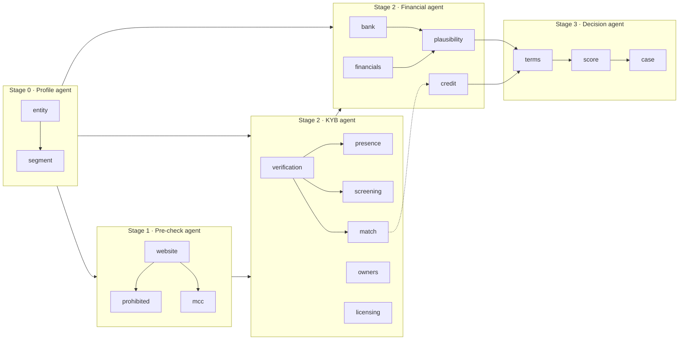
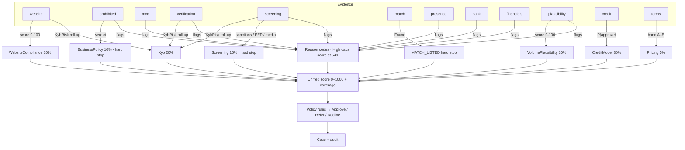

# Underwriting lifecycle — step-by-step guide

One page per assessment step, written for three readers at once: the **analyst** who has to interpret the result, the **domain / compliance owner** who needs to know what the check proves and does not prove, and the **engineer** who maintains it. Each page follows the same structure — purpose and acquiring context, inputs, internal flow (with diagrams), algorithms and thresholds, outputs, downstream impact on score / rules / terms / brief, behaviour on missing or unavailable evidence, analyst interpretation and remediation, false positives / negatives, limitations and worked examples.

Everything documented here describes the behaviour of the current implementation; proposed extensions are not included.

## The 18 steps

| # | Step | Agent | Page | Answers |
|---|---|---|---|---|
| 0 | `entity`, `segment` | Profile | [profile.md](profile.md) | What legal form and size is this merchant, how many locations, which registers and checks therefore apply? |
| 1 | `website` | Pre-check | [website.md](website.md) | Is the merchant's site compliant with card-brand disclosure expectations, and does it look like an operating business? |
| 2 | `prohibited` | Pre-check | [prohibited.md](prohibited.md) | Is the business type prohibited, restricted or high-risk under acceptable-use policy? |
| 3 | `mcc` | Pre-check | [mcc.md](mcc.md) | Does the declared MCC match what the business actually does? |
| 4 | `verification` | KYB | [verification.md](verification.md) | Does the legal entity exist in public registries as declared? |
| 5 | `screening` | KYB | [screening.md](screening.md) | Is the entity or any beneficial owner sanctioned, politically exposed, or in adverse media? |
| 6 | `match` | KYB | [match.md](match.md) | Has this merchant or principal been terminated by another acquirer (MATCH/TMF)? |
| 7 | `presence` | KYB | [presence.md](presence.md) | Does a real business operate at the declared address? |
| 7b | `owners` | KYB | [owners.md](owners.md) | Is the declared owner identity complete and consistent, and has this person applied before? |
| 7c | `licensing` | KYB | [licensing.md](licensing.md) | Does a regulated MCC's merchant hold the permits its trade requires, as attested by the analyst from its documents? |
| 8 | `bank` | Financial | [bank.md](bank.md) | What do the bank statements say about cash flow, NSFs, debt and real card volume? |
| 9 | `financials` | Financial | [financials.md](financials.md) | What do the P&L and balance sheet say about profitability, coverage, liquidity and leverage? |
| 10 | `plausibility` | Financial | [plausibility.md](plausibility.md) | Is the declared card volume believable given headcount, tenure, revenue, statements and catalogue? |
| 11 | `credit` | Financial | [credit.md](credit.md) | How would past underwriting have decided this profile, and which features drive that? |
| 12 | `terms` | Decision | [terms.md](terms.md) | On what reserve, settlement and pricing terms should the merchant be boarded? |
| 13 | `score` | Decision | [score.md](score.md) | Taken together, how risky is this merchant, how much do we know, and what does policy say? |
| 14 | `case` | Decision | [case.md](case.md) | Who does what next, and how is the decision made auditable? |

## Lifecycle at a glance



Text form of the dependency graph:

```text
Profile   : entity → segment            (always first; every step below implicitly depends on it)
Pre-check : website → prohibited ∥ mcc
KYB       : verification → presence ∥ screening ∥ match
Financial : bank ∥ financials → plausibility ∥ credit
Decision  : terms → score → case
```

### Orchestration facts that matter when reading any page
* **Five rule-based agents** (`profile`, `precheck`, `kyb`, `financial`, `decision`) own the 16 steps. The Profile agent is pinned first by the planner and cannot be disabled, fed by a transition or gated; it decides registry scope, segment weights and which steps are not applicable. The agent framework provides stage gates, streaming events and per-agent reviews; the agents themselves are deterministic C# — there is no LLM reasoning anywhere in the decision path.
* **Dependencies are soft.** A step runs once its dependencies have *finished* (succeeded, failed or skipped); it copes with missing upstream results rather than blocking. The exceptions are explicit workflow stop-gates (hard stop / failed / high-severity / named flag) that can skip the remainder of an agent or the workflow and force Refer or Decline.
* **Step failure policy** is configurable per step: `Skip` (coverage gap, default), `Refer` (continue but force Refer), `Abort`.
* **Unknown is never clear.** Unavailable providers, failed lookups and unloaded lists are surfaced as `Inconclusive` / `Unavailable` statuses and coverage gaps, not as passes. Several pages call out where numeric coverage can still be high enough to auto-approve while a critical check (screening lists, MATCH) never ran — analysts must read the step outcomes, not only the score.
* **Not applicable is a third state.** Steps the profile marks not applicable (e.g. `financials` for a Micro merchant, `website` for a card-present shop without a site) are skipped with the reason in the audit log and leave the coverage denominator — they are neither passes nor gaps.
* **Financial documents are optional.** `bank` and `financials` run only when statements or inline figures are provided; `plausibility` and `credit` run regardless.

## How the steps feed the decision



Key numbers (all detailed in [score.md](score.md)): seven weighted components renormalised over the ones that ran; each missing component pulls the score 6 % toward 500; hard stops (`SANCTIONS_MATCH`, `PROHIBITED_BUSINESS`, `MATCH_LISTED`) cap at 150 and decline; any High-severity reason caps at 549 and blocks auto-approval; auto-approval needs score ≥ 650, coverage ≥ 60 % and no High reasons, and no Refer rule (volume > $5M, ticket > $10k, PEP, new entity > $1M) may match.

## Reading order

* New analyst: start with [score.md](score.md) and [case.md](case.md) to understand what the outcome means, then the KYB pages, then Pre-check and Financial.
* Compliance / AML: [screening.md](screening.md), [verification.md](verification.md), [match.md](match.md), [prohibited.md](prohibited.md), [case.md](case.md) (audit chain and override control).
* Credit / pricing: [credit.md](credit.md), [plausibility.md](plausibility.md), [bank.md](bank.md), [financials.md](financials.md), [terms.md](terms.md).
* Engineering: every page ends with the implementing source files; the wiki pages under `../wiki/` cover architecture, configuration, API and data sources at the system level.

## Terminology used across pages

| Term | Meaning |
|---|---|
| KYB / KYC | Know Your Business (entity checks) / Know Your Customer (beneficial-owner checks). Owner sanctions/PEP screening is performed inside `screening`; there is no separate owner identity-verification step. |
| Hard stop | A finding policy never allows the system to approve past: sanctions match, prohibited business, MATCH listing. |
| Coverage | Share of score weight backed by evidence that actually ran; reported as a percentage plus the list of missing components. |
| Reason code | Normalised `CODE` + severity from any step, surfaced in the unified score and available to policy rules. |
| Refer | Route to an analyst; the default outcome when no rule matches. |
| Reserve / settlement delay | Acquirer collateral against chargeback and non-delivery exposure; recommended by `terms`. |
| Champion / challenger | Production credit model vs. shadow model scored in parallel for comparison. |
