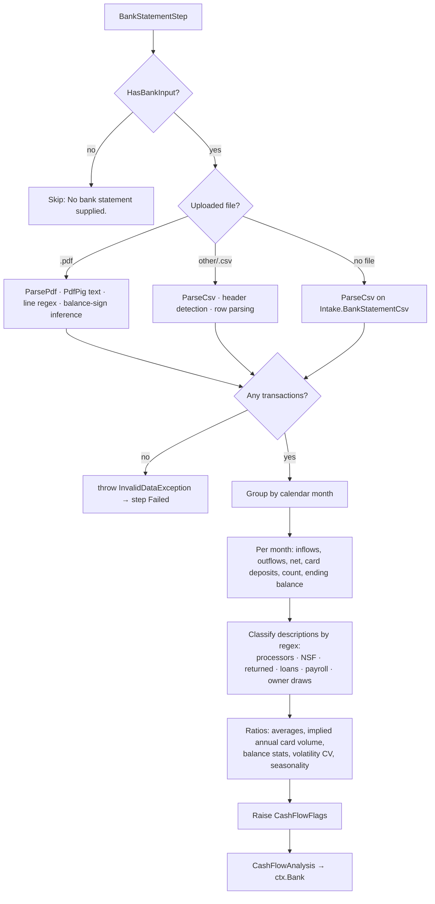
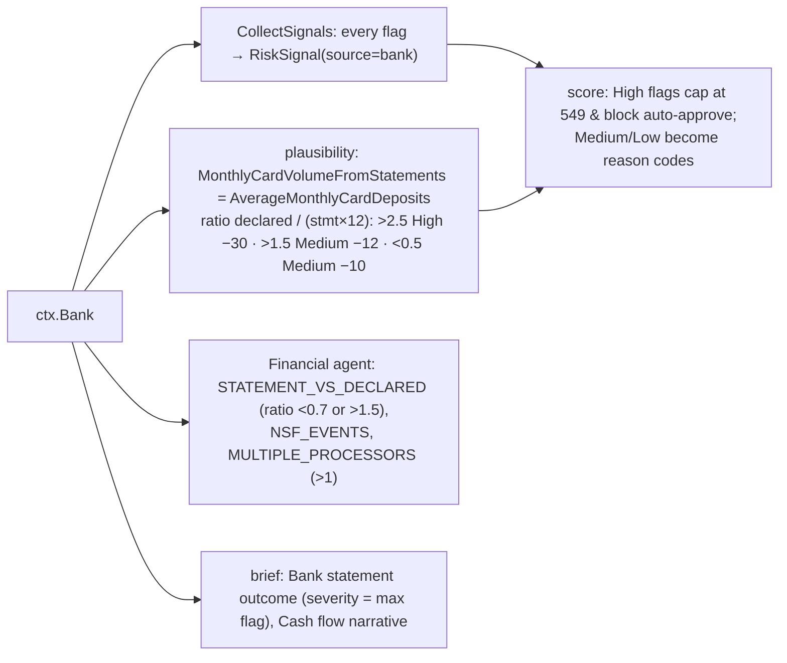

# Step 8 · `bank` — Bank statement cash-flow analysis

| | |
|---|---|
| Step id | `bank` |
| Agent | Financial (`financial`) |
| Stage | 2, runs in parallel with `financials`; both feed `plausibility` |
| Depends on | nothing (data-gated: runs only when a bank statement is supplied) |
| Can hard-stop | No |
| Consumed by | `plausibility` (statement-evidenced card volume), Financial agent review, unified score (flags as reason codes), analyst brief |
| Implementation | `src/MerchantIntelligence.Underwriting/Financials/BankStatementParser.cs`, `CashFlowAnalyzer.cs`; wrapper `src/MerchantIntelligence.Platform/Agents/Financial/BankStatementStep.cs` |

---

## 1. Why this step exists

### Functional purpose
Turn an uploaded business bank statement (CSV or text PDF) into **underwriting ratios**: monthly inflows/outflows, card-processor settlements, NSF and overdraft events, balances, debt service, payroll, owner draws, volatility and seasonality — and raise cash-flow flags.

### Business question answered
*"Does the money actually flowing through this business support what the applicant declared, and can the business absorb chargebacks, refunds and reserves without defaulting?"*

### Merchant-acquiring rationale
An acquirer extends unsecured credit to every merchant it boards: it settles card sales today and is liable for chargebacks for up to 120–540 days (longer for future-delivery models). If the merchant fails, the acquirer eats the losses. Bank statements are the closest thing to ground truth about a small business:
* **Card settlements** from a prior processor (Stripe, Square, Fiserv, …) are direct evidence of historical card volume — the single best test of `AnnualVolume`.
* **NSF / overdraft fees** and negative balances are the strongest leading indicators of small-business failure.
* **Loan / MCA repayments** show hidden leverage (merchant cash advances are often stacked and invisible in P&Ls).
* **Multiple processors** hint at load balancing to hide chargeback ratios, or at prior terminations.
* **Owner draws via Zelle/Venmo/Cash App** show how much cash is stripped out of the business.

### Compliance / fraud relevance
* Statement content is also an **AML window**: pass-through patterns and large one-off deposits (`LUMPY_DEPOSITS`) deserve a source-of-funds question.
* Statement *authenticity* (PDF tampering, fabricated CSVs) is **not** checked by this step — the parser trusts the document. That is a known gap; see limitations.

---

## 2. Inputs

| Input | Source | Notes |
|---|---|---|
| Uploaded statement file | `POST …/assess` multipart `bankStatement` → `ctx.BankStatementDocument` | `.csv` or `.pdf` (text-based); other extensions are treated as CSV |
| Inline CSV | `Intake.BankStatementCsv` | Used when no file is uploaded |
| `Intake.AnnualVolume` | intake | Not used by this step itself; used by consumers to compare against `ImpliedAnnualCardVolume` |

`ctx.HasBankInput` = file present **or** inline CSV non-blank. When false the step is **Skipped** ("No bank statement supplied.") — the whole Financial stage is therefore optional evidence.

### 2.1 CSV parsing (`ParseCsv`)
Header names are matched case-insensitively, exact then contains:

| Column | Accepted headers |
|---|---|
| date | `date`, `posted`, `transaction date`, `value date` |
| description | `description`, `memo`, `details`, `narrative`, `payee`, `transaction`, `particulars` |
| amount (signed) | `amount`, `value`, `net` |
| debit | `debit`, `withdrawal`, `money out`, `paid out`, `out` |
| credit | `credit`, `deposit`, `money in`, `paid in`, `in` |
| balance | `balance`, `running balance`, `closing balance` |

If no date/amount/debit header is found, columns are inferred from data and a warning is recorded. Rows whose date or amount cannot be parsed are skipped and counted in a warning.

### 2.2 PDF parsing (`ParsePdf`)
* Uses **PdfPig** to extract text; lines are reconstructed from glyph positions.
* Each line is matched against a date + description + trailing amounts pattern; amounts accept `$/£/€`, thousands separators, parentheses and `CR/DR` suffixes.
* The statement year is inferred from the first `20xx` seen when dates omit the year.
* When a running balance column exists, the **sign of a transaction is inferred from the balance delta** (warning records how many were fixed).
* Image-only (scanned) PDFs produce zero transactions → warning *"No transaction lines recognised; the PDF may be scanned…"* and the analysis throws → step **Failed**.

Output of parsing: `ParsedStatement(Transactions[(Date, Description, Amount, Balance?)], Warnings, Format)`.

---

## 3. Internal flow



### 3.1 Classification dictionaries (regex, case-insensitive)

| Family | Patterns (abridged) |
|---|---|
| Card processors | Stripe · Square (`sq *`) · PayPal · Shopify · Adyen · Worldpay/Vantiv/FIS · Fiserv/First Data/Clover/CardConnect · Elavon · Global Payments/TSYS/Heartland · Chase Paymentech · American Express · Toast · Authorize.net · generic `merchant settlement/deposit/bankcard`, `mtot dep`, `credit card deposit` |
| NSF / overdraft | `nsf`, `non-sufficient`, `insufficient funds`, `overdraft fee/charge/item`, `od fee`, `returned item fee`, `unpaid item` |
| Returned items | `returned`, `reversal`, `chargeback`, `bounced`, `unpaid` (excluding NSF hits) |
| Loan / advance | `loan`, `lending`, Kabbage, OnDeck, Fundbox, `sba`, `mca`, `merchant cash`, `capital advance/funding`, `financing`, `payoff`, `lease pay` |
| Payroll | `payroll`, Gusto, ADP, Paychex, Intuit Payroll, `wages`, `salary` |
| Owner draws | `owner draw`, `distribution`, `dividend`, `transfer to savings/personal`, Zelle, Venmo, Cash App |

Only **positive** amounts matching a processor count as card deposits; only **negative** amounts count for loans, payroll and draws.

### 3.2 Derived metrics

```text
monthsCovered            = distinct calendar months present
avgIn / avgOut           = totals ÷ monthsCovered
avgCard                  = Σ card deposits ÷ monthsCovered
ImpliedAnnualCardVolume  = avgCard × 12 ÷ (1 − 0.029)     ← grosses net settlements up by an assumed 2.9 % blended fee
AverageDailyBalance      = mean of each day's last running balance
MinimumBalance / NegativeBalanceDays from the same daily series
InflowVolatility         = sample std-dev(monthly inflows) ÷ mean   (0 when < 2 months)
SeasonalityIndex         = top-3 months' inflows ÷ total   (only when ≥ 6 months, else 0)
LargestSingleDeposit     = max positive transaction
```

### 3.3 Flags

| Code | Condition | Severity |
|---|---|---|
| `SHORT_STATEMENT_HISTORY` | < 3 months covered | Medium |
| `FREQUENT_NSF` | ≥ 3 NSF/overdraft events | **High** |
| `NSF_PRESENT` | 1–2 events | Medium |
| `NEGATIVE_BALANCE_DAYS` | any day's balance < 0 | High if ≥ 5 days, else Medium |
| `NEGATIVE_CASH_FLOW` | avgOut > 1.1 × avgIn | **High** |
| `HIGH_DEBT_SERVICE` | monthly loan repayments > 20 % of avgIn | **High** |
| `THIN_LIQUIDITY` | avg balance < 25 % of monthly outflows (≈ under a week of burn) | Medium |
| `VOLATILE_INFLOWS` | CV > 0.6 | Medium |
| `SEASONAL_BUSINESS` | top-3 months > 55 % of inflows | Low |
| `LUMPY_DEPOSITS` | one deposit > 40 % of all inflows | Medium |
| `NO_CARD_DEPOSITS` | no processor settlements found | Low |
| `MULTIPLE_PROCESSORS` | ≥ 3 distinct processors | Medium |
| `HIGH_OWNER_DRAWS` | monthly draws > 30 % of avgIn | Medium |

Warnings (parser + "No running balance column; balance metrics unavailable.") are carried in `Warnings` and shown in the brief; they are not flags.

---

## 4. Outputs

`CashFlowAnalysis` — period, months, counts, totals, averages, `ImpliedAnnualCardVolume`, balance metrics, `NsfOrOverdraftCount`, `ReturnedItemCount`, `LoanRepayments`, `Payroll`, `OwnerDraws`, `LargestSingleDeposit`, `InflowVolatility`, `SeasonalityIndex`, `DetectedProcessors`, `Monthly[]`, `Flags[]`, `Warnings[]`.

Timeline summary: `6 month(s) · implied annual card volume $412,000 · 0 NSF/overdraft · 1 flag(s)`.

---

## 5. Downstream impact



* **No dedicated score component.** Bank evidence reaches the unified score two ways: through the `VolumePlausibility` component (10 %) via the statement ratio, and through **High** cash-flow flags (`FREQUENT_NSF`, `NEGATIVE_CASH_FLOW`, `HIGH_DEBT_SERVICE`, `NEGATIVE_BALANCE_DAYS ≥ 5`) which cap the score at 549 and block automatic approval.
* **Rules**: no default rule reads bank facts directly; policies can be written against `reasonCodes` (e.g. `contains FREQUENT_NSF → Refer`).
* **Terms**: `terms` does not read `ctx.Bank` directly; its inputs are plausibility/credit/KYB signals. Reserve sizing for NSF stress is an agent *recommendation*, not an automatic adjustment.
* **Credit model**: not a feature (the LightGBM model uses only MCC, volume, tickets, MATCH, existing relationship).

Note the two different ratio bands: the Financial agent flags at 0.7×–1.5×, `plausibility` penalises at >1.5×, >2.5× and <0.5×.

---

## 6. Missing input, failures and coverage

| Situation | Behaviour | Downstream |
|---|---|---|
| No statement and no inline CSV | **Skipped** | Brief "Bank statement: Not run — No statement supplied." (uncovered); plausibility loses its strongest signal; Financial agent summary "no financial evidence" |
| Scanned PDF / unsupported layout / empty CSV | `InvalidDataException` → **Failed** (`onFail: Skip`), `ctx.Bank = null` | Brief "Not run — Could not parse statement." (uncovered) |
| CSV with no header | Columns inferred, warning | Analysis proceeds; check warnings |
| No balance column | Balance metrics null, `NegativeBalanceDays=0`, no `THIN_LIQUIDITY`/`NEGATIVE_BALANCE_DAYS` possible | Warning shown; liquidity stress may be under-detected |
| < 3 months | `SHORT_STATEMENT_HISTORY` Medium | Volatility unstable; seasonality not computed |
| Personal account uploaded | Parses fine | Owner draws / payroll misclassified; `NO_CARD_DEPOSITS` likely — analyst must check account holder (not automated) |
| Unknown processor naming | Missed card deposits → understated `ImpliedAnnualCardVolume` | Spurious `DECLARED_ABOVE_STATEMENTS` — see false positives |

Skipped or failed bank analysis is a **coverage gap**, not a clean bill of health: the brief marks it uncovered and the score's `Coverage` falls.

---

## 7. Analyst interpretation and remediation

| Finding | Read as | Do |
|---|---|---|
| `ImpliedAnnualCardVolume` ≈ declared (0.7–1.5×) | Volume corroborated | Nothing further. |
| Implied ≪ declared (`DECLARED_FAR_ABOVE_STATEMENTS`) | Growth story or inflation | Ask for processor statements; if new to cards, size reserve for declared not proven volume. |
| Implied ≫ declared (`DECLARED_BELOW_STATEMENTS`) | Volume splitting / load balancing | Ask why volume is being moved; check chargeback history with the other processor; consider `MULTIPLE_PROCESSORS`. |
| `FREQUENT_NSF`, `NEGATIVE_BALANCE_DAYS` | Liquidity distress — top default predictor | Higher rolling reserve, shorter settlement window or decline; request 3 more months. |
| `HIGH_DEBT_SERVICE` | Stacked loans/MCAs | Ask for loan schedules; MCA daily debits often precede failure. |
| `HIGH_OWNER_DRAWS` | Cash stripped out | Confirm salary vs draws; relevant to personal guarantee value. |
| `LUMPY_DEPOSITS` | Capital injection, loan proceeds or layering | Source-of-funds question; exclude from volume analysis. |
| `NO_CARD_DEPOSITS` for a business claiming existing card acceptance | Statement not from the operating account, or processor unrecognised | Request the settlement account statement; read raw descriptions. |
| `SEASONAL_BUSINESS` | Normal for many MCCs | Size reserve to off-season; expect high plausibility "volatility" that is benign. |

### False positives / negatives
* **Processor recognition is regex-based**: a local bank's `MERCH DEP 4421` won't match unless it contains one of the generic phrases → card volume understated.
* `\bsquare\b` also matches "Square One Plaza rent"; `\btoast\b` matches a bakery's supplier; `\bsba\b` matches an SBA *grant* (inflow, ignored) but also an "SBA loan proceeds" deposit (positive, so not counted as debt — correct) — read descriptions when totals look odd.
* Zelle/Venmo transfers **to** suppliers are counted as owner draws.
* `ReturnedRegex` counts "reversal" fee refunds as returned items.
* Sign inference from balances assumes the statement is sorted chronologically within a day.

---

## 8. Worked example

Six-month CSV, 412 transactions, running balance present. Monthly inflows ≈ $58k; Stripe deposits ≈ $34k/month → `ImpliedAnnualCardVolume` = 34,000 × 12 ÷ 0.971 ≈ **$420,185**. Declared `AnnualVolume` $480,000 → ratio 1.14× (agent silent, plausibility metric "within 0.7–1.5×"). One `OVERDRAFT FEE` → `NSF_PRESENT` (Medium); average balance $9,800 vs monthly outflows $55k → 17.8 % → `THIN_LIQUIDITY` (Medium). Kabbage debits $3,100/month = 5.3 % → no debt flag. CV 0.21, seasonality 0.52 → no flags. Result: 2 Medium flags → brief outcome severity Medium; two reason codes added; no score cap; Financial agent notes `NSF_EVENTS` and suggests a higher reserve.
