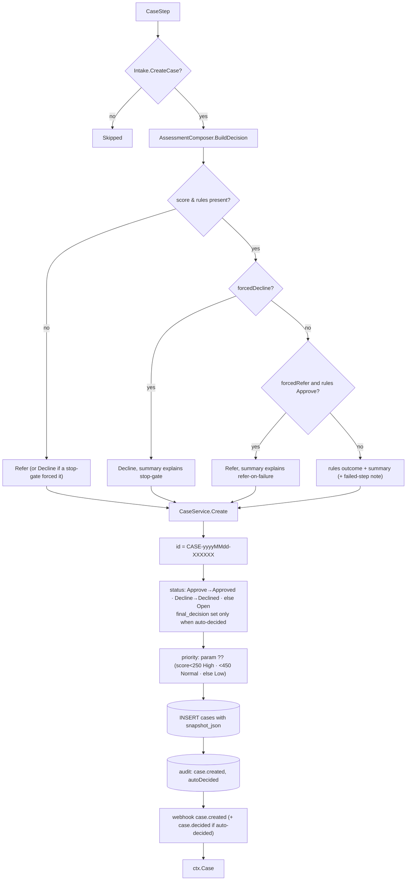
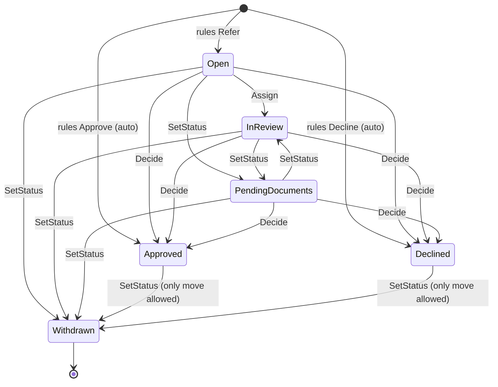
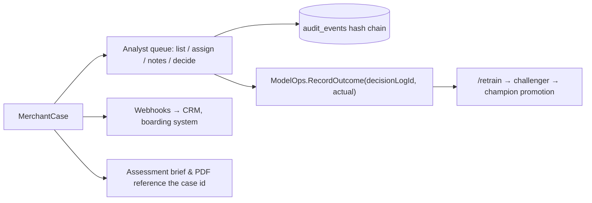

# Step 14 · `case` — Case creation & audit

| | |
|---|---|
| Step id | `case` |
| Agent | Decision (`decision`) |
| Stage | 3, last step of the lifecycle |
| Depends on | `score` (soft — a case is still opened when the score failed, as a Refer) |
| Can hard-stop | No |
| Parameters | `priority` = `Low | Normal | High | Urgent` (overrides the score-derived priority) |
| Consumed by | Analyst review queue (API `/cases`, workbench), webhooks (`case.created`, `case.decided`), audit trail, ModelOps outcome feedback |
| Implementation | `src/MerchantIntelligence.Platform/Cases/CaseService.cs`, `src/MerchantIntelligence.Platform/Cases/AuditTrail.cs`, `AssessmentComposer.BuildDecision`; wrapper `src/MerchantIntelligence.Platform/Agents/Decision/CaseStep.cs` |

---

## 1. Why this step exists

### Functional purpose
Turn the assessment into a **work item**: compose the final `AssessmentDecision`, open a `MerchantCase` in the analyst queue with a JSON snapshot of the decision context, set its initial status from the rules outcome (auto-approved / auto-declined / open for review), derive a priority, write a hash-chained audit event and publish webhooks.

### Business question answered
*"Who needs to do what next with this merchant, and can we prove later exactly what the system knew and decided?"*

### Merchant-acquiring context
Underwriting decisions must be **defensible** — to card brands (Visa/Mastercard acquirer due-diligence rules), to regulators (BSA/AML programme, model-risk governance) and in disputes with merchants. A case record with an immutable decision snapshot, every analyst action logged, and explicit *override* tracking when a human contradicts policy is the operational backbone of that defensibility. It is also where the loop closes: analyst decisions are the labelled outcomes that retrain the credit model.

### Compliance relevance
* **Append-only, tamper-evident audit log** — each event hash = SHA-256 of (case id, actor, action, detail JSON, timestamp, previous hash), chained from `GENESIS`; `AuditTrail.Verify()` re-computes the whole chain and reports the first broken sequence number.
* **Four-eyes / override control** — a human decision that contradicts the rules outcome requires a stated reason and is recorded as `case.overridden`; override counts are surfaced in queue stats.
* **No reopen** — Approved/Declined cases cannot be reopened; a new assessment creates a new case, so history is never rewritten.

---

## 2. Inputs

| Input | Used for |
|---|---|
| `Intake.CreateCase` (default true) | Skip switch: `false` → step Skipped ("Case creation disabled by caller.") |
| `ctx.Score`, `ctx.Rules`, `ctx.Steps`, `ctx.ForcedRefer`, `ctx.ForcedDecline` | `BuildDecision` |
| `Intake.Business.LegalName`, `Intake.Actor`, `Intake.ExternalRef ?? AssessmentId` | Case identity |
| step param `priority` | Optional forced priority |
| `ctx.Score.Score / Tier / CoverageGaps / HardStops`, `ctx.Rules.Outcome` | Case fields and snapshot |
| `ctx.DecisionLogId` | Links the case to the credit model's `decision_log` row for outcome feedback |
| `ctx.Workflow.Version` | Snapshot provenance |

---

## 3. Internal flow



### 3.1 Snapshot contents
```json
{ "assessmentId": "...", "decision": { "outcome", "score", "tier", "coveragePercent", "ruleSetVersion", "summary" },
  "coverageGaps": [...], "hardStops": [...], "decisionLogId": 123, "workflow": "v…" }
```
The snapshot is the decision *as taken*; the full assessment (all step results, brief, PDF) lives in the assessment record keyed by `assessmentId`.

### 3.2 Status semantics
| Rules outcome | Case status | `final_decision` | Webhooks |
|---|---|---|---|
| Approve | `Approved` | `Approved` | `case.created`, `case.decided` |
| Decline | `Declined` | `Declined` | `case.created`, `case.decided` |
| Refer / none | `Open` | null | `case.created` |

Note that `BuildDecision`'s forced Refer/Decline is inside the **snapshot**, while the case `status` is derived from the *raw rules outcome* passed to `Create`. When a refer-on-failure policy downgrades an Approve, the case still opens as `Approved` (rules said Approve) while the snapshot decision says Refer — analysts and integrators should read `snapshot.decision.outcome` as the authoritative system recommendation. This is a known inconsistency to keep in mind when wiring queue filters.

### 3.3 Case lifecycle after creation (analyst operations)



* `Assign` → status `InReview`, audit `case.assigned`.
* `SetStatus` cannot set Approved/Declined (use `Decide`); a decided case can only move to `Withdrawn`; reopen is refused. `SetStatus` does not otherwise guard transitions (e.g. a `Withdrawn` case can be set back to `Open`), whereas `Assign`, `Decide` require the case to be Open/InReview/PendingDocuments.
* `AddNote` → `case_notes` row + audit `case.note_added` (note body is not in the audit detail, only its id).
* `Decide(Approved|Declined, actor, reason, isOverride)` — override = explicit flag **or** contradiction of the stored rules outcome (Approve→Declined, Decline→Approved). Override without a reason is rejected. Audit `case.overridden` / `case.decided`; webhook `case.decided` with reason and override flag.
* Queue order: priority Urgent → High → Normal → Low, then oldest first. `Stats()` reports counts per status, override count and average open age.

### 3.4 Priority
Derived priority is inverted relative to intuition for a *review* queue: **low scores get High priority** because they are the risky cases needing attention first; strong Refers (score ≥ 450) are Low priority. Use the `priority` step parameter (e.g. via workflow configuration) to force `Urgent` for specific programmes.

---

## 4. Outputs

* `ctx.Case` — `MerchantCase(Id, MerchantName, ExternalRef, Status, AssignedTo=null, Priority, RiskScore, RiskTier, RulesOutcome, FinalDecision, Snapshot, CreatedAt, UpdatedAt)`.
* SQLite rows: `cases`, `audit_events`.
* Webhook events.
* Timeline summary: `CASE-20260919-3F9A1C · Open · priority Normal`.

---

## 5. Downstream and the feedback loop



* The Decision agent review summarises `Outcome · score · deciding rule · terms band · coverage` and raises `NO_SCORE`, `HARD_STOP`, `FORCED_REFER`, `COVERAGE_GAPS` and a `BRIEF` roll-up of upstream agent findings.
* `decisionLogId` in the snapshot is what lets an analyst's final decision be written back as the realised outcome of the credit model prediction (`RecordOutcome`), feeding model performance metrics (accuracy, approval precision, decline recall, confusion matrix) and retraining.

---

## 6. Missing input, failures and coverage

| Situation | Behaviour |
|---|---|
| `CreateCase=false` (e.g. API callers that only want the assessment) | Skipped; no case, no audit event; assessment still complete |
| Score step failed / disabled | Decision Refer ("unified score or rules engine failed" / "score step is disabled"); case `Open`, `RiskScore` null, priority Low (null score is not < 450) |
| Stop-gate forced Decline before score | Decision Decline in snapshot; case status from rules outcome (may be `Open` if rules never ran) |
| SQLite unavailable | Step Failed; `ctx.Case=null`; the assessment result is still returned to the caller but no queue item exists — operationally this must be monitored, since a Refer without a case is invisible to analysts |
| Webhook endpoint down | Dispatcher handles delivery; case creation is not rolled back |

The case step has no score component and no coverage effect; it is the *sink* of the lifecycle.

---

## 7. Analyst interpretation and working the case

| Case state | Meaning | Analyst action |
|---|---|---|
| `Approved` at creation | `AUTO_APPROVE` fired: score ≥ 650, coverage ≥ 60 %, no High reasons, no Refer rule | Spot-check per sampling policy; confirm coverage gaps (e.g. screening/MATCH unavailable) are acceptable — auto-approval does **not** mean every check ran |
| `Declined` at creation | Hard stop or score < 250 | Only overridable with reason; sanctions/prohibited declines should not be overridden without compliance sign-off |
| `Open`, priority High | Refer with score < 250 — but not declined (e.g. `LOW_SCORE_DECLINE` disabled in a custom rule set) | Work first |
| `Open`, priority Low, deciding rule `LARGE_VOLUME_REFER` / `HIGH_TICKET_REFER` | Strong profile, policy limit only | Senior sign-off; often approve on recommended terms |
| `Open`, deciding rule `PEP_EDD` | Enhanced due diligence | Source-of-wealth/funds, senior approval, document in notes |
| `Open`, deciding rule `HIGH_SEVERITY_REFER` | One or more High findings | Follow the specific step page's remediation (registry mismatch, possible sanctions, restricted business, failed website check, `MODEL_DECLINE`…) |
| `Open`, deciding rule `LOW_COVERAGE_REFER` | Evidence, not risk | Move to `PendingDocuments`, request statements / fix website, re-run assessment (new case) |
| Snapshot `decision.outcome` ≠ case status | Forced refer/decline by workflow policy | Trust the snapshot |

Working hygiene: assign before reviewing (`InReview` shows ownership); write findings as notes; when deciding against the rules, give a reason that a reviewer can audit later — it is stored verbatim in the audit chain.

### Limitations
* Case status derives from the raw rules outcome, not from the forced decision (see §3.2).
* Notes bodies and snapshot content are not hashed into the chain (only event metadata and detail JSON are); the chain proves the *sequence of actions*, not the immutability of `cases.snapshot_json`.
* No SLA/escalation logic; average open age is reported but nothing acts on it.
* No de-duplication: re-running an assessment for the same merchant creates a second case.
* Case creation and the `decision_log` row are separate writes without a transaction; a crash between them can leave a prediction with no case.

---

## 8. Worked example

Score example D (549, Medium, Refer via `HIGH_SEVERITY_REFER`, `BUSINESS_UNVERIFIED`), no stop-gates, all steps succeeded.
`BuildDecision` → `Refer for manual review. Score 549/1000 (Medium); rule HIGH_SEVERITY_REFER requires an analyst decision.`
`Create` → `CASE-20260919-7B2E4D`, status `Open`, priority `Low` (549 ≥ 450), snapshot with `coverageGaps=[]`, `hardStops=[]`, `decisionLogId=418`. Audit seq 1042 `case.created {autoDecided:false}` chained to seq 1041's hash. Webhook `case.created`.
Analyst assigns herself (`InReview`), moves to `PendingDocuments` and notes "Requested Secretary of State certificate of good standing". The merchant supplies it; the analyst re-runs the assessment (new case, now verified → score ≈ 638, still Refer via DEFAULT) and decides `Approved` with reason "Entity verified via state certificate; HighRisk MCC accepted on band C terms" — `isOverride=false` because the stored rules outcome was Refer, not Decline. Audit `case.decided`; webhook `case.decided`; `RecordOutcome(418, Approved)` marks the champion's earlier `Cancelled/Declined`-leaning prediction as a miss in model performance stats.
