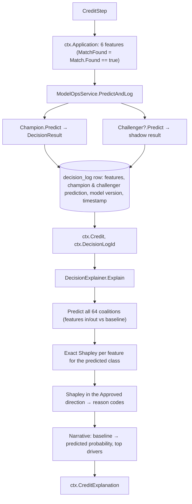
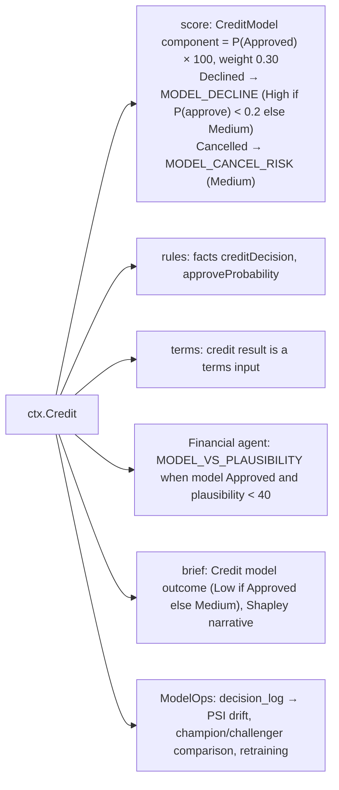

# Step 11 · `credit` — Credit decision model & explainability

| | |
|---|---|
| Step id | `credit` |
| Agent | Financial (`financial`) |
| Stage | 2, after `match` (soft dependency: runs with `MatchFound=false` when MATCH was unavailable) |
| Depends on | `match`; intake declaration |
| Can hard-stop | No |
| Consumed by | `score` (`CreditModel` component, 30 %), rules (`creditDecision`, `approveProbability` facts), `terms` (input), Financial agent, analyst brief, decision log / ModelOps |
| Implementation | `src/MerchantIntelligence.CreditDecision/` (`Models.cs`, `ModelTrainer.cs`, `DecisionPredictor.cs`, `SyntheticDataGenerator.cs`), `src/MerchantIntelligence.Underwriting/Explainability/DecisionExplainer.cs`, `src/MerchantIntelligence.Platform/ModelOps/ModelRegistry.cs`, `ModelOpsService.cs`; wrapper `src/MerchantIntelligence.Platform/Agents/Financial/CreditStep.cs` |

---

## 1. Why this step exists

### Functional purpose
Score the application with the **champion machine-learning model** (ML.NET LightGBM multiclass) to predict the historical outcome class — `Approved`, `Declined` or `Cancelled` — with class probabilities; **explain** the prediction feature by feature using exact Shapley values; **log** the decision (and the shadow challenger's) for monitoring, drift detection and retraining.

### Business question answered
*"Based on how applications with this profile have turned out before, how would an experienced underwriting desk have decided — and why?"*

### Underwriting rationale
Traditional merchant underwriting is a mix of policy (hard rules) and judgement. The model captures the *judgement* part as a learned function of the core application attributes, giving a consistent, fast first opinion and a probability that feeds the unified score. It is deliberately **narrow**: six features, no documents, no KYB evidence. Everything else in the lifecycle is layered around it by the rules engine and the unified scorer, which is why a model "Approve" never bypasses a sanctions or MATCH hard stop.

### Compliance / model-risk relevance
* **Explainability** is a regulatory expectation (adverse-action reasoning, model-risk management guidance such as SR 11-7). Every prediction carries per-feature contributions, reason codes and a narrative — nothing is a black box.
* **Champion / challenger + logging** give a full audit trail of which model version produced which prediction, and evidence for validation/back-testing.
* The model uses **no consumer data** (no owner credit pulls), so FCRA permissible-purpose and adverse-action-notice duties are not triggered by this step.

### The label meaning
The three classes are **historical outcomes**, not recommendations:
* `Approved` — boarded.
* `Declined` — refused by underwriting.
* `Cancelled` — borderline applications withdrawn by the merchant after being asked for documents or reserves. Predicting `Cancelled` is read as "borderline; likely friction".

---

## 2. Inputs

`ctx.Application` (`MerchantApplication`) is derived from intake and MATCH:

| Feature | Source | Type |
|---|---|---|
| `MerchantCategoryCode` | `Intake.MerchantCategoryCode` (declared) | float |
| `AnnualVolume` | `Intake.AnnualVolume` | float |
| `AverageTicket` | `Intake.AverageTicket` | float |
| `HighestTicket` | `Intake.HighestTicket` | float |
| `MatchFound` | `ctx.Match?.Found == true` — **false when MATCH is unavailable** | bool |
| `ExistingRelationship` | `Intake.ExistingRelationship` | bool |

Everything else (KYB, website, statements, plausibility) is **not** a model input.

### Model artefact
* Champion model file registered in `ModelRegistry` (SQLite `models` table); bootstrapped from the shipped `models/credit-decision.zip` on first run.
* Training pipeline (`ModelTrainer`): `MapValueToKey(Decision)` → convert bools → `Concatenate` 6 features → `LightGbmMulticlass` (31 leaves, 200 iterations, learning rate 0.05, seed 42) → `MapKeyToValue`. 80/20 train/test split, seed 42.
* Training data: `SyntheticDataGenerator` rows (rule-based risk with noise: high-risk MCC, volume, ticket spread > 10× / 25×, implied transactions < 50 …; `risk ≥ 0.45 → Declined`, borderline 0.25–0.45 → 55 % `Cancelled`) **plus** any logged decisions with realised outcomes when `/retrain` is used. Because the bootstrap data is synthetic, the champion encodes *encoded underwriting heuristics*, not real portfolio performance, until retrained on real outcomes.

---

## 3. Internal flow

### 3.1 Prediction
`DecisionPredictor` wraps a thread-safe `PredictionEngine`; class probabilities come from the LightGBM soft-max scores mapped back to `Decision` labels. `DecisionResult(Decision, Confidence = max probability, Probabilities{Approved, Declined, Cancelled})`.

### 3.2 Exact Shapley attribution
* **Baseline** "typical" application: MCC 5812, volume $500k, ticket $60, highest $400, no MATCH, no relationship.
* For each of the \(2^6 = 64\) feature subsets, a hybrid application is composed (subset features from the applicant, the rest from the baseline) and scored once.
* Shapley value of feature *i* = weighted average over all coalitions *S* not containing *i* of `P(S ∪ {i}) − P(S)`, with the classic \(|S|!(n-|S|-1)!/n!\) weights. Sums exactly to `P(applicant) − P(baseline)` for the explained class.
* `FeatureContribution(Feature, Value, BaselineValue, Contribution, Direction)` where direction is Increases / Decreases / Neutral (|Δ| ≤ 0.005).

### 3.3 Reason codes
Computed on the **Approved-direction** Shapley values so they read the same whatever class was predicted; features with |contribution| > 0.02, most adverse first, at most 4:

| Feature | Adverse code | Favourable code |
|---|---|---|
| MCC | `HIGH_RISK_MCC` | `LOW_RISK_MCC` |
| Annual volume | `VOLUME_TOO_LOW` (< $50k) / `VOLUME_EXPOSURE` | `VOLUME_APPROPRIATE` |
| Average ticket | `HIGH_AVERAGE_TICKET` | `MODERATE_AVERAGE_TICKET` |
| Highest ticket | `TICKET_SPREAD` | `CONSISTENT_TICKETS` |
| MATCH found | `MATCH_LISTED` | `NO_MATCH_RECORD` |
| Existing relationship | `NO_EXISTING_RELATIONSHIP` | `EXISTING_RELATIONSHIP` |

Each carries its Shapley weight (probability points).

---

## 4. Outputs

* `ctx.Credit` — `DecisionResult(Decision, Confidence, Probabilities)`.
* `ctx.CreditExplanation` — `DecisionExplanation(Decision, Confidence, ExplainedClass, BaselineProbability, PredictedProbability, Contributions[6], ReasonCodes[≤4], Narrative)`.
* `ctx.DecisionLogId` — row id in `decision_log` (used later by the case to link outcome feedback).

Timeline summary: `Approved (81%) · top driver AnnualVolume`.

---

## 5. Downstream impact

* **Unified score**: the largest single component (30 %). A model Decline with P(approve) < 0.2 adds a **High** reason code, which caps the unified score at 549 and blocks auto-approval; otherwise Medium.
* **Rules**: `creditDecision` (`Approved`/`Declined`/`Cancelled`) and `approveProbability` are facts; no default rule references them directly — policy authors may add e.g. `approveProbability lt 0.3 → Refer`. Hard stops and the `AUTO_APPROVE` rule act on other facts.
* **Not** an input to `plausibility`, `mcc` or KYB.

---

## 6. Missing input, failures and coverage

| Situation | Behaviour |
|---|---|
| MATCH unavailable / error | `MatchFound=false` is fed to the model — the model sees "no MATCH record" even though the truth is *unknown*. The coverage gap is reported by `match`, not here. Analysts must not read `NO_MATCH_RECORD` in the credit reason codes as evidence. |
| MCC blank | `MerchantCategoryCode = 0` → an out-of-distribution value; the model still predicts (tree splits treat it as a small number). Treat with suspicion; the brief shows MCC 0 in the explanation. |
| Champion model file missing / unloadable | Step **Failed**; `ctx.Credit=null` → `CreditModel` component uncovered (30 % of weight renormalised away, coverage drops to ≤ 70 % which is *above* the 60 % auto-approve floor only if every other component is covered); brief "Credit model: Not run — Champion model unavailable." (Medium, uncovered) |
| Challenger absent | Shadow columns null in `decision_log`; no effect on the assessment |
| SQLite log write fails | Exception → step Failed (prediction is not surfaced without a log row) |

---

## 7. Analyst interpretation and remediation

| Result | Read as | Do |
|---|---|---|
| `Approved` ≥ 0.8 with `LOW_RISK_MCC`, `VOLUME_APPROPRIATE` | Mainstream profile | Rely on the rest of the lifecycle; the model adds little marginal information. |
| `Approved` but plausibility < 40 (`MODEL_VS_PLAUSIBILITY`) | Model is blind to evidence conflicts | Weigh evidence over the model; the model never saw statements. |
| `Cancelled` predicted | Borderline; historically such merchants walked away when asked for reserves | Expect friction; decide whether the terms are worth offering. |
| `Declined` with `HIGH_RISK_MCC` + `TICKET_SPREAD` | Classic high-exposure vertical | Cross-check `prohibited`/`mcc`; consider reserve-based approval rather than outright decline if KYB is strong. |
| `Declined` driven by `NO_EXISTING_RELATIONSHIP` | Weak reason on its own (every new merchant has it) | Discount; look at the other contributions. |
| Confidence ≈ 0.4–0.5 across classes | Model is unsure | Treat as no signal; rely on rules and analyst judgement. |
| Champion vs challenger disagree (visible in ModelOps, not the brief) | Model instability on this profile | Note for model validation; decide on evidence. |

### Limitations to keep in mind
* Six features only; no KYB, fraud or document signals — the model **cannot** detect identity fraud, sanctions or laundering. It is a heuristic-encoded prior, not a risk engine.
* Bootstrap training data is synthetic; until retrained on real realised outcomes, probabilities are not calibrated to the portfolio.
* `MatchFound` is binary and defaults to false under uncertainty (see §6).
* The unified score linearly maps P(approve) to 0–100 — a model at 55 % approve contributes 16.5 of 300 possible points, so the model rarely "carries" a weak application on its own.
* Shapley values are exact but relative to one fixed baseline; a different baseline changes the attribution, not the prediction.

---

## 8. Worked example

Applicant: MCC 5999, volume $2.0M, ticket $1,900, highest $9,500, no MATCH record (provider `Available`, `Found=false`), no relationship.

Champion → `Declined` 0.71 (P: Approved 0.18, Declined 0.71, Cancelled 0.11). Baseline P(Declined) 0.06 → predicted 0.71.
Shapley (Declined direction): AverageTicket +0.29, AnnualVolume +0.17, MerchantCategoryCode +0.11, HighestTicket +0.06, ExistingRelationship +0.02, MatchFound 0.00.
Reason codes (Approve direction, most adverse first): `HIGH_AVERAGE_TICKET` (−0.27), `VOLUME_EXPOSURE` (−0.15), `HIGH_RISK_MCC` (−0.10), `TICKET_SPREAD` (−0.05).
Unified score: `CreditModel` = 18/100 → 5.4 weighted points of 30; `MODEL_DECLINE` **High** (P(approve) < 0.2) → score capped at 549, auto-approve blocked. Rules: `HIGH_SEVERITY_REFER` fires → Refer. Brief narrative: "Champion model predicts Declined with 71 % confidence… drivers AverageTicket=1,900 (+29.0 pts), AnnualVolume=2,000,000 (+17.0 pts)…". Analyst reads this alongside plausibility example B (Implausible 0/100) — two independent views agreeing that the profile is a bust-out shape.
