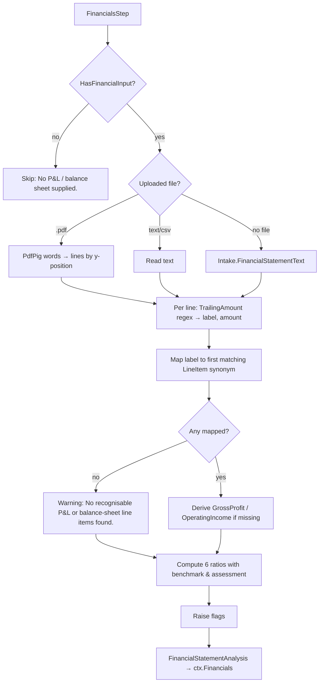
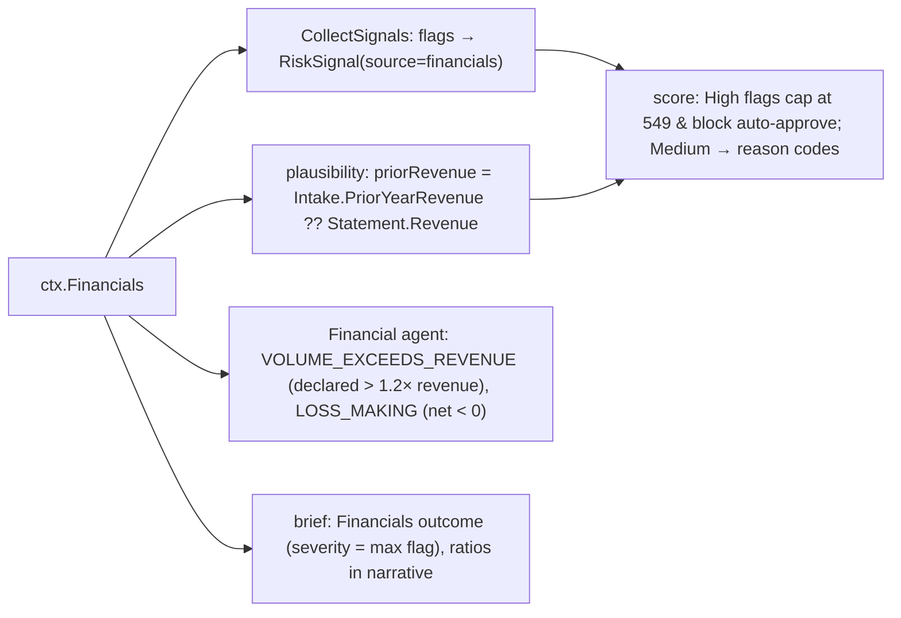

# Step 9 · `financials` — P&L / balance-sheet analysis

| | |
|---|---|
| Step id | `financials` |
| Agent | Financial (`financial`) |
| Stage | 2, runs in parallel with `bank`; both feed `plausibility` |
| Depends on | nothing (data-gated: runs only when a financial statement is supplied) |
| Can hard-stop | No |
| Consumed by | `plausibility` (revenue fallback when `PriorYearRevenue` is blank), Financial agent review, unified score (flags as reason codes), analyst brief |
| Implementation | `src/MerchantIntelligence.Underwriting/Financials/ProfitAndLossAnalyzer.cs`; wrapper `src/MerchantIntelligence.Platform/Agents/Financial/FinancialsStep.cs` |

---

## 1. Why this step exists

### Functional purpose
Extract the standard line items from an uploaded **profit-and-loss statement and/or balance sheet** (CSV, plain text or text PDF), compute classical **credit ratios** and raise flags for loss-making, thin-margin, over-leveraged or illiquid businesses. Also cross-check the declared card volume against reported revenue.

### Business question answered
*"Is this a going concern with enough margin, liquidity and equity to survive the chargeback tail we would be exposed to — and is the declared card volume even possible given its revenue?"*

### Merchant-acquiring rationale
Acquirer credit risk is *contingent* — it crystallises when a merchant cannot fund refunds/chargebacks. Classical lending ratios translate directly:
* **Gross margin** — the cushion per sale to absorb a refund or chargeback fee.
* **Net margin / loss-making** — persistent losses precede insolvency, the #1 cause of acquirer loss.
* **EBITDA / interest** — a proxy for debt-service coverage; an over-indebted merchant stops paying suppliers and starts failing to deliver goods, which produces chargebacks.
* **Current ratio, cash / monthly revenue** — near-term liquidity: can it fund a reserve and keep trading?
* **Leverage / negative equity** — how much of the enterprise is creditors' money.
* **Card volume vs revenue** — card sales cannot exceed total sales; declared volume above 120 % of revenue is a red flag for inflated applications or transaction laundering (processing someone else's sales).

### Compliance relevance
Financial statements are part of the **enhanced due-diligence** file for higher-risk merchants and are required by many sponsor banks above volume thresholds (commonly $1M+ annual). Unaudited, self-prepared statements are weak evidence; the step does not assess authenticity.

---

## 2. Inputs

| Input | Source | Notes |
|---|---|---|
| Uploaded statement | multipart `financialStatement` → `ctx.FinancialStatementDocument` | `.pdf` (text-based, words re-flowed into lines by vertical position) or any text/CSV |
| Inline text | `Intake.FinancialStatementText` | Used when no file is uploaded; `label,amount` rows or free text |
| `Intake.AnnualVolume` | intake | For `CARD_VOLUME_EXCEEDS_REVENUE` |

`ctx.HasFinancialInput` = document present **or** inline text non-blank; otherwise **Skipped** ("No P&L / balance sheet supplied.").

### 2.1 Line-item recognition
Every line is matched against `label … amount` (amount may be `(1,234.56)`, `-1234`, `$1,234`). Labels shorter than 3 characters or starting with a digit are ignored. The first label matching each synonym pattern wins (case-insensitive, anchored at line start):

| Key | Synonyms (abridged) |
|---|---|
| Revenue | (total/net) revenue, sales, income from operations, turnover, gross receipts |
| CostOfGoodsSold | cost of goods/sales/revenue, COGS, direct costs |
| GrossProfit | gross profit / gross margin |
| OperatingExpenses | (total) operating / opex / SG&A / general and administrative / overheads |
| OperatingIncome | operating income/profit, EBIT, profit from operations |
| InterestExpense | interest expense / paid / charges |
| Depreciation | depreciation, amortisation/amortization, D&A |
| NetIncome | net income / profit / earnings / loss, profit after tax, profit for the year, bottom line |
| TotalAssets, CurrentAssets, Cash (incl. "bank balances"), TotalLiabilities (not "…and equity"), CurrentLiabilities, TotalDebt (debt, borrowings, loans/notes payable, long-term debt), Equity (shareholders'/owners'/members' equity, net assets) |

All raw `label → amount` pairs are kept in `RawLines` for the analyst.

Derived when absent: `GrossProfit = Revenue − |COGS|`, `OperatingIncome = GrossProfit − |Opex|`.

---

## 3. Internal flow



### 3.1 Ratios

| Ratio | Formula | Benchmark | Assessment bands |
|---|---|---|---|
| Gross margin | GrossProfit ÷ Revenue | > 0.25 | < 0.10 Very thin · < 0.25 Thin · else Healthy |
| Net margin | NetIncome ÷ Revenue | > 0.03 | < 0 Loss-making · < 0.03 Marginal · else Healthy |
| EBITDA / interest | (OperatingIncome + |D&A|) ÷ |Interest| | > 3 | < 1.25 Cannot service debt · < 3 Tight · else Comfortable |
| Current ratio | CurrentAssets ÷ CurrentLiabilities | > 1.2 | < 1 Illiquid · < 1.2 Tight · else Adequate |
| Liabilities / equity | (TotalLiabilities ?? TotalDebt) ÷ Equity | < 2.5 | Equity ≤ 0 Negative equity · > 4 Highly leveraged · > 2.5 Leveraged · else Conservative |
| Cash / monthly revenue | Cash ÷ (Revenue ÷ 12) | > 1 | < 0.5 Under two weeks · < 1 Under a month · else Adequate |

A ratio is `null` ("n/a") whenever either operand is missing or the denominator is zero — the step never guesses.

### 3.2 Flags (reuse the `CashFlowFlag` type)

| Code | Condition | Severity |
|---|---|---|
| `LOSS_MAKING` | net margin < 0 | **High** |
| `THIN_GROSS_MARGIN` | gross margin < 0.10 | Medium |
| `WEAK_DEBT_COVERAGE` | EBITDA / interest < 1.25 | **High** |
| `ILLIQUID` | current ratio < 1 | **High** |
| `NEGATIVE_EQUITY` | equity ≤ 0 | **High** |
| `HIGH_LEVERAGE` | liabilities / equity > 4 (only when equity > 0) | Medium |
| `CARD_VOLUME_EXCEEDS_REVENUE` | declared `AnnualVolume` > 1.2 × Revenue | **High** |

---

## 4. Outputs

`FinancialStatementAnalysis(Statement: ProfitAndLoss, Ratios[6], Flags[], Warnings[])` → `ctx.Financials`.
Timeline summary: `Revenue $1,240,000 · net income $-38,000 · 2 flag(s)`.

---

## 5. Downstream impact



* **No dedicated score component.** Influence is via `VolumePlausibility` (revenue-based checks when the applicant left `PriorYearRevenue` blank) and via **High** flags (`LOSS_MAKING`, `WEAK_DEBT_COVERAGE`, `ILLIQUID`, `NEGATIVE_EQUITY`, `CARD_VOLUME_EXCEEDS_REVENUE`) which cap the unified score at 549 and block auto-approval.
* **Rules**: no default rule; `reasonCodes contains LOSS_MAKING` etc. can be added.
* **Terms**: not read directly; the Financial agent's `LOSS_MAKING` finding recommends reserve/settlement adjustments for the analyst.
* **Credit model**: not a feature.

---

## 6. Missing input, failures and coverage

| Situation | Behaviour | Downstream |
|---|---|---|
| No statement | **Skipped** | Brief "Financials: Not run" (uncovered); plausibility uses `PriorYearRevenue` only |
| Scanned PDF / no recognisable labels | Analysis succeeds with a warning and **all ratios n/a**, zero flags | Looks "clean" — analysts must read the warning; brief shows revenue n/a |
| Balance sheet only (no P&L) | Margin ratios n/a; liquidity/leverage still computed | Partial evidence |
| P&L only | Liquidity/leverage n/a | Partial evidence |
| Unusual labels ("Sales revenue, net" is fine; "Turnover incl. VAT" fine; "Receipts" **not** matched) | Item missing | Check `RawLines` |
| Amounts in thousands ("$000s") | Taken at face value | `CARD_VOLUME_EXCEEDS_REVENUE` false positive — analyst must spot the unit |
| Multi-period columns (FY23 FY24) | Only the **last** trailing amount is captured (usually the most recent or the comparative — depends on layout) | Verify period |
| Step throws (corrupt PDF) | **Failed**, `ctx.Financials=null` | Brief "Not run" |

A statement that parsed but yielded nothing is the subtle case: the step reports success, the outcome is Low severity, but the evidence is empty. The warning *"No recognisable P&L or balance-sheet line items found."* is the only tell.

---

## 7. Analyst interpretation and remediation

| Finding | Read as | Do |
|---|---|---|
| Healthy margins, current ratio > 1.2, positive equity | Solid going concern | Standard terms. |
| `LOSS_MAKING` with strong cash and equity | Growth-stage business burning capital | Acceptable with reserve; check runway (cash / monthly burn) and funding evidence. |
| `LOSS_MAKING` + `ILLIQUID` + `NEGATIVE_EQUITY` | Insolvency profile | Decline or heavy reserve + delayed settlement + personal guarantee. |
| `WEAK_DEBT_COVERAGE` | Cannot service interest from operations | Cross-check `HIGH_DEBT_SERVICE` in `bank`; ask for debt schedule. |
| `THIN_GROSS_MARGIN` | Reseller/wholesale/fuel/grocery profiles are normally thin | Compare to MCC norms before penalising; a 6 % margin is fine for MCC 5541, alarming for MCC 7372. |
| `CARD_VOLUME_EXCEEDS_REVENUE` | Inflated application, stale statement, or laundering | Ask for current-year management accounts; if volume genuinely exceeds revenue, the merchant is processing for someone else. |
| All n/a | Parse failure | Request CSV export from accounting software (QuickBooks/Xero) instead of a scanned PDF. |

### False positives / negatives
* Sign conventions vary: some statements show expenses positive, others negative; COGS and Opex are taken as absolute values, but a **net loss shown as positive under "Net loss"** is read as profit (`NetIncome` regex matches "net loss" but the sign comes from the amount).
* "Total liabilities and equity" is excluded by a negative lookahead, but "Total liabilities & equity" is **not** and will be captured as TotalLiabilities → leverage overstated.
* Interest of zero → coverage n/a (no `WEAK_DEBT_COVERAGE`), which is correct for debt-free merchants.
* Percent columns or note references at line end can be captured as the amount.

---

## 8. Worked example

Uploaded QuickBooks P&L + balance sheet CSV:

```
Total Revenue,1240000
Cost of Goods Sold,806000
Gross Profit,434000
Total Operating Expenses,452000
Interest Expense,18000
Depreciation,9000
Net Income,(38000)
Cash and cash equivalents,61000
Total Current Assets,142000
Total Current Liabilities,171000
Total Liabilities,388000
Total Equity,96000
```

Ratios: gross margin 0.35 Healthy · net margin −0.031 **Loss-making** · EBITDA/interest = (−18,000 + 9,000) ÷ 18,000 = −0.5 **Cannot service debt** · current ratio 0.83 **Illiquid** · liabilities/equity 4.04 **Highly leveraged** · cash/monthly revenue 0.59 Under a month. Declared volume $900,000 ≤ 1.2 × revenue → no volume flag.
Flags: `LOSS_MAKING` (High), `WEAK_DEBT_COVERAGE` (High), `ILLIQUID` (High), `HIGH_LEVERAGE` (Medium). Unified score capped at 549 → auto-approve blocked; Financial agent adds `LOSS_MAKING` finding; analyst pairs this with `bank` NSF evidence before deciding on reserve vs decline.
