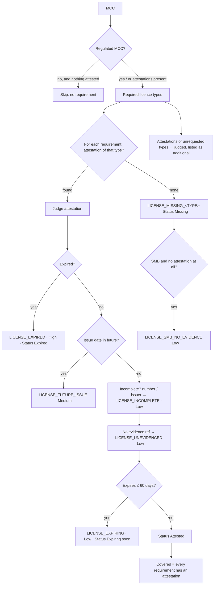

# Step 7c · `licensing` — Licences & permits (regulated MCCs, analyst-attested)

| | |
|---|---|
| Step id | `licensing` |
| Agent | KYB (`kyb`) |
| Stage | 1, runs in parallel with `verification`, `screening`, `match`, `presence`, `owners` (no dependencies beyond the implicit Profile step) |
| Depends on | Profile (`segment`) implicitly; reads `ctx.Profile.IsSmb` |
| Can hard-stop | No |
| Consumed by | KybRisk (Kyb score component) via `RiskSignal`s, explainability check outcome *Licences & permits*, analyst next steps, PDF memo, workbench *Identity & screening* tab |
| Storage | `LicensingAssessment` on `AssessmentResult.Licensing`; the attestations themselves on the intake summary (`Licenses`) |
| Implementation | `src/MerchantIntelligence.Platform/Licensing/Licensing.cs` (`LicensingAssessor`, models), `src/MerchantIntelligence.Platform/Agents/Kyb/LicensingStep.cs` |

---

## 1. Why this step exists

### Functional purpose
Some merchant categories cannot lawfully trade without a permit: a restaurant needs a health-department food-service permit, a bar an alcoholic-beverage licence, a pharmacy a board-of-pharmacy licence, a money transmitter FinCEN registration and state licences. Boarding such a merchant without the permit means the acquirer processes for an unlicensed operator — a card-brand compliance breach and, for the merchant, a business that can be shut overnight, leaving chargebacks behind.

### Business question answered
*"Does this merchant hold the permits its trade requires, and have we actually seen them?"*

### Merchant-acquiring rationale
For an SMB the permit is often the **only independent document** besides the bank statement: a food-service permit proves an inspector stood in the kitchen at 4213 Bardstown Road. Card-brand rules make the acquirer responsible for the legality of the merchant's business; a regulated MCC with no licence evidence is an underwriting gap, not a formality.

### What it proves — and what it does not
The step records **what the analyst attested from the merchant's documents** and checks it for **completeness and expiry**. It does **not** verify a licence against an issuing authority — there is no national licence registry and county / state portals are heterogeneous — so *Attested* means "seen and transcribed", never "confirmed with the issuer". **An active Secretary of State registration is not a licence** and never satisfies a requirement here: the Kentucky record for Riverbend Meat & Grill LLC proves the LLC exists, not that it may serve food.

---

## 2. Inputs

| Field | From | Used for |
|---|---|---|
| `MerchantCategoryCode` | intake | Selects the required licence types |
| `Licenses[]` — `Type`, `Number`, `IssuingAuthority`, `IssueDate`, `ExpiryDate`, `EvidenceReference` | intake (analyst) | Attestations matched against requirements |
| `ctx.Profile.IsSmb` | Profile step | Adds the `LICENSE_SMB_NO_EVIDENCE` nudge |
| Today (UTC) | clock | Expiry / expiring-soon |

### Regulated-MCC table (`LicensingAssessor`)

| Licence type | MCCs | Severity if missing | Why |
|---|---|---|---|
| `FoodService` | 5812, 5814, 5811, 5462, 5499 | Medium | Health-department food-service permit |
| `FoodService` **and** `Alcohol` | 5813 (bars) | Medium / High | Bar serves both |
| `Alcohol` | 5921 | High | Package liquor licence |
| `Tobacco` | 5993 | Medium | Tobacco / vapour retail licence |
| `Pharmacy` | 5912, 5122 | High | Board-of-pharmacy licence |
| `HealthcareProfessional` | 8011, 8021, 8031, 8041–8043, 8049, 8050, 8062, 8071, 8099 | High | Practitioner state licence |
| `Legal` | 8111 | Medium | Bar admission |
| `PersonalCare` | 7230, 7297, 7298 | Medium | Barber / cosmetology / massage establishment licence |
| `ChildCare` | 8351 | High | State child-care licence |
| `MoneyServices` | 6051, 6211, 4829, 6540 | High | FinCEN MSB registration + state money-transmitter licences |
| `Gaming` | 7995, 7800–7802 | High | Gaming-commission licence |
| `Firearms` | 5099 | High | Federal Firearms License |
| `PassengerTransport` | 4111, 4121, 4131 | Low | Local operating permit |
| `Contractor` | 1520, 1711, 1731, 1740, 1750, 1761, 1771, 1799 | Low | State contractor licence |
| `Lodging` | 7011, 7012 | Low | Occupancy / operating permit |

The table is a platform heuristic: it names the permits an acquirer would ordinarily expect, not a jurisdiction-exact legal map.

---

## 3. Internal flow



Flags are de-duplicated by code. The step is **skipped with an audited reason** when the MCC is unregulated and nothing was attested; if the analyst attests a licence for an unregulated MCC it is still judged (expiry etc.) and listed as *additional*.

---

## 4. Outputs

```csharp
LicensingAssessment(
    IReadOnlyList<LicenseRequirement> Requirements,   // Type, Reason, SeverityIfMissing, Attested?, Status
    IReadOnlyList<LicenseAttestation> Unrequested,    // attested but not required by the MCC
    IReadOnlyList<KybFlag> Flags,
    bool Covered)                                     // no requirement left without an attestation
```

`Status` ∈ `Missing` · `Attested` · `Attested (incomplete)` · `Expiring soon` · `Expired` · `Inconsistent`.

Timeline summary: `1 required · 1 attested · 2 finding(s): LICENSE_INCOMPLETE_FOODSERVICE, LICENSE_UNEVIDENCED_FOODSERVICE`.

### Flags

| Code | Severity | Meaning |
|---|---|---|
| `LICENSE_MISSING_<TYPE>` | per table (Low–High) | Required permit not attested |
| `LICENSE_EXPIRED_<TYPE>` | High | Expiry date in the past |
| `LICENSE_FUTURE_ISSUE_<TYPE>` | Medium | Issue date after today — transcription error or forged document |
| `LICENSE_INCOMPLETE_<TYPE>` | Low | No number or no issuing authority — cannot be re-checked later |
| `LICENSE_UNEVIDENCED_<TYPE>` | Low | No document reference — nothing in the file shows where it was sighted |
| `LICENSE_EXPIRING_<TYPE>` | Low | Expires within 60 days — diarise renewal evidence |
| `LICENSE_SMB_NO_EVIDENCE` | Low | Regulated Micro / Small merchant with no licence evidence at all |

---

## 5. Downstream impact

- **Unified score** — flags become `RiskSignal("licensing", …)` and feed the Kyb component like any KYB flag: a High (`LICENSE_EXPIRED_*`, `LICENSE_MISSING_ALCOHOL`) lifts KybRisk to High and applies the high-severity cap; a Medium (`LICENSE_MISSING_FOODSERVICE`) makes Approve unlikely without analyst review.
- **Coverage** — `Covered=false` counts the step as a coverage gap for the applicable-components denominator (SMB weight table gives Kyb 0.25).
- **Explainability** — check outcome *Licences & permits* (`n/m attested`) with per-requirement status; narrative line; next steps *"Obtain the merchant's food service permit (MCC 5812); company registration does not substitute for it."* and, on expiry, *"hold boarding until renewal evidence is supplied."*
- **PDF memo** — via the check-outcome and findings tables.
- **Workbench** — *Licences & permits* table on the Identity & screening tab; intake block with type / number / issuer / issued / expires / evidence per row.

---

## 6. Missing input, failures and coverage

| Situation | Behaviour |
|---|---|
| Unregulated MCC, nothing attested | Skipped, `Covered=true`, no flags |
| Regulated MCC, nothing attested | `LICENSE_MISSING_*` per requirement, `Covered=false`; SMB adds `LICENSE_SMB_NO_EVIDENCE` |
| Attestation without dates | Judged on completeness only; no expiry finding (unknown ≠ expired) |
| Attestation for another type than required | Requirement stays *Missing*; the attestation is listed as *additional* |

Nothing external is called, so the step cannot fail on availability.

---

## 7. Analyst interpretation and remediation

- *Missing* — ask for the permit before boarding. For a restaurant, the county health department's permit (Louisville: Louisville Metro Department of Public Health & Wellness) is usually displayed on the premises and can be photographed.
- *Expired* — hold. Many jurisdictions allow a grace period, but the acquirer should see the renewal.
- *Incomplete / unevidenced* — go back to the document and transcribe number, issuer and attach the file reference; the finding is Low because the permit exists, but a file that cannot be re-checked is weak audit evidence.
- **Never** treat "Active / Good standing" from the Secretary of State as satisfying a licence requirement.

### False positives / negatives
- A licence transcribed under the wrong type (e.g. *Other* for a food permit) leaves the requirement *Missing* — pick the specific type.
- MCCs outside the table (e.g. 5411 grocery with a deli counter) are not asked for a permit; the analyst may still attest one.
- Attested is not verified: a forged permit passes this step; the defence is the document reference and, where available, the issuer's own lookup.

---

## 8. Worked examples

**Riverbend Meat & Grill LLC (fictional SMB preset)** — MCC 5812, one `FoodService` row with no number, issuer, dates or evidence (the preset pre-fills the type only). Result: `Covered=true` (a requirement is matched), `LICENSE_INCOMPLETE_FOODSERVICE` and `LICENSE_UNEVIDENCED_FOODSERVICE` (Low). Clearing the row instead gives `LICENSE_MISSING_FOODSERVICE` (Medium) + `LICENSE_SMB_NO_EVIDENCE`, `Covered=false`.

**Bar, MCC 5813** with only a food permit attested → `LICENSE_MISSING_ALCOHOL` (High); KybRisk High.

**Pharmacy, MCC 5912**, licence expiring in 30 days → `LICENSE_EXPIRING_PHARMACY` (Low), status *Expiring soon*, covered.
