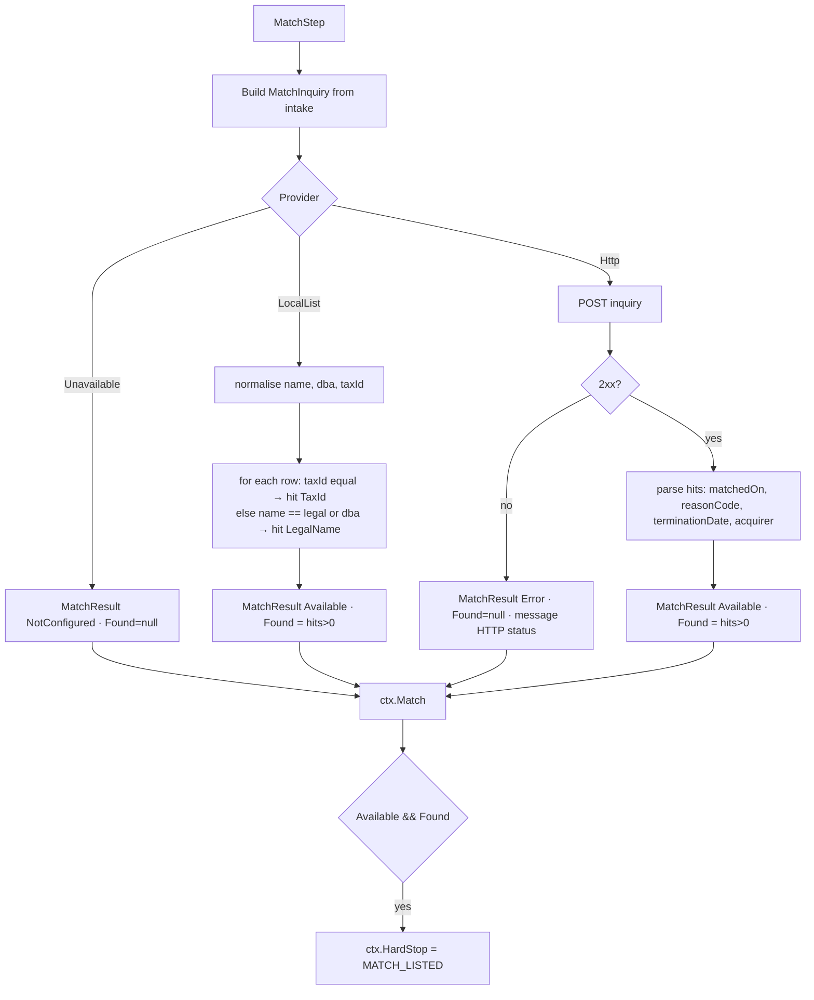
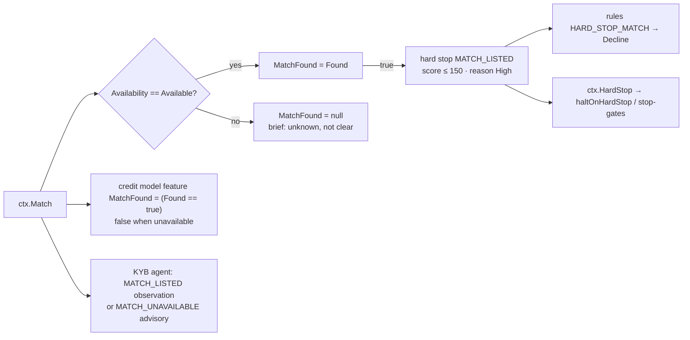

# Step 6 · `match` — MATCH / terminated-merchant (TMF) inquiry

| | |
|---|---|
| Step id | `match` |
| Agent | KYB (`kyb`) |
| Stage | 1, runs in parallel with `screening` and `presence` |
| Depends on | nothing (the planner runs it after `verification` because the KYB agent owns it, but it has no data dependency) |
| Can hard-stop | **Yes** — `MATCH_LISTED` |
| Consumed by | `credit` (the `MatchFound` model feature — `credit` depends on this step), `score` (hard stop, reason code), rules `HARD_STOP_MATCH`, KYB agent review, analyst brief |
| Implementation | `src/MerchantIntelligence.Platform/Integrations/MatchProvider.cs`; wrapper `src/MerchantIntelligence.Platform/Agents/Kyb/MatchStep.cs`; wiring `PlatformServiceCollectionExtensions.cs` |

---

## 1. Why this step exists

### Functional purpose
Ask the configured terminated-merchant source whether this business, its tax id, or any of its principals has previously been **terminated by another acquirer for cause**.

### Business question answered
*"Has anyone in the payments industry already thrown this merchant out — and why?"*

### Domain background — what MATCH is
**MATCH** (Member Alert To Control High-risk merchants, formerly the Terminated Merchant File / TMF) is a Mastercard-operated database that acquirers are *required* to query before signing a merchant and to *populate* when they terminate one for a listed reason. A listing stays for five years. It is the industry's shared memory of bad merchants: excessive chargebacks, fraud, laundering (transaction laundering / factoring), PCI breaches, illegal transactions, identity theft. Visa has no equivalent public file; acquirers rely on MATCH for both brands.

Standard MATCH reason codes surfaced by this step:

| Code | Meaning | Underwriting weight |
|---|---|---|
| 01 | Account data compromise | Security failure |
| 02 | Common point of purchase | Card data compromise traced to merchant |
| 03 | Laundering | Processing for an undisclosed third party — very serious |
| 04 | Excessive chargebacks | Programme breach (VDMP/ECP thresholds) |
| 05 | Excessive fraud | Fraud-to-sales ratio breach |
| 07 | Fraud conviction | Criminal |
| 08 | Mastercard Questionable Merchant Audit Program | Brand audit finding |
| 09 | Bankruptcy / liquidation / insolvency | Credit event |
| 10 | Violation of Mastercard standards | Rules breach |
| 11 | Merchant collusion | Criminal / bust-out |
| 12 | PCI DSS non-compliance | Security |
| 13 | Illegal transactions | Criminal |
| 14 | Identity theft | Merchant identity was itself stolen — the *current* applicant may be a victim, not a perpetrator |

### Compliance and access reality
MATCH is only accessible to Mastercard-licensed acquirers (or via a sponsor bank / ISO agreement). **This suite ships without a working client.** Out of the box the step returns `NotConfigured`, which the entire downstream chain treats as *unknown — not clear*. This is one of the most important honesty properties of the system: a merchant is never shown as "MATCH clear" because nobody asked.

### Fraud relevance
Re-application by terminated merchants under a new legal name, new DBA, or a relative's name is the classic "MATCH evasion" pattern. Matching on tax id and principals (not just name) is how that is caught, which is why the inquiry carries both.

---

## 2. Inputs

`MatchInquiry` built by `MatchStep`:

| Field | From intake | Purpose |
|---|---|---|
| `LegalName` | `Business.LegalName` | Name match |
| `DoingBusinessAs` | `Business.TradingName` | DBA match |
| `TaxId` | `Business.TaxId` | Strongest identifier (EIN) |
| `Country`, `AddressLine`, `City`, `Region`, `PostalCode` | `Business.*` | Address match (HTTP provider only) |
| `Principals[]` | each `Owner` → `MatchPrincipal(FirstName, LastName, DateOfBirth, NationalId=null)` — `FullName` is split at the first space | Principal match (HTTP provider only) |

Principal national ids are never sent (the intake does not collect SSN/national id).

### Provider selection (`Match:*` configuration)

```mermaid
flowchart TD
    C{Match options} -->|Endpoint set| H[HttpMatchProvider<br/>POST inquiry JSON, Bearer ApiKey<br/>parses hits[] → MatchHit]
    C -->|else LocalListPath exists| L[LocalListMatchProvider<br/>CSV: name,taxId,reasonCode,terminationDate,acquirer]
    C -->|else| U[UnavailableMatchProvider<br/>Availability = NotConfigured]
```

* **HttpMatchProvider** — thin client for a MATCH-compatible endpoint (Mastercard Developers MATCH API or an internal proxy). Non-2xx or transport/JSON error → `Availability=Error`.
* **LocalListMatchProvider** — an acquirer's own TMF export. Hit when normalised tax id equals, or normalised legal name / DBA equals a row's name (normalisation = lower-case alphanumerics only; exact after that, **no fuzzy matching**). Principals and address are ignored by this provider.
* **UnavailableMatchProvider** — default; message *"MATCH access requires Mastercard acquirer credentials; configure Match:Endpoint/ApiKey or Match:LocalListPath. Result is UNKNOWN, not clear."*

---

## 3. Internal flow



Timeline summary: `FOUND · 2 hit(s) via local-list`, `No record via http`, or `NotConfigured · MATCH access requires …`.

---

## 4. Outputs

```csharp
MatchResult(
    MatchAvailability Availability,   // NotConfigured | Available | Error
    bool? Found,                      // null unless Available
    IReadOnlyList<MatchHit> Hits,     // MatchedOn, ReasonCode, ReasonDescription, TerminationDate, Acquirer
    string Provider,                  // "none" | "local-list" | "http"
    string? Message)
```

There are no risk flags on this step; its result is consumed structurally.

---

## 5. Downstream impact



### Unified score
* `MatchFound == true` → `hardStops += MATCH_LISTED`, reason `MATCH_LISTED` (High), score capped at 150, tier `VeryHigh`, recommended action Decline. There is no score *component* for MATCH — it is binary and terminal.
* `MatchFound == null` (unavailable) → no penalty, no coverage change in the numeric score, but the brief records an **Unavailable** outcome (`Covered=false`) with next action *"Run a MATCH / terminated-merchant inquiry through your sponsor bank before final approval."*

### Rules
`HARD_STOP_MATCH` (priority 1): `matchFound eq true` → **Decline** ("declined unless an analyst overrides"). The `matchFound` fact falls back to the credit-model feature when the scorer input is null, i.e. `false` when unavailable — the rule simply does not fire.

### Credit model
`MerchantApplication.MatchFound = Match?.Found == true` is one of the six LightGBM features (see `credit` page). The feature vector is built lazily so it sees the MATCH result; `credit` declares a dependency on `match` to guarantee ordering. An unavailable MATCH therefore enters the model as `false`, which is the model's best-effort default, not evidence.

### Workflow control
`ctx.HardStop` returns `MATCH_LISTED` when `Available && Found`. With `haltOnHardStop: true`, remaining evidence steps are skipped. Stop-gates on `match` can fire on `HardStop`.

---

## 6. Missing input, failures and coverage

| Situation | Result | Downstream |
|---|---|---|
| No provider configured (default) | `NotConfigured`, `Found=null` | Brief outcome **NotConfigured** (Medium, uncovered): "Treated as unknown, not clear"; agent advisory `MATCH_UNAVAILABLE`; no score change; next action to run MATCH via sponsor bank |
| HTTP endpoint down / non-2xx / bad JSON | `Error`, `Found=null` | Same treatment as NotConfigured, message carries the HTTP status or exception |
| Local list configured but file missing | Falls back to `UnavailableMatchProvider` at startup | NotConfigured |
| No `TaxId` on intake | Local list can only match on name/DBA; HTTP provider matches on what it has | Weaker evasion detection — encourage EIN capture |
| No owners | No principals in inquiry | Principal-level evasion undetectable |
| Step throws / times out | `Failed`, `ctx.Match=null` | Brief "MATCH / TMF: Not run — Inquiry failed" (Medium, uncovered); `credit` still runs (dependency satisfied by completion, not success) with `MatchFound=false` |

The numeric coverage percentage is **not** reduced by an unavailable MATCH (it is not a score component), so an assessment can reach `AUTO_APPROVE` with MATCH unknown. The brief's uncovered outcome and the next-action line are the analyst's control; production acquirers should configure a provider.

---

## 7. Analyst interpretation and remediation

| Result | Read as | Do |
|---|---|---|
| `FOUND`, reason 03/05/07/11/13 | Prior termination for laundering / fraud / criminal | Decline. Document acquirer and date. |
| `FOUND`, reason 04 | Excessive chargebacks | Decline by default; if > 5 years ago or business model changed, an override with senior approval and rolling reserve may be considered. |
| `FOUND`, reason 09 | Bankruptcy | Check whether the *entity* is the same or a successor; often decline. |
| `FOUND`, reason 12 | PCI non-compliance | Require current PCI AOC before any override. |
| `FOUND`, reason 14 | Identity theft | The applicant may be the victim — verify with the listing acquirer before declining. |
| `FOUND` on `LegalName` only (local list) | Name collision possible | Compare tax id, address, principals manually before acting. |
| `No record via http` | Genuinely clear as of today | Record inquiry date; MATCH is also re-queried at boarding by most sponsors. |
| `NotConfigured` / `Error` | **Unknown** | Do not approve as final until an inquiry has been run through the sponsor bank. |

### False positives / negatives
* Local-list matching is exact after normalisation: "Acme Inc" and "Acme Incorporated" do not match (false negative), while two unrelated "Cafe Roma" entries do match by name (false positive) — hence the guidance to compare tax id.
* A real MATCH inquiry returns *possible* matches on partial data (phone, address, principal); the HTTP provider takes the endpoint's `hits[]` at face value and marks `Found=true` on any hit. Analysts must read `MatchedOn`.
* Principal matching relies on splitting `FullName` at the first space: "Mary Ann Smith" → first "Mary", last "Ann Smith".

---

## 8. Worked examples

**A. Default deployment.** No `Match:*` options. Result `NotConfigured`. Brief: "MATCH / TMF — NotConfigured: MATCH access requires Mastercard acquirer credentials … Treated as unknown, not clear." Agent advisory `MATCH_UNAVAILABLE`. Score otherwise unaffected; next-actions list includes running MATCH via the sponsor bank. Credit feature `MatchFound=false`.

**B. Internal TMF export configured.** `Match:LocalListPath=data/tmf.csv` containing `Northwind Traders Inc,82-4471123,04,2023-11-02,First Acquirer Bank`. Applicant "Northwind Trading LLC" with EIN 82-4471123 → tax id match → hit `TaxId · 04 Excessive chargebacks · 2023-11-02 · First Acquirer Bank`. `Found=true` → `MATCH_LISTED` hard stop, score ≤ 150, rule `HARD_STOP_MATCH` → Decline. The name change did not help the applicant.

**C. HTTP provider, clean.** Endpoint returns `{"hits": []}` → `Available`, `Found=false`. Brief "MATCH / TMF — Clear: No record via http" (Low, covered). Credit feature `MatchFound=false` — now as evidence rather than default.

**D. HTTP provider, outage.** Endpoint returns 503 → `Error`, message "MATCH endpoint returned HTTP 503." Brief outcome **Error**, uncovered; treated exactly like NotConfigured. Re-run when the endpoint recovers.
