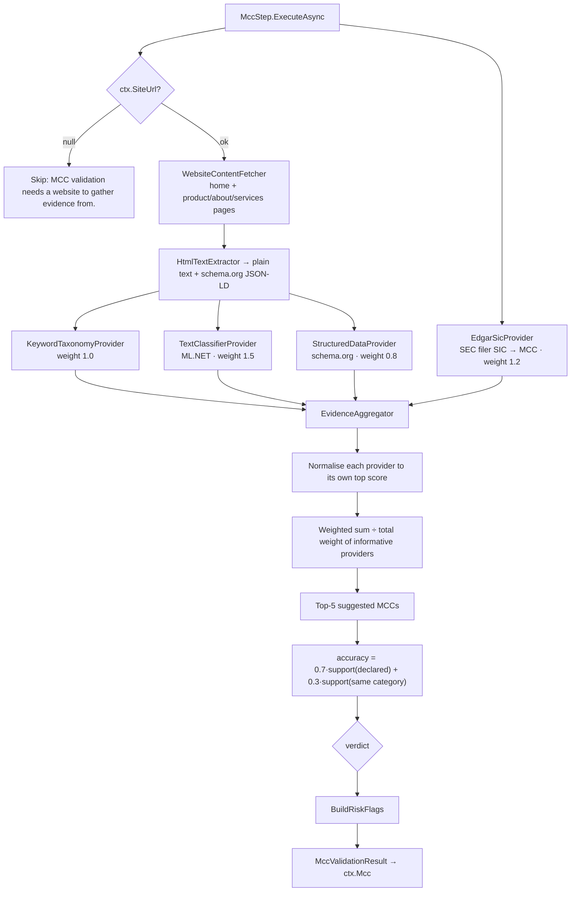
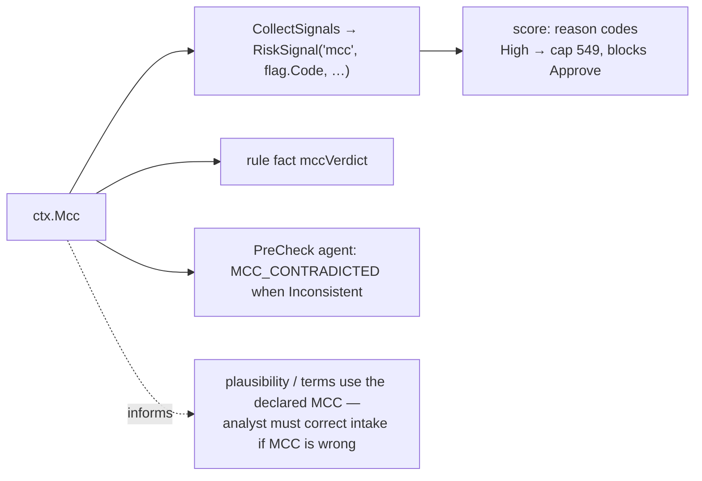

# Step 3 · `mcc` — MCC validation

| | |
|---|---|
| Step id | `mcc` |
| Agent | Pre-check (`precheck`) |
| Stage | 1, in parallel with `prohibited` (both follow `website`) |
| Depends on | nothing declared; needs a website URL to run |
| Consumed by | `score` (risk-flag signals such as `HIDDEN_HIGH_RISK`, `MCC_MISMATCH`), rules engine fact `mccVerdict`, Pre-check agent finding `MCC_CONTRADICTED`, analyst brief |
| Required | No — skipped when no website URL is supplied |
| Implementation | `src/MerchantIntelligence.MccValidation/` (`Validation/MccValidationService.cs`, `EvidenceProviders.cs`, `EvidenceAggregator.cs`, `Classification/MccTextClassifier.cs`, `Taxonomy/MccCatalog.cs`); wrapper `src/MerchantIntelligence.Platform/Agents/PreCheck/MccStep.cs` |

---

## 1. Why this step exists

### Functional purpose
The Merchant Category Code is a four-digit ISO 18245 code that tells the card network what the merchant sells. The merchant (or the sales agent) *declares* it at application. This step gathers independent evidence from the merchant's website and asks: **does what the site sells agree with the declared MCC?**

### Business / underwriting question answered
*"Is the declared MCC accurate — and if it is wrong, is the true category riskier than the one declared?"*

### Merchant-acquiring rationale
The MCC drives almost everything downstream in acquiring:

* **Interchange** — issuers price transactions by MCC; a mis-coded merchant causes downgrades, interchange leakage and scheme fines for the acquirer.
* **Scheme registration and fees** — high-risk MCCs (7995 gambling, 5912 pharmacy, 5966/5967 direct marketing, 6051 quasi-cash…) require registration and carry annual programme fees. Declaring 5999 to avoid 7995 is a registration breach for the acquirer.
* **Chargeback expectations and monitoring thresholds** — chargeback-rate norms and reserve policies are set per MCC. The `plausibility` step and `terms` step both take the MCC as an input; a wrong MCC contaminates their outputs.
* **Cardholder controls** — corporate cards, HSA/FSA cards and some issuer rules block or allow transactions by MCC; mis-coding produces declines and complaints.
* **Model inputs** — the credit model uses `MerchantCategoryCode` as a feature; validating it protects the model from adversarial input.

### Compliance / fraud relevance
MCC misdeclaration is the mechanism of **transaction laundering** and **MCC arbitrage**. A merchant declares 5734 (software) and processes for an online casino; or declares 5499 (food store) and sells nutraceutical free trials. Detecting the divergence between declared and observed category before boarding is materially cheaper than discovering it via a BRAM fine.

---

## 2. Inputs

| Input | Source | Use |
|---|---|---|
| `MerchantCategoryCode` | intake | The claim being tested. Looked up in `mcc-catalog.json` for description, category group and risk tier. |
| `Business.WebsiteUrl` (parsed `ctx.SiteUrl`) | intake | Evidence source. Fetched and text-extracted by `WebsiteContentFetcher` + `HtmlTextExtractor`. |
| `mcc-catalog.json` | embedded | MCC → description, category, risk tier, keywords. |
| `sic-to-mcc.json` | embedded | Crosswalk used by the EDGAR provider. |
| `models/mcc-classifier.zip` | model artifact | ML.NET TF-IDF + SDCA maximum-entropy classifier. |

External sources: the merchant website; SEC EDGAR full-text company search (`efts.sec.gov` / `data.sec.gov`, keyless) for the SIC crosswalk when the business is a public filer.

---

## 3. How the domain process works

A manual MCC review: the underwriter opens the site, reads the product pages, decides what industry it is, looks the industry up in the MCC handbook and compares. If the merchant is a public company they might check its SEC SIC code. The suite models this as **four independent "evidence providers"**, each of which votes for candidate MCCs, and an aggregator that turns the votes into an accuracy score and verdict.

---

## 4. Internal flow



### 4.1 Evidence providers

| Provider | Weight | Method | Abstains when |
|---|---|---|---|
| **Website keyword taxonomy** | 1.0 | Counts catalog keywords per MCC in the extracted text; scores by hit count. Deterministic and explainable. | No keyword matched. |
| **ML text classifier (EDGAR-trained)** | 1.5 | ML.NET pipeline: text featurisation (TF-IDF, word 1–2-grams) → SDCA maximum-entropy multiclass. Returns top-k MCC probabilities. Trained on public-company websites labelled via SIC→MCC crosswalk (`DataPipeline`). | Top probability < `MinProbability = 0.10` — the provider reports "classifier abstains". |
| **schema.org structured data** | 0.8 | Reads JSON-LD / microdata `@type` (e.g. `Restaurant`, `Dentist`, `ClothingStore`) and maps to MCCs. High precision, low recall. | No structured data. |
| **SEC EDGAR filer (SIC crosswalk)** | 1.2 | Searches EDGAR for the legal name; if a filer is found, maps its SIC code to an MCC via `sic-to-mcc.json` with fixed confidence 0.9. | Not a filer, or EDGAR unreachable. |

A provider that throws or times out returns `Succeeded = false`; it is excluded from the vote and reported in `PROVIDER_UNAVAILABLE`.

### 4.2 Aggregation
1. Only *informative* providers (succeeded and returned ≥ 1 candidate) participate.
2. Each provider's candidates are divided by that provider's own top score → range [0,1]. This stops a provider with large raw scores dominating.
3. `combined[mcc] += weight × normalisedScore`; the result is divided by the total weight of informative providers so the top candidate can reach 1.0 only when *every* provider agrees.
4. `declaredSupport` = combined score of the declared MCC; `sameCategorySupport` = sum of combined scores of every suggested MCC in the same catalog category (e.g. all *Restaurants & Food* codes).
5. `accuracy = clamp(0.7 × declaredSupport + 0.3 × sameCategorySupport, 0, 1)` — reported as `AccuracyPercent`.

### 4.3 Verdict thresholds

| Verdict | Condition | Meaning |
|---|---|---|
| `Insufficient` | No informative provider | Website not analysable — **not** a pass |
| `Consistent` | accuracy ≥ 0.55 | Evidence supports the declared MCC |
| `Questionable` | accuracy ≥ 0.25, or same-category support ≥ 0.5 | Right industry, possibly wrong code; or thin evidence |
| `Inconsistent` | otherwise | Evidence points elsewhere |

### 4.4 Risk flags

| Code | Severity | Condition |
|---|---|---|
| `UNKNOWN_MCC` | Medium | Declared MCC not in catalog |
| `HIGH_RISK_MCC` | High | Declared MCC is catalogued as high-risk (honest declaration; still drives EDD) |
| `HIDDEN_HIGH_RISK` | **High** | Declared MCC is *not* high-risk, but a high-risk MCC ≠ declared has combined score ≥ 0.25 **and** is corroborated (voted for by >1 provider, or is some provider's top pick). This is the transaction-laundering flag. |
| `MCC_MISMATCH` | Medium | Verdict `Inconsistent` and the top suggested MCC differs from declared (and is not already the hidden-high-risk one) |
| `PROVIDER_UNAVAILABLE` | Low | One or more providers failed |
| `INSUFFICIENT_EVIDENCE` | Medium | Verdict `Insufficient` — manual review required |

The corroboration rule exists because per-provider normalisation inflates a lone provider's lower-ranked guesses; a single weak vote must not trigger a High flag.

---

## 5. Outputs

```csharp
MccValidationResult(
    int DeclaredMcc,
    string DeclaredDescription,
    RiskTier DeclaredRiskTier,
    Uri WebsiteUrl,
    MccVerdict Verdict,                        // Consistent | Questionable | Inconsistent | Insufficient
    double AccuracyPercent,                    // 0–100
    IReadOnlyList<MccCandidate> SuggestedMccs, // top 5 with combined score
    IReadOnlyList<RiskFlag> RiskFlags,
    IReadOnlyList<ProviderEvidence> Evidence,  // per provider: success, candidates, highlights
    IReadOnlyList<Uri> PagesAnalyzed)
```

Timeline summary: `Consistent · 78% agreement · suggests 5812 Eating places` etc.

---

## 6. Downstream impact



* **Unified score.** There is no dedicated MCC component; MCC risk flags enter as reason codes with source `mcc` and their original codes. `HIDDEN_HIGH_RISK` and `HIGH_RISK_MCC` are High → the unified score is capped at 549, auto-approve is blocked and `HIGH_SEVERITY_REFER` fires. Medium/Low flags (`MCC_MISMATCH`, `INSUFFICIENT_EVIDENCE`, `UNKNOWN_MCC`, `PROVIDER_UNAVAILABLE`) do not change the number; they appear in the reason list and the brief so the analyst sees them.
* **Rules.** `mccVerdict` is available as a fact (`"Consistent"`, `"Inconsistent"`…) so a tenant can add e.g. `{ "field": "mccVerdict", "op": "eq", "value": "Inconsistent" } → Refer`. The default rule set does not reference it directly.
* **Pre-check agent** emits observation `MCC_CONTRADICTED` with "Consider MCC {top} instead."
* **Plausibility, terms, credit model** all consume the *declared* MCC from intake, not the suggested one. The system never silently re-codes the merchant; the analyst must amend the application.

---

## 7. Missing input, failures and coverage

| Situation | Status | Effect |
|---|---|---|
| No website URL | `Skipped` — "MCC validation needs a website to gather evidence from." | `ctx.Mcc = null`. No signals. Coverage is unaffected (no component) but the analyst brief lacks MCC corroboration; the Pre-check agent's `NO_WEBSITE` advisory covers this. |
| Website unreachable | `Succeeded`, verdict `Insufficient`, flag `INSUFFICIENT_EVIDENCE` (Medium) | Reason code surfaces in the brief; no numeric effect and not a hard stop. |
| Classifier model missing / EDGAR down | Provider marked failed → `PROVIDER_UNAVAILABLE` (Low) | Remaining providers vote; accuracy may be lower and `Questionable` more likely. |
| Step throws | `Failed` (default `onFail: Skip`) | Treated as not run. |

`Insufficient` and `Questionable` are **not** clean results — they mean the evidence did not confirm the MCC.

---

## 8. Analyst interpretation and remediation

| Result | Interpretation | Action |
|---|---|---|
| `Consistent`, ≥ 70 % | Declared MCC corroborated | None. |
| `Questionable`, same-category support high | Right industry, imprecise code (5812 vs 5814) | Correct the MCC to the top suggestion if it fits; low risk. |
| `Questionable`, thin evidence (single provider) | Site too sparse to judge | Review product pages manually; request catalogue or price list. |
| `Inconsistent` + `MCC_MISMATCH` | Site sells something else | Re-code and re-run plausibility/terms; ask merchant why. |
| `HIDDEN_HIGH_RISK` | Possible laundering / arbitrage | Refer. Compare with `prohibited` flags; request licences; if boarded, code to the high-risk MCC and register. |
| `HIGH_RISK_MCC` | Honest high-risk declaration | Apply high-risk programme (registration, reserve, monitoring). |
| `INSUFFICIENT_EVIDENCE` | Site unreadable | Retry; if persistent treat MCC as unverified in the case notes. |

### False positives / negatives
* **Multi-line businesses** (a gym that sells supplements) split the vote → `Questionable`. Legitimate.
* **Marketplaces / agencies** whose sites describe *clients'* industries mislead the classifier.
* **EDGAR name collisions** — a small business sharing its name with a public filer can receive a wrong SIC-derived vote (weight 1.2). The corroboration rule limits the damage, but analysts should check `Evidence` for the EDGAR highlight.
* **Sparse or JavaScript-only sites** yield few keywords; the classifier abstains below 10 % and the verdict degrades to `Questionable`/`Insufficient` rather than to a false `Inconsistent`.
* The classifier was trained on public-company websites; small-business vocabulary is under-represented (this is a known limitation, noted in the wiki as a future data-pipeline improvement).

---

## 9. Worked example

Declared MCC **5734** (computer software stores). Website: a subscription "sports picks" service with "guaranteed winners", "bet slips", "odds".

* Keyword provider: 7995 (0.8), 7999 (0.3) — top 7995.
* Classifier: 7995 p=0.46, 5734 p=0.12 — top 7995.
* Structured data: none (abstains).
* EDGAR: not a filer (abstains).
* Informative weight = 1.0 + 1.5 = 2.5. Combined: 7995 = (1.0·1 + 1.5·1)/2.5 = **1.0**; 5734 = (1.5·0.26)/2.5 = 0.16; 7999 = 0.15.
* `declaredSupport` = 0.16; same-category support (Software/Services) ≈ 0.16 → accuracy = 0.7·0.16 + 0.3·0.16 = **0.16 → Inconsistent**.
* 7995 is high-risk, ≠ declared, score ≥ 0.25, corroborated by two providers → `HIDDEN_HIGH_RISK` (High). Top ≠ declared but equals the hidden-high-risk MCC → no separate `MCC_MISMATCH`.
* Signal `HIDDEN_HIGH_RISK` (source `mcc`) High → unified score capped at 549, `HIGH_SEVERITY_REFER`; agent finding `MCC_CONTRADICTED`. Analyst refers, with `prohibited` almost certainly showing `RESTRICTED_GAMBLING` as well.
