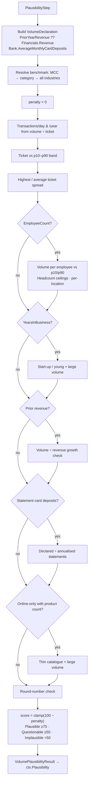
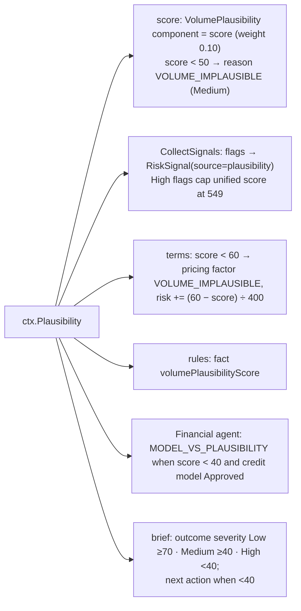

# Step 10 · `plausibility` — Declared volume plausibility

| | |
|---|---|
| Step id | `plausibility` |
| Agent | Financial (`financial`) |
| Stage | 2, after `bank` and `financials` (soft dependency — runs even when both were skipped) |
| Depends on | `bank`, `financials` (optional evidence); intake declaration; embedded industry benchmarks |
| Can hard-stop | No |
| Consumed by | `score` (`VolumePlausibility` component, 10 %), `terms` (pricing factor), rules (`volumePlausibilityScore` fact), Financial agent, analyst brief |
| Implementation | `src/MerchantIntelligence.Underwriting/Plausibility/VolumePlausibilityAnalyzer.cs`, `Benchmarks/IndustryBenchmarks.cs`, `Resources/industry-benchmarks.json`; wrapper `src/MerchantIntelligence.Platform/Agents/Financial/PlausibilityStep.cs` |

---

## 1. Why this step exists

### Functional purpose
Cross-check the merchant's **self-declared processing profile** — annual card volume, average and highest ticket, headcount, locations, tenure, prior revenue, catalogue size — against **industry benchmarks for its MCC** and against whatever hard evidence exists (bank statement settlements, P&L revenue). Produce a 0–100 plausibility score, a verdict and flags.

### Business question answered
*"Could a business like this really process the volume it says it will — and if not, what is it hiding?"*

### Merchant-acquiring rationale
Everything in acquiring pricing and exposure is driven by declared volume and ticket size: reserve percentages, settlement delay, monitoring thresholds, interchange forecasts and the size of the credit line the acquirer is implicitly extending. Applicants inflate or distort these numbers for several reasons, each a different risk:

| Pattern | Typical purpose | Signals here |
|---|---|---|
| **Inflated volume** | Get better pricing, higher limits, avoid velocity blocks later | Volume ≫ statements/revenue, volume/employee far above peers, start-up declaring millions |
| **Bust-out set-up** | Board with a benign profile, then run stolen cards / non-delivered goods | Very high ticket, thin catalogue, new business, large volume, extreme ticket spread |
| **Load balancing / shells** | Spread chargebacks across acquirers to stay under VDMP/ECP thresholds | Statements show *more* card deposits than declared; multiple processors (`bank`) |
| **Headcount fiction** | Look established | Headcount above industry ceiling, or employees who could not possibly generate the volume |
| **Guessed figures** | Careless application | Exact round millions |

### Underwriting rationale
Plausibility is a *consistency* check, not a creditworthiness check: it asks whether the story hangs together. A low score means the underwriter cannot rely on the declaration for exposure sizing and must obtain processing history before final terms.

---

## 2. Inputs

`VolumeDeclaration` is assembled by the step from intake and earlier steps:

| Field | From | Meaning |
|---|---|---|
| `AnnualVolume` | intake | Declared annual card volume (required) |
| `AverageTicket` | intake | Declared average sale; floored at 0.01 |
| `HighestTicket` | intake | Largest expected single sale |
| `MerchantCategoryCode` | intake (declared MCC, **not** the `mcc` step's suggestion) | Selects the benchmark row |
| `EmployeeCount`, `LocationCount` | intake | Capacity checks |
| `YearsInBusiness` | intake | Tenure checks |
| `PriorYearRevenue` | intake, **falling back to** `ctx.Financials.Statement.Revenue` | Volume-vs-revenue check |
| `MonthlyCardVolumeFromStatements` | `ctx.Bank.AverageMonthlyCardDeposits` | Volume-vs-evidence check |
| `WebsiteProductCount`, `HasPhysicalLocation` | intake | Catalogue check for online-only merchants |

### Benchmarks (`industry-benchmarks.json`)
Approximate US SMB benchmarks per MCC **catalog category** (Agricultural Services, Contracted Services, Retail, Restaurants, …) with optional per-MCC overrides:

* `revenuePerEmployee` p10 / p50 / p90 (USD per year)
* `ticket` p10 / p90 (USD)
* `chargebackRate`, `deliveryDays` (used by `terms`, not here)
* `maxEmployeesPerLocation`, `maxEmployees` (headcount ceilings; defaults 300 / 5,000)

Resolution order: exact MCC override → MCC's category → "All industries" fallback (rev/employee 60k / 150k / 500k, ticket 15–1,500). `BenchmarkSource` in the result records which was used (`MCC 5812`, `Category 'Retail'`, `All industries`).

---

## 3. Internal flow



### 3.1 Checks, flags and penalties

| Check | Flag | Condition | Severity | Penalty |
|---|---|---|---|---|
| Transaction count | `IMPLAUSIBLY_FEW_TRANSACTIONS` | volume ÷ ticket < 24 per year | Medium | 15 |
| Ticket vs industry | `TICKET_FAR_ABOVE_INDUSTRY` | ticket > 3 × p90 | **High** | 25 |
| | `TICKET_ABOVE_INDUSTRY` | ticket > p90 | Medium | 10 |
| Ticket spread | `EXTREME_TICKET_SPREAD` | highest ÷ average > 50 | Medium | 10 |
| Volume per employee | `VOLUME_EXCEEDS_HEADCOUNT_CAPACITY` | > 2 × p90 | **High** | 30 |
| | `VOLUME_HIGH_FOR_HEADCOUNT` | > p90 | Medium | 12 |
| | `HEADCOUNT_IMPLAUSIBLE_FOR_VOLUME` | < p10 ÷ 20 | **High** | 30 |
| | `HEADCOUNT_HIGH_FOR_VOLUME` | < p10 ÷ 4 | Medium | 12 |
| Headcount ceiling | `HEADCOUNT_ABOVE_INDUSTRY_CEILING` | employees > max(maxEmployees, locations × maxPerLocation) | **High** | 25 |
| | `HEADCOUNT_HIGH_FOR_LOCATIONS` | employees ÷ locations > maxPerLocation (and not already above ceiling) | Medium | 12 |
| Volume per location | `VOLUME_PER_LOCATION_FAR_ABOVE_MCC` | volume ÷ locations > 3 × MCC p90 per site | **High** | 25 |
| | `VOLUME_PER_LOCATION_ABOVE_MCC` | > MCC p90 per site | Medium | 10 |
| | `VOLUME_PER_LOCATION_FAR_BELOW_MCC` | < MCC p10 ÷ 4 per site | Medium | 10 |
| | `VOLUME_PER_LOCATION_BELOW_MCC` | < MCC p10 per site | Low | 4 |
| Tenure | `STARTUP_WITH_LARGE_VOLUME` | < 1 year and volume > $1M | **High** | 25 |
| | `YOUNG_BUSINESS_LARGE_VOLUME` | < 2 years and volume > $5M | Medium | 12 |
| Prior revenue | `VOLUME_EXCEEDS_REVENUE` | volume ÷ revenue > 3 | **High** | 30 |
| | `AGGRESSIVE_GROWTH_ASSUMPTION` | > 1.5 | Medium | 12 |
| Bank statements | `DECLARED_FAR_ABOVE_STATEMENTS` | volume ÷ (monthly card × 12) > 2.5 | **High** | 30 |
| | `DECLARED_ABOVE_STATEMENTS` | > 1.5 | Medium | 12 |
| | `DECLARED_BELOW_STATEMENTS` | < 0.5 | Medium | 10 |
| Catalogue | `THIN_CATALOGUE_LARGE_VOLUME` | online-only, < 5 products, volume > $500k | **High** | 20 |
| Round number | `ROUND_NUMBER_DECLARATION` | volume ≥ 100k and exact multiple of 1,000,000 | Low | 3 |

**Per-location band.** `industry-benchmarks.json` carries `volumePerLocation: [p10, p90]` per category with MCC overrides (e.g. 5812 restaurants $150k–$4M, 5814 fast food $200k–$3.5M, 5411 grocery $500k–$30M, 7372 software $50k–$50M — platform heuristics, not card-brand figures). The divisor is the intake **location count** only — the platform does not collect per-location addresses; a merchant with `HasPhysicalLocation = true` and no count is treated as one site, and an online-only merchant gets no per-location row. This is the SMB-shaped check: a single Louisville grill declaring $15M fails it (needs 4+ typical sites) while two grills sharing $600k pass; ten sites sharing $200k is the volume-splitting / dormant-location pattern.

Penalties are additive; the score is `clamp(100 − Σ penalty, 0, 100)`. Each check also emits a **metric** row (value, benchmark, assessment) even when no flag fires, so the analyst sees the full comparison.

Note: the statement ratio here uses **net** card deposits × 12 (not the fee-grossed `ImpliedAnnualCardVolume` from `bank`), so it is ~3 % stricter than the Financial agent's `STATEMENT_VS_DECLARED` comparison.

---

## 4. Outputs

```csharp
VolumePlausibilityResult(
    int PlausibilityScore,          // 0..100
    string Verdict,                 // Plausible | Questionable | Implausible
    IReadOnlyList<PlausibilityMetric> Metrics,   // Name, Value, Benchmark, Assessment
    IReadOnlyList<PlausibilityFlag> Flags,
    string BenchmarkSource)
```

Timeline summary: `82/100 · Plausible`.

---

## 5. Downstream impact



* **Unified score**: the 0–100 plausibility score is used directly as the `VolumePlausibility` component (10 % weight). Below 50 adds the `VOLUME_IMPLAUSIBLE` Medium reason. Any **High** plausibility flag (via signals) caps the unified score at 549 and blocks automatic approval — so a single `STARTUP_WITH_LARGE_VOLUME` is enough to force analyst review.
* **Terms**: below 60, reserve/pricing risk is nudged up by up to +0.15 (at score 0).
* **Rules**: `volumePlausibilityScore` is available as a fact (no default rule uses it).
* **Credit model**: not a feature — hence the agent's `MODEL_VS_PLAUSIBILITY` cross-check when the model approves an implausible declaration.

---

## 6. Missing input, failures and coverage

| Situation | Behaviour |
|---|---|
| No MCC declared / unknown MCC | "All industries" benchmark — wide bands, fewer flags, `BenchmarkSource = All industries` |
| No employees / tenure / revenue / statements / product count | Those checks are silently skipped; score can be 100 on volume & ticket alone — **a high score with few metrics is weak evidence**; count `Metrics` |
| `bank` skipped or failed | No statement comparison; `MonthlyCardVolumeFromStatements` null |
| `financials` skipped and `PriorYearRevenue` blank | No revenue comparison |
| `AverageTicket` 0 | Floored to 0.01 → absurd transaction counts → "Very high" metric; no flag (a data-quality issue for the analyst) |
| Step throws | **Failed**, `ctx.Plausibility=null` → `VolumePlausibility` component uncovered (weights renormalised, coverage drops); `terms` and agent skip plausibility logic |

The step has no external dependencies and always runs, so in practice it fails only on malformed intake.

---

## 7. Analyst interpretation and remediation

| Finding | Read as | Do |
|---|---|---|
| Plausible (≥ 75) with ≥ 6 metrics | Story is consistent with evidence | Rely on declared volume for exposure sizing. |
| Plausible with 2–3 metrics only | Untested, not confirmed | Ask for statements/headcount before high limits. |
| `DECLARED_FAR_ABOVE_STATEMENTS`, `VOLUME_EXCEEDS_REVENUE` | Inflated declaration or new channel | Obtain processor statements; if switching from cash to cards, underwrite on evidence and ramp limits. |
| `DECLARED_BELOW_STATEMENTS` | Volume splitting | Ask what the other acquirer relationship is; check chargeback history there; `MULTIPLE_PROCESSORS` in `bank`. |
| `TICKET_FAR_ABOVE_INDUSTRY` + `EXTREME_TICKET_SPREAD` | Mis-declared MCC (B2B wholesale vs retail) or bust-out set-up | Reconcile with `mcc` step and website prices; consider per-transaction caps. |
| `STARTUP_WITH_LARGE_VOLUME`, `THIN_CATALOGUE_LARGE_VOLUME` | Classic bust-out / drop-ship profile | Rolling reserve, delayed settlement, volume cap with review at 90 days. |
| `HEADCOUNT_*` flags | Careless data or fabricated scale | Confirm headcount (payroll in `bank`, PPP data, LinkedIn). |
| `ROUND_NUMBER_DECLARATION` | Guessed | Request statements; low weight on its own. |

### False positives / negatives
* Benchmarks are **approximate US SMB** figures per category; franchise, luxury, wholesale and B2B merchants legitimately sit outside p90 ticket bands. Use the declared MCC's specificity (an MCC override is more trustworthy than a category fallback).
* Seasonal or fast-growing businesses trip `AGGRESSIVE_GROWTH_ASSUMPTION` legitimately; pair with `SEASONAL_BUSINESS` from `bank`.
* Headcount checks use *card* volume, not total revenue, so cash-heavy businesses look under-staffed per dollar rather than over-staffed — the `HEADCOUNT_HIGH_FOR_VOLUME` direction is the more common benign false positive.
* Declared MCC drives the benchmark. If `mcc` finds the MCC is wrong, the plausibility result was computed against the wrong peer group — re-run after correcting the declaration.

---

## 8. Worked examples

**A. Neighbourhood restaurant (MCC 5812).** Volume $720k, ticket $38, highest $600, 14 employees, 1 location, 6 years, prior revenue $810k, statements $52k/month card deposits. Transactions/day 52 Normal; ticket within band; spread 15.8× Normal; volume/employee $51k vs p10–p90 → within band; ceilings fine; tenure Established; volume ÷ revenue 0.89 Consistent; declared ÷ annualised statements 720 ÷ 624 = 1.15 within 0.7–1.5. No flags → **100 / Plausible**, 9 metrics. Score component 100 → full 10 % contribution.

**B. New online store (MCC 5999).** Volume $2,000,000, ticket $1,900, highest $9,500, 2 employees, 0.4 years, 3 products, no statements, no revenue. Transactions/day 2.9; ticket > 3 × p90 → `TICKET_FAR_ABOVE_INDUSTRY` −25; spread 5× fine; volume/employee $1M > 2 × p90 → `VOLUME_EXCEEDS_HEADCOUNT_CAPACITY` −30; `STARTUP_WITH_LARGE_VOLUME` −25; `THIN_CATALOGUE_LARGE_VOLUME` −20; `ROUND_NUMBER_DECLARATION` −3. Score = max(0, 100 − 103) = **0 / Implausible**. Four High flags → unified score capped at 549, `VOLUME_IMPLAUSIBLE` reason, terms +0.15 risk, brief next action "obtain processing history or revise the declaration"; if the credit model approved, the agent raises `MODEL_VS_PLAUSIBILITY`.
