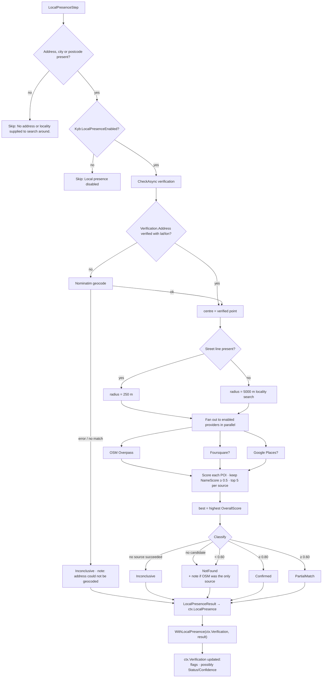
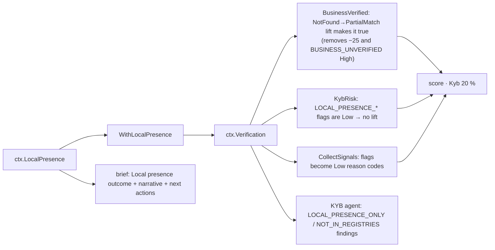

# Step 7 · `presence` — Local business presence (places / map evidence)

| | |
|---|---|
| Step id | `presence` |
| Agent | KYB (`kyb`) |
| Stage | 1, runs in parallel with `screening` and `match` after `verification` |
| Depends on | `verification` (uses its geocoded address; folds its own result back into `ctx.Verification`) |
| Can hard-stop | No |
| Consumed by | `verification` result (status lift, `LOCAL_PRESENCE_*` flags → KybRisk, BusinessVerified, score, rules), KYB agent review, analyst brief |
| Configuration | `Kyb:LocalPresenceEnabled` (true), `Kyb:LocalPresenceRadiusMeters` (250), `Kyb:LocalPresenceLocalityRadiusMeters` (5000), `Kyb:MaxResultsPerSource` (5), `Kyb:FoursquareApiKey`, `Kyb:GooglePlacesApiKey` |
| Implementation | `src/MerchantIntelligence.Kyb/Registry/LocalPresence.cs`; fold-in `BusinessVerificationService.WithLocalPresence`; wrapper `src/MerchantIntelligence.Platform/Agents/Kyb/LocalPresenceStep.cs` |

---

## 1. Why this step exists

### Functional purpose
Look for a **business with the declared name physically operating at or near the declared address** using points-of-interest data — OpenStreetMap always, Foursquare and Google Places when keys exist.

### Business question answered
*"Whatever the registries say, is there actually a shop / office / restaurant with this name at this address?"*

### Merchant-acquiring rationale
The great majority of merchant applicants are small private businesses. In the US they register only with a state Secretary of State, hold no LEI and file nothing with the SEC — so the keyless registries in `verification` will report `NotFound`. Declining or referring every such merchant would be commercially absurd; approving them on the applicant's word alone would be reckless. Places data is the free, independent evidence that fills that gap: a café listed on OpenStreetMap with the right name 30 m from the declared address is strong evidence that a real trading business exists.

### What it proves — and what it does not
Local presence proves **trading activity at a location**. It does **not** prove:
* that a legal entity of that name exists (a sole trader can trade under any name),
* that the applicant controls that business,
* that the business is current (map data lags; a closed shop may still be listed).

That is why the fold-in caps the lifted verification confidence at **70 %** and the KYB agent asks for a certificate of formation whenever identity rests on presence alone. This step *complements* registry verification; it never replaces it.

### Fraud relevance
* CNP fraudsters typically declare a residential, virtual-office or borrowed commercial address. `LOCAL_PRESENCE_NOT_FOUND` for a merchant claiming a physical storefront (`HasPhysicalLocation=true`) is a meaningful inconsistency.
* Conversely, a *confirmed* presence for an unrelated but similarly-named business ("Joe's Pizza" at an address that has a real "Joe's Pizza") is exactly how address hijacking looks — hence the analyst guidance to check that the POI matches the applicant's *category*, not just its name.

---

## 2. Inputs

| Input | Source | Use |
|---|---|---|
| `LegalName`, `TradingName` | intake `Business` | Name similarity vs POI names (best of the two) |
| `AddressLine`, `City`, `Region`, `PostalCode`, `Country` | intake `Business` | Geocoding centre, address-text similarity, radius selection |
| Verified geocode (`Verification.Address.Latitude/Longitude`) | `verification` (Census geocoder) | Used as the search centre when `Verified=true`; otherwise Nominatim is called |

### Providers (`ILocalPresenceProvider`)

| Provider | Enabled | Query | Notes |
|---|---|---|---|
| **OpenStreetMap (Overpass)** | always | `nwr(around:{radius},{lat},{lon})[name]` — every named node/way/relation within the radius, up to 80 | Two public endpoints tried in order (`overpass-api.de`, `overpass.kumi.systems`); rate-limited; SMB coverage is partial and volunteer-maintained |
| **Foursquare Places** | `Kyb:FoursquareApiKey` | text search on name, `ll`, radius ≥ 500 m, limit 10 | Good US SMB coverage; free tier |
| **Google Places (New) Text Search** | `Kyb:GooglePlacesApiKey` | `places:searchText` with circular location bias radius ≥ 500 m | Best coverage; billing account required |

Geocoding: **Nominatim** (`nominatim.openstreetmap.org`, keyless, 1 req/s policy) — only when `verification` did not already produce a verified point.

Disabled providers appear in `Sources` as `Succeeded=false`, *"Not configured (API key missing)."*.

---

## 3. Internal flow



### 3.1 POI scoring (`Score`)

```text
usable      = normalised POI name has ≥ 3 characters   (ignore "E", "H&M"-style labels that fool initials matching)
nameScore   = usable ? max(Similarity(LegalName, poi), Similarity(TradingName, poi)) : 0
addressScore = AddressMatcher.Similarity(FullAddress, poi.Address)
distance    = haversine(centre, poi) when the POI has coordinates

locationScore = distance known ? clamp(1 − distance / radius, 0, 1) : addressScore
locationScore = max(locationScore, 0.9 × addressScore)

overall = 0.65 × nameScore + 0.35 × locationScore
if poi.Status contains "closed": overall ×= 0.5
```

Design notes:
* **Proximity beats address text** — POI addresses on maps are often abbreviated or missing, so distance within the radius is the primary location signal; address text is a fallback (weighted 0.9).
* The **trading name** is scored at full weight here (unlike `verification`, where it is × 0.95) because map labels show the *brand*, not the legal name.
* A `closed` status from Foursquare/Google halves the score, so a permanently closed venue rarely confirms presence.
* Candidates with `nameScore < 0.5` are discarded before ranking, so a random neighbouring shop cannot become the "best match" on proximity alone.

### 3.2 Status thresholds

| Status | Condition | Meaning |
|---|---|---|
| `Confirmed` | best overall ≥ 0.80 | A business with (essentially) this name trades at/near the address |
| `PartialMatch` | 0.60 ≤ best < 0.80 | Similar name nearby, or right name a bit further away |
| `NotFound` | best < 0.60 or no candidate, ≥ 1 source succeeded | Nothing matching in the sources searched — see the OSM-only note |
| `Inconclusive` | no source succeeded, or geocoding failed | Nothing is known |
| `NotChecked` | no address/locality (service-level; the step itself skips before this) | — |

`ConfidencePercent` = best overall × 100.

When `NotFound` and **only OpenStreetMap** succeeded, the result carries the note: *"Only OpenStreetMap was searched; its coverage of small businesses is partial, so absence is weak evidence. Configure a Foursquare or Google Places key for stronger coverage."*

### 3.3 Fold-in to verification (`WithLocalPresence`)

| Presence status | Flag added to `Verification.Flags` (all **Low**) | Effect on verification status / confidence |
|---|---|---|
| `Confirmed` | `LOCAL_PRESENCE_CONFIRMED` | If no registry match and status `NotFound` → **`PartialMatch`**, confidence = POI overall × **70** |
| `PartialMatch` | `LOCAL_PRESENCE_PARTIAL` | Status unchanged; if no registry match, confidence = max(current, POI overall × 50) |
| `NotFound` (street address given) | `LOCAL_PRESENCE_NOT_FOUND` | None |
| `Inconclusive` / `NotChecked` | none | None; `Verification.LocalPresence` still populated |

Any previous `LOCAL_PRESENCE_*` flags are removed first, so re-running is idempotent. When `verification` itself failed (`ctx.Verification == null`), the step still runs against a synthetic `Inconclusive` verification and stores `ctx.LocalPresence`, but there is nothing to fold into.

---

## 4. Outputs

```csharp
LocalPresenceResult(
    LocalPresenceStatus Status,
    double ConfidencePercent,
    PlaceMatch? BestMatch,              // Record (Source, Name, Address, Category, Status, lat/lon, SourceUrl), NameScore, AddressScore, DistanceMeters, OverallScore
    IReadOnlyList<PlaceSourceResult> Sources,
    string? Note)
```

Stored in `ctx.LocalPresence` **and** in `ctx.Verification.LocalPresence`. Timeline summary: `Confirmed (91%) · 'Bright Bean Coffee' via OpenStreetMap · 38 m away` or `NotFound · Only OpenStreetMap was searched; …`.

---

## 4a. Digital footprint and venue reputation

`DigitalFootprint` (on `LocalPresenceResult.Footprint`) gives a merchant that has **no website** — and therefore never reaches the website-compliance RDAP check — a tenure signal from the **contact e-mail domain**:

| Code | Severity | Trigger |
|---|---|---|
| `EMAIL_FREEMAIL` | Low | Domain is a free-mail provider (gmail, yahoo, outlook, icloud, proton …); no tenure can be derived |
| `EMAIL_DOMAIN_NEW` | Medium | RDAP registration date < 6 months ago — a very young domain is a common bust-out / impersonation marker |
| `EMAIL_DOMAIN_TENURE` | Low | Registration date ≥ 6 months ago; message carries age and registrar (positive evidence) |
| `EMAIL_DOMAIN_UNRESOLVED` | Low | RDAP answered without a registration date, or was unavailable — tenure is *unknown*, not clear |
| `EMAIL_DOMAIN_MISMATCH` | Low | E-mail domain differs from the website domain |

Lookup: `RdapDomainLookup` (`https://rdap.org/domain/<domain>`, keyless, shared with the website step). Missing e-mail → footprint is `null` and nothing is inferred.

Venue **reputation** comes with the place record when the provider exposes it: Foursquare (rating, rating count, popularity, `date_created` as *listed since*, open-now) and Google Places (rating, user rating count, open-now). It is surfaced, not scored:

| Code | Severity | Trigger |
|---|---|---|
| `LOCAL_PRESENCE_REPUTATION` | Low | Any reputation attribute on the best match — "crowd activity supports an operating venue; not a quality or legitimacy judgement" |
| `LOCAL_PRESENCE_LOW_RATING` | Low | Rating < 50 % of scale across ≥ 10 ratings — poor service history correlates with disputes |

## 4b. Address type classification

The same geocode and the same Overpass results are reused to answer a second question: **what kind of place is the declared address?** `AddressClassifier.Classify(addressLine, geocodeHit, nearbyPois, mcc)` produces `LocalPresenceResult.AddressType`.

| Evidence | Weight | Direction |
|---|---|---|
| `PO Box`, `PMB`, `Private Mailbox` in the address text | 0.9 | Cmra |
| `Apt` / `Unit n` / `#n` in the address text | 0.35 | Residential |
| `Suite` / `Floor` / `Plaza` / `Bldg` in the address text | 0.25 | Commercial |
| Nominatim feature `building=house|residential|apartments|…` (`extratags=1`) | 0.6 | Residential |
| Nominatim feature `building=commercial|retail|office|…` or `shop=`/`amenity=`/`office=` POI | 0.5–0.6 | Commercial |
| `landuse=residential` vs `landuse=commercial|retail|industrial` | 0.3 | either |
| Named POIs within 40 m of the point with a business category | 0.25 each, max 0.6 | Commercial |
| A known CMRA / virtual-office operator within 40 m (UPS Store, Regus, WeWork, iPostal, Davinci, …) or `amenity=post_office` / `coworking` | 0.8 | Cmra |

Types: `Residential`, `Commercial`, `MixedUse` (both ≥ 0.5), `Cmra`, `Unknown`. Confidence is the winning weight, capped at 1. **No evidence ⇒ `Unknown`, never `Commercial`.** Text-only evidence (geocoder unavailable) sets `Covered = false`.

MCC fit:

| Code | Severity | Condition |
|---|---|---|
| `ADDRESS_CMRA` | High if the MCC is a walk-in storefront (`AddressClassifier.IsStorefrontMcc`), else Medium | mail-drop / virtual office |
| `ADDRESS_RESIDENTIAL_STOREFRONT_MCC` | Medium | residential ≥ 0.5 and storefront MCC (5812/5814 restaurants, 5411 grocery, 5732 electronics, 7230 salons, …) |
| `ADDRESS_HOME_BASED` | Low | residential and a home-compatible MCC (5811 catering, 7372 software, 7399 business services, contractors 1520–1799, direct marketing 5964–5969, …) |
| `ADDRESS_RESIDENTIAL` | Low | residential, MCC neither list |
| `ADDRESS_TYPE_WEAK` | Low | leaning either way on < 0.5 evidence |
| `ADDRESS_TYPE_UNKNOWN` | Low | nothing usable; treat premises as unverified |

Flags join the verification flag list (`WithLocalPresence`), so they enter KybRisk and reason codes; the explainability check outcome is *Address type* and the workbench shows type, confidence, evidence lines and flags under Local presence. Combined with `OWNER_HOME_BASED` (owner address = business address, from `owners`) a residential café becomes a coherent story for the analyst: home address, home-based owner, storefront MCC → visit or re-code.

## 5. Downstream impact

Presence has **no direct scorer input**; everything flows through the updated `ctx.Verification`.



### Concrete score effect
The single biggest effect is the **status lift**: a small business that would otherwise carry `BUSINESS_UNVERIFIED` (High → unified score capped at 549, auto-approve blocked) becomes `PartialMatch`, `BusinessVerified=true`. The remaining `ENTITY_NOT_FOUND` flag (Medium) still makes `KybRisk` Medium → Kyb component 55 → a Refer-leaning but not capped score. This is deliberate: presence turns "unverified" into "partially verified", not into "verified".

`LOCAL_PRESENCE_NOT_FOUND` is Low severity — it informs the analyst but does not move the score; the brief outcome is shown as Medium severity to draw attention.

### Rules
No dedicated rule. `businessVerified` fact reflects the lift.

### KYB agent
* `LOCAL_PRESENCE_ONLY` — *"No registry record …, but OpenStreetMap lists 'X' 38 m from the declared address; identity is PartialMatch on trading evidence alone."* → *"Ask for a certificate of formation / state registration."*
* `NOT_IN_REGISTRIES` adds *"and no matching business near the declared address"* when presence is `NotFound`.

---

## 6. Missing input, failures and coverage

| Situation | Result | Downstream |
|---|---|---|
| No address, city or postcode | Step **Skipped**: *"No address or locality supplied to search around."* | Brief "Local presence: Not run"; verification unaffected |
| Only city/postcode (no street) | 5 km locality search | Weaker proximity signal; `LOCAL_PRESENCE_NOT_FOUND` is **not** raised (requires a street line) |
| `Kyb:LocalPresenceEnabled=false` | Skipped: *"Local presence disabled (Kyb:LocalPresenceEnabled=false)."* | As above |
| Address cannot be geocoded (Census unverified and Nominatim no match) | `Inconclusive`, note explains | Brief "Local presence: Unavailable" (Low, uncovered); no flags |
| Overpass rate-limited / both endpoints fail, no other keys | `Inconclusive` | As above — **not** `NotFound` |
| Only OSM configured, nothing found | `NotFound` + OSM-only note | Brief next action: configure Foursquare / Google Places |
| Foursquare/Google key invalid | That source `Succeeded=false` with error; OSM still counts | Result based on remaining sources |
| `verification` failed (`ctx.Verification=null`) | Presence still runs; `ctx.LocalPresence` set | No fold-in; brief shows presence outcome separately |
| Step throws | `Failed` (`onFail: Skip`), `ctx.LocalPresence=null` | Brief "Local presence: Not run" |

The service is written to **never throw** — outages become `Inconclusive` with the error in `Note`, so the step itself fails only on cancellation.

---

## 7. Analyst interpretation and remediation

| Result | Read as | Do |
|---|---|---|
| `Confirmed`, registry `Verified` | Consistent identity and location | Nothing further. |
| `Confirmed`, registry `NotFound` → `PartialMatch` ≤ 70 % | Real trading business, legal entity unproven | Request certificate of formation / state SOS printout; check POI **category** matches declared MCC (a "Joe's Pizza" POI does not support a "Joe's Pizza Electronics" application). |
| `PartialMatch` | Similar name or some distance away | Open `BestMatch.Record.SourceUrl`; decide whether it is the same business (rebrand? moved next door?). |
| `NotFound`, OSM only | Weak evidence of absence | Do not penalise; configure a places key or ask for a utility bill / lease / storefront photo. |
| `NotFound`, Foursquare/Google also searched, merchant claims storefront | Meaningful inconsistency | Ask for lease/photos; consider site visit for high volume; cross-check `VIRTUAL_OFFICE_ADDRESS`. |
| `NotFound`, merchant is CNP-only / home-based | Expected | Note and move on; rely on registry and website evidence. |
| `Inconclusive` | Sources down or address not geocodable | Fix address formatting (unit numbers, spelled-out house numbers are handled, but typos are not) and re-run. |

### False positives / negatives
* **Chains and franchises**: "Subway" at the address confirms a Subway, not that *this* franchisee entity is the operator.
* **Shared buildings / malls**: 250 m radius covers a whole mall; name similarity carries the weight — generic names ("The Coffee Shop") can match the wrong venue.
* **Map staleness**: OSM POIs are rarely deleted when businesses close; Foursquare/Google `closed` status is applied (× 0.5) where returned.
* **Nominatim geocoding** of rural or new addresses fails more often, yielding `Inconclusive` rather than `NotFound`.
* **Initials handling** is disabled for very short POI names, but two-word brand names with one shared word can still reach 0.5–0.6 and appear as `PartialMatch`.

---

## 8. Worked examples

**A. Corner café, keyless setup.** "Bright Bean Coffee Roasters LLC", trading as "Bright Bean Coffee", 1420 SE Division St, Portland OR. Census geocodes the address (verified). OSM Overpass within 250 m returns 23 named features; "Bright Bean Coffee" (cafe) 38 m away: nameScore 1.0 (trading name), distance → locationScore 0.85 → overall 0.65 + 0.30 = 0.95 → **Confirmed 95 %**. Fold-in: registry was `NotFound` → `PartialMatch`, confidence 0.95 × 70 = 66.5 %, flag `LOCAL_PRESENCE_CONFIRMED`. Score: `BusinessVerified=true`; KybRisk Medium (from `ENTITY_NOT_FOUND`) → Kyb component 55. Agent: `LOCAL_PRESENCE_ONLY`, ask for certificate of formation.

**B. Home-based e-commerce.** "Lumen Skincare LLC", residential address in Austin TX, `HasPhysicalLocation=false`. OSM returns houses and a park; no name ≥ 0.5. **NotFound** with the OSM-only note; flag `LOCAL_PRESENCE_NOT_FOUND` (Low). No score movement; brief shows Medium-severity outcome and recommends configuring a places key. Analyst notes CNP-only model and relies on website/registry evidence.

**C. Address hijack.** Applicant "Riverside Dental Group PLLC" declares 200 Main St, which hosts a real "Riverside Dental" (Google Places, open). nameScore 0.88, 12 m → overall ≈ 0.92 → **Confirmed**. Registry `NotFound` → lifted to `PartialMatch` 64 %. Looks fine — until the analyst notes the declared MCC is 5732 (electronics) and the website sells gadgets. The category mismatch, not the presence result, is the tell; `mcc` and `website` pages cover that side. This is why presence alone never yields `Verified`.

**D. Overpass outage.** Both Overpass endpoints return 429; no other keys. `Sources`: OSM failed, Foursquare/Google "Not configured". **Inconclusive**; brief "Local presence: Unavailable" and no `LOCAL_PRESENCE_NOT_FOUND` — the system refuses to convert an outage into "not found".
