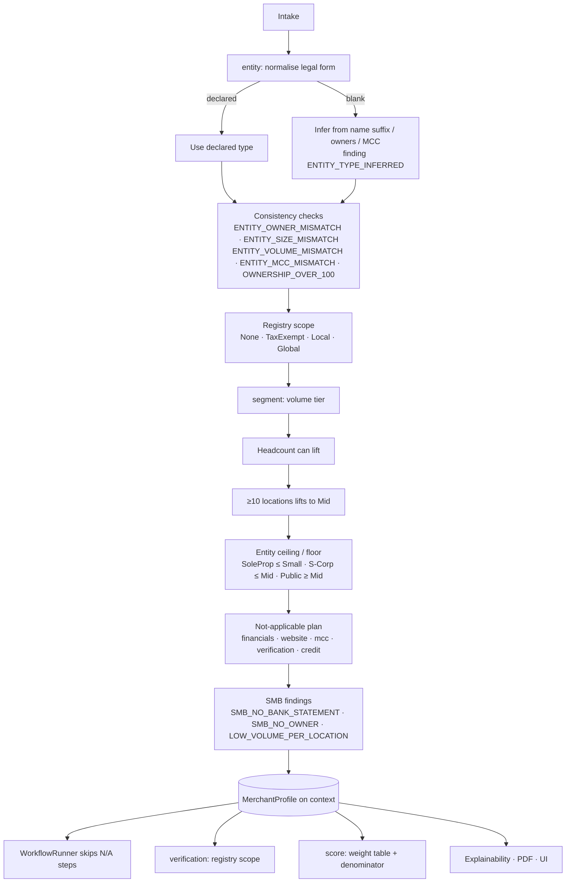

# Step 0 · `entity` + `segment` — Merchant profile (legal form, size segment, plan)

| | |
|---|---|
| Step ids | `entity`, `segment` (the only two steps of the Profile agent) |
| Agent | Profile (`profile`, kind `Profiling`) |
| Stage | 0 — always the first stage, alone; every other agent waits for it |
| Depends on | `entity`: nothing · `segment`: `entity` |
| Consumed by | `WorkflowRunner` (not-applicable skips), `verification` (registry scope), `score` (segment weight table, not-applicable components), explainability / PDF ("Merchant profile" outcome), workbench profile card |
| Required | Yes — the planner rejects a workflow in which the Profile agent is missing, disabled, fed by a transition or placed after another agent |
| Implementation | `src/MerchantIntelligence.Platform/Profiling/MerchantProfile.cs`, `MerchantProfiler.cs`; `src/MerchantIntelligence.Platform/Agents/Profile/EntityStep.cs`, `SegmentStep.cs`, `ProfileAgent.cs`; governance in `Workflows/WorkflowPlanner.cs` |

---

## 1. Why this step exists

### Functional purpose
Before any lookup runs, the platform decides **what kind of merchant it is looking at** and therefore **which questions are worth asking**. A one-shop café and a listed retailer both arrive as "an application", but the evidence that proves each is legitimate is different: the café has no SEC filing, no LEI, often no website and no audited P&L — and none of that is a finding. Without this step the pipeline asked every merchant the large-merchant questions, so a genuine SMB scored "unverified, no financials, non-compliant website" exactly like a fake one.

### Business / underwriting question answered
*"What legal form is this, how big is it, how many places does it trade from — and which registers, documents and checks are therefore the right evidence?"*

### Merchant-acquiring rationale
* Acquirers segment their book by annual card volume and headcount (card-brand SMB programmes, PCI merchant levels, SBA size standards). Underwriting depth, pricing and reserve policy follow the segment.
* Legal form decides where identity evidence lives: a sole proprietorship exists only as its owner and a county DBA filing; an LLC lives in a state register; a public corporation in EDGAR and GLEIF; a 501(c) in the IRS tax-exempt list.
* Legal form also caps plausible size: an S-Corporation has at most 100 US shareholders; a sole proprietorship declaring $5M of card volume is itself a plausibility signal.
* Location count changes *how* the merchant is verified and boarded (one MID per location, presence per location) but does **not** make a merchant large: two cafés doing $900k are still an SMB.

### Compliance / fraud relevance
The profile is **advisory to scope, not to score**. It never lowers risk, never adds coverage on its own, never bypasses a hard stop. What it does for compliance is remove false negatives (an SMB wrongly marked `BUSINESS_UNVERIFIED`) and surface inconsistencies between the declared legal form and the rest of the application — a classic sign of a synthetic or misrepresented business.

---

## 2. Inputs

| Field | Source | Used for |
|---|---|---|
| `entityType` (optional enum) | intake | Declared legal form; blank → inferred |
| `business.legalName` | intake | Suffix inference (`Inc`, `Corp`, `LLC`, `LLP`, `Foundation`…) |
| `owners[]` (count, `ownershipPercent`, `nationality`) | intake | Sole-proprietor inference, owner-count and S-Corp consistency, ownership sum |
| `annualVolume` | intake | Volume tier |
| `employeeCount` | intake | Headcount tier |
| `locationCount` | intake | Chain lift, per-location advisories |
| `merchantCategoryCode` | intake | Non-profit inference / mismatch |
| `hasPhysicalLocation`, `website` present | intake | Website / MCC applicability |
| bank statement / inline P&L present | intake | Financial applicability, `SMB_NO_BANK_STATEMENT` |

No external provider is called. Both steps complete in microseconds and can never be `Unavailable`.

`EntityType` values: `SoleProprietorship`, `SingleMemberLlc`, `MultiMemberLlc`, `Partnership`, `SCorporation`, `CCorporation`, `PublicCorporation`, `NonProfit`, `Government`, `Trust`, `Other` (`Unknown` = not declared).

---

## 3. Internal flow



### 3.1 `entity` — legal form

1. **Declared type wins.** If `entityType` is supplied it is used verbatim; the reason list records "Declared as …".
2. **Inference (blank only)**, first match wins, and `ENTITY_TYPE_INFERRED` (Low) is always emitted:

| Signal | Inferred type |
|---|---|
| Name ends in `Inc`, `Corp`, `Corporation`, `Incorporated`, `PLC`, `Ltd`, `Limited`, `AG`, `SA`, `NV` | `PublicCorporation` if volume ≥ $10M or employees > 100, else `CCorporation` |
| `LLC`, `L.L.C.`, `PLLC` | `MultiMemberLlc` if > 1 owner, else `SingleMemberLlc` |
| `LLP`, `Partners`, `Partnership`, `& Sons` | `Partnership` |
| MCC ∈ {8398, 8661, 8641, 8651, 8699, 8220, 8211} or `Foundation`, `Charity`, `Church`, `Association`, `Society` | `NonProfit` |
| exactly one owner at ≥ 99 %, no corporate suffix, ≤ 5 employees | `SoleProprietorship` |
| otherwise | `Other` |

3. **Consistency findings** (never silent overrides):

| Code | Severity | Fires when |
|---|---|---|
| `ENTITY_OWNER_MISMATCH` | Medium | sole prop with > 1 owner · single-member LLC with > 1 owner · multi-member LLC / partnership with ≤ 1 owner · S-Corp with > 100 shareholders or any non-US shareholder |
| `ENTITY_SIZE_MISMATCH` | Medium | sole prop with > 20 employees |
| `ENTITY_VOLUME_MISMATCH` | Medium / Low | sole prop with ≥ $1M volume (Medium) · public corporation with < $1M volume (Low) |
| `ENTITY_MCC_MISMATCH` | Low | non-profit with a commercial MCC |
| `OWNERSHIP_OVER_100` | Medium | declared ownership sums to > 100 % |

4. **Registry scope** — which identity sources are the right ones:

| Entity type | Scope | Meaning for `verification` |
|---|---|---|
| Sole proprietorship, Government | `None` | No company register holds this form; result is `NotApplicable`, no provider is queried |
| Non-profit | `TaxExempt` | Tax-exempt registers are primary; company registers secondary |
| Single/multi-member LLC, Partnership, S-Corp, Trust, private C-Corp < $10M | `Local` | State / national company registers (OpenCorporates, Companies House) are authoritative; GLEIF / EDGAR silence is **expected** and not a finding |
| Public corporation, C-Corp ≥ $10M, Unknown, Other | `Global` | Today's full path: GLEIF + SEC EDGAR + company registers |

### 3.2 `segment` — size and plan

Deterministic tiers, in order:

| Rule | Micro | Small | Mid | Enterprise |
|---|---|---|---|---|
| Annual card volume | < $250k | < $1M | < $10M | ≥ $10M |
| Employees (only ever *lifts*) | ≤ 5 | ≤ 20 | ≤ 100 | > 100 |
| Locations | — | — | ≥ 10 lifts Micro/Small to Mid | — |

Then the legal form acts as a ceiling / floor: sole proprietorship → at most Small; S-Corporation → at most Mid; public corporation → at least Mid. Every adjustment is written to `reasons[]` so the analyst can see how the segment was reached. 2–9 locations never change the segment; the reason list records "presence and volume are checked per location".

**Not-applicable plan** (`notApplicable[]`, each with a human-readable reason):

| Step | Marked not applicable when |
|---|---|
| `financials` | Micro / Small and no P&L / balance sheet supplied — bank-statement cash flow is the financial evidence |
| `website`, `mcc` | Micro / Small, card-present (`hasPhysicalLocation` not false) and no website URL |
| `verification`, `credit` | Government / public body |

Profile findings specific to SMBs:

| Code | Severity | Fires when |
|---|---|---|
| `SMB_NO_BANK_STATEMENT` | Medium | Micro / Small and no bank statement supplied |
| `SMB_NO_OWNER` | Medium | Micro / Small with no declared principal |
| `LOW_VOLUME_PER_LOCATION` | Low | > 1 location and volume ÷ locations < $20k |

---

## 4. Outputs

```jsonc
"profile": {
  "entityType": "MultiMemberLlc",
  "entityTypeInferred": false,
  "segment": "Small",
  "registryScope": "Local",
  "locationCount": 2,
  "reasons": [
    "Declared as multi-member LLC.",
    "Verify against state / national company registers; LEI and SEC filings are not expected.",
    "Annual card volume $900,000 → Small.",
    "12 employees is consistent with Small.",
    "2 locations: presence and volume are checked per location; segment unchanged."
  ],
  "notApplicable": [
    { "stepId": "financials", "reason": "Small merchants are not expected to produce audited P&L / balance sheets; bank-statement cash flow is the financial evidence instead." }
  ],
  "findings": []
}
```

The Profile agent's review adds one `AgentFinding` per profile finding (Medium+ → Observation, else Advisory) plus advisories `NOT_APPLICABLE_<STEP>`, `REGISTRY_SCOPE_LOCAL` and `MULTI_LOCATION`.

---

## 5. Downstream impact

### Workflow runner
A step listed in `notApplicable` is **skipped before it starts**, with an audit line of the form *"Not applicable to a Small multi-member LLC: …"*. A skipped step is neither a pass nor a failure; it simply does not exist for this merchant.

### Verification
`VerificationStep` passes the registry scope to `BusinessVerificationService.VerifyAsync(identity, scope)`:
* `Local` — a company-register hit → `Verified`; a company-register miss → `NotFound` (`ENTITY_NOT_FOUND`); no local provider configured → `Inconclusive` + `LOCAL_REGISTRY_UNAVAILABLE`. GLEIF / EDGAR absence alone can **never** produce `BUSINESS_UNVERIFIED`.
* `None` — `NotApplicable`; nothing is queried.
* `Global` / `All` — unchanged behaviour.

### Score
* Weight table by segment (`ScoreWeights.Standard` vs `ScoreWeights.Smb`):

| Component | Standard | SMB (Micro / Small) |
|---|---|---|
| CreditModel | 0.30 | 0.25 |
| Kyb | 0.20 | 0.25 |
| Screening | 0.15 | 0.15 |
| WebsiteCompliance | 0.10 | 0.05 |
| VolumePlausibility | 0.10 | 0.15 |
| BusinessPolicy | 0.10 | 0.10 |
| Pricing | 0.05 | 0.05 |

* Components whose step was not applicable (`website`→WebsiteCompliance, `credit`→CreditModel, `plausibility`→VolumePlausibility, `prohibited`→BusinessPolicy, `terms`→Pricing) leave the **coverage denominator** instead of counting as gaps — so an SMB without a website can reach 100 % coverage on the checks that do apply.
* Hard stops, `ADVERSE_MEDIA` (Medium cap), `INSUFFICIENT_EVIDENCE` and every policy rule are untouched. A Micro classification with poor evidence still Refers / Declines.

### Explainability, PDF, UI
A "Merchant profile" check outcome (`Small · multi-member LLC`, registry scope, locations, not-applicable list, weight table) and a "Profile: …" narrative line with the first reasons and every profile finding. The workbench Agents tab shows the profile card above the agent lanes; the workflow designer pins the Profile agent first.

---

## 6. Workflow governance

`WorkflowPlanner` enforces, for every published or previewed workflow:

1. exactly one agent of kind `Profiling`, enabled;
2. it owns every step marked `Profiling` and nothing else;
3. no transition may point **into** it; its steps may not depend on evidence steps;
4. its steps may not carry stop-gates (it scopes, it does not decide);
5. every evidence step receives an implicit dependency on the profile steps, so nothing can start before the profile exists;
6. the Profile agent is always placed first when stages are computed.

Violations fail validation with a message that names the rule (e.g. *"Transition 'kyb' → 'profile' is not allowed: the profiling agent always runs first, nothing can run before it."*). Workflows saved before the agent existed fail the same validation and must be re-saved from the designer, which inserts the agent automatically when dropped.

---

## 7. Behaviour on missing / unusual input

| Situation | Result |
|---|---|
| No `entityType` | Inferred; `ENTITY_TYPE_INFERRED` (Low) so the inference is visible |
| No `employeeCount` | Volume tier only; no lift |
| No `locationCount` | Treated as 1 |
| Profile could not be built (exception) | Agent review says so; every downstream step runs with the generic (Global / standard) plan — never a silent skip |

---

## 8. Analyst interpretation

* **Read `reasons[]` first** — it is the audit trail of how the segment was reached.
* **`ENTITY_*` findings are questions for the merchant**, not risk by themselves; confirm the legal form with formation documents.
* **Not-applicable ≠ clear.** The memo lists what was skipped and why; if the analyst believes a skipped check *should* have run (e.g. the "card-present" café is actually selling online), correct the intake and re-run.
* **`SMB_NO_BANK_STATEMENT`** is the SMB equivalent of missing financials — request the statement before approving.

---

## 9. False positives / negatives and limitations

* Inference is suffix-based; a trading name without a legal suffix falls to `Other` (Global scope) — declaring the entity type is always better.
* Thresholds are platform heuristics, not regulatory definitions; they are constants in `MerchantProfiler` and easy to tune.
* Location count is a single integer today: presence is verified at the declared address only, plausibility divides volume by locations. Per-location addresses and per-location presence checks are not yet modelled.
* Tax-exempt registers are a scope, not yet a provider: a `TaxExempt` merchant is verified against configured company registers with the scope recorded.

---

## 10. Worked examples

| Applicant | Entity | Segment | Scope | Not applicable | Findings |
|---|---|---|---|---|---|
| Nitin Coffee Co LLC, $900k, 12 staff, 2 cafés, bank CSV, no P&L | Multi-member LLC (declared) | Small | Local | `financials` | — |
| "Maria's Nails", 1 owner 100 %, $120k, 2 staff, no website, no bank CSV | Sole proprietorship (inferred) | Micro | None | `financials`, `website`, `mcc` | `ENTITY_TYPE_INFERRED`, `SMB_NO_BANK_STATEMENT` |
| Sole proprietorship declaring $3M and 45 staff | Sole proprietorship | Small (capped from Mid) | None | — | `ENTITY_VOLUME_MISMATCH`, `ENTITY_SIZE_MISMATCH` |
| Starbucks Corporation, $50M+, 1,000 staff | Public corporation | Enterprise | Global | — | — |
| City parks department | Government | by volume | None | `verification`, `credit` | — |
