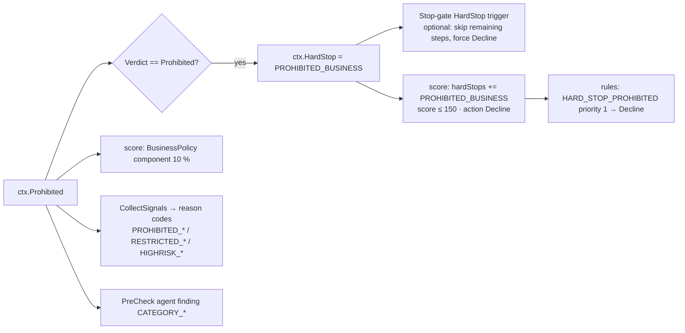

# Step 2 · `prohibited` — Prohibited & restricted business check

| | |
|---|---|
| Step id | `prohibited` |
| Agent | Pre-check (`precheck`) |
| Stage | 1, after `website` |
| Depends on | `website` (soft — runs even when the website step was skipped) |
| Consumed by | `score` (BusinessPolicy 10 % component, `PROHIBITED_BUSINESS` hard stop), rules engine, stop-gates, analyst brief |
| Required | No, but it is one of the three steps that can establish a **hard stop** |
| Implementation | `src/MerchantIntelligence.Kyb/Prohibited/ProhibitedBusinessDetector.cs` + `Resources/restricted-categories.json`; wrapper `src/MerchantIntelligence.Platform/Agents/PreCheck/ProhibitedStep.cs`; merge logic `AssessmentComposer.CombineProhibited` |

---

## 1. Why this step exists

### Functional purpose
Every acquirer publishes an **Acceptable Use Policy (AUP)**: a list of business types it will not board (prohibited), will board only with licences or card-brand registration (restricted), and will board only with enhanced due diligence and pricing (high-risk). This step classifies the applicant against that list using the merchant's own description of the business and, when available, the text of its website.

### Business / underwriting question answered
*"Is this a business we are allowed to acquire for at all, and if so, under which policy tier?"*

### Merchant-acquiring rationale
* **Card-brand rules.** Visa's Global Brand Protection Program and Mastercard's BRAM (Business Risk Assessment and Mitigation) programme fine acquirers for boarding illegal or brand-damaging merchants (child exploitation, counterfeit goods, unlicensed pharmacies, unlicensed gambling…). Fines run to hundreds of thousands of dollars per merchant.
* **High-risk registration.** Certain MCCs (e.g. 5962/5966/5967 direct marketing, 7995 gambling, 5912 pharmacy) require the acquirer to register the merchant with the schemes and pay annual fees. A merchant hiding inside a benign MCC avoids that registration — the acquirer, not the merchant, is liable.
* **Sponsor-bank policy.** The sponsoring bank's own risk appetite (no cannabis, no firearms, no adult) is contractual; breaching it can terminate the acquiring relationship.
* **Reputational and legal exposure.** Payday lending, forex/binary options and essay mills may be legal in one jurisdiction and prohibited in another; these are typically declined outright.

### Compliance / fraud relevance
The most common form of merchant fraud is **transaction laundering**: a prohibited business processes through a front company with a compliant-looking description. Classifying *both* the self-declared description and the actual website text, then corroborating with the declared MCC, is how the suite detects the mismatch between what the merchant *says* and what it *sells*.

---

## 2. Inputs

| Input | Source | Role |
|---|---|---|
| `BusinessDescription` | intake | Self-declared text. Matches here are weighted **2×** because the merchant chose these words. |
| `MerchantCategoryCode` | intake | Corroboration: if the declared MCC belongs to a matched category the score is multiplied by 1.5 and the flag is raised even for a weak keyword score. An MCC alone (no keyword hit) never creates a match. |
| `ctx.Website.ProhibitedBusiness` | `website` step | The same detector already ran over the crawled site text; that result is merged here. |
| `restricted-categories.json` | embedded resource | 23 categories × keywords, MCC lists, policy tier and analyst notes. |

No external calls are made by this step; it is pure text classification.

---

## 3. The category taxonomy

| Code | Category | Policy | MCCs corroborating |
|---|---|---|---|
| `ADULT` | Adult content and services | **Prohibited** | 5967, 7273, 7841 |
| `PAYDAY_LOANS` | Payday / short-term / high-interest lending | **Prohibited** | 6012, 6051, 6050 |
| `FOREX_BINARY` | Forex, binary options, CFDs, investment schemes | **Prohibited** | 6211, 6051 |
| `ESSAY_MILLS` | Essay writing / academic cheating | **Prohibited** | 8299, 7399 |
| `DRUG_PARAPHERNALIA` | Drug paraphernalia and legal highs | **Prohibited** | 5999, 5993 |
| `COUNTERFEIT_IP` | Counterfeit goods, replicas, IP infringement | **Prohibited** | 5699, 5948, 5944, 5945 |
| `GOVERNMENT_GRANTS_DOCS` | Government document / grant / visa "assistance" resellers | **Prohibited** | 7399, 8999 |
| `CBD_CANNABIS` | CBD / cannabis / hemp | Restricted | 5912, 5122, 5499, 5999 |
| `CRYPTO` | Cryptocurrency exchange / wallet / NFT | Restricted | 6051, 6211 |
| `FIREARMS` | Firearms, ammunition, weapons | Restricted | 5941, 5999 |
| `GAMBLING` | Gambling, betting, lotteries, skill games | Restricted | 7995, 7801, 7802, 7800 |
| `TOBACCO_VAPE` | Tobacco, e-cigarettes, vaping | Restricted | 5993, 5194 |
| `ONLINE_PHARMACY` | Online pharmacy / prescription drugs | Restricted | 5912, 5122 |
| `NUTRACEUTICALS` | Supplements and free-trial offers | HighRisk | 5499, 5912, 5122, 5999 |
| `MLM` | Multi-level marketing | HighRisk | 5963, 7399 |
| `DEBT_COLLECTION` | Debt collection and credit repair | HighRisk | 7322, 7321, 6051 |
| `TRAVEL_TIMESHARE` | Travel, timeshares, vacation clubs | HighRisk | 4722, 7012, 7011, 3000 |
| `TELEMARKETING` | Telemarketing / call-centre sales | HighRisk | 5966, 5967, 5968, 5969, 4816 |
| `PSYCHIC` | Psychic, astrology, fortune telling | HighRisk | 7999, 7299 |
| `TECH_SUPPORT_SCAM` | Remote tech support / PC repair | HighRisk | 7372, 7379, 4816 |
| `DATING` | Online dating and companionship | HighRisk | 7273, 7299 |
| `PRECIOUS_METALS` | Precious metals, coins, bullion | HighRisk | 5944, 5094, 5999 |
| `FUNDRAISING_CROWDFUNDING` | Crowdfunding, donations, unregistered charities | HighRisk | 8398, 8641, 8661 |

Policy tiers are ordered: `Acceptable < HighRisk < Restricted < Prohibited`. The verdict for the application is the **highest** tier among the categories that were flagged.

---

## 4. Internal flow

```mermaid
flowchart TD
    A[ProhibitedStep.ExecuteAsync] --> B[Detector.Analyze(null, description, mcc)]
    B --> C{ctx.Website?.ProhibitedBusiness present?}
    C -- no --> R[Result = description-only]
    C -- yes --> M[CombineProhibited]
    M --> M1[verdict = max(descVerdict, webVerdict)]
    M --> M2[matches: union by category code,<br/>keep highest score]
    M --> M3[flags: union by code]
    M1 & M2 & M3 --> R
    R --> S[ctx.Prohibited]

    subgraph Analyze
        direction TB
        T1[text = lower(website + ' ' + description)] --> T2[for each category: run keyword regexes]
        T2 --> T3[weight per keyword:<br/>1.0 single word · 1.5 phrase · ×2 if in description]
        T3 --> T4[score += weight × ln(1 + hits)]
        T4 --> T5[×1.5 if declared MCC ∈ category MCCs]
        T5 --> T6[× (1 + min(1, 10 × hits/wordCount)) density]
        T6 --> T7[normalise: min(1, score × (0.5 + 0.5·min(distinct,4)/4) / 4)]
        T7 --> T8{score ≥ 0.15 or MCC hit with score > 0?}
        T8 -- yes --> T9[keep as CategoryMatch]
        T9 --> T10{score ≥ 0.35 or MCC hit?}
        T10 -- yes --> T11[emit flag POLICY_CODE, raise verdict]
    end
```

### 4.1 Keyword matching
* Every keyword is compiled once into a case-insensitive, **word-boundary** regex, so "vape" does not match "evaporate".
* Text is the concatenation of website text (if the caller supplied it) and the description, lower-cased.
* Each keyword's hit count is compressed with `ln(1 + count)` so that a product grid repeating "CBD" 200 times does not dominate.

### 4.2 Weighting decisions and why
| Rule | Rationale |
|---|---|
| Multi-word phrase = 1.5× | "binary options" is far less ambiguous than "options". |
| Hit in self-declared description = 2× | The merchant chose those words; they are the strongest admission. |
| Declared MCC in category = 1.5× and always flags | An MCC that already belongs to the category corroborates the keyword evidence and signals the merchant is not hiding — but the tier still applies. |
| Density term | Two hits in a seven-word description are conclusive; two hits in a 2,000-word site are noise. |
| Breadth term (distinct keywords capped at 4) | Five different firearms terms is stronger evidence than one term repeated. |
| Normalisation `/4` and cap at 1.0 | Produces a comparable 0–1 confidence per category. |

### 4.3 Thresholds
* `score ≥ 0.15` → category is **reported** as a match (visible to analysts, no flag).
* `score ≥ 0.35` **or** declared MCC in category → **flag** emitted and verdict raised.
* MCC alone with zero keyword hits → nothing (avoids penalising every 5999 "miscellaneous retail" merchant).

### 4.4 Merge with the website result
The `website` step already ran the detector over the crawled pages plus description plus MCC. `CombineProhibited` produces one result whose verdict is the *stricter* of the two and whose match list is the union (best score per category). This means a merchant whose description is clean but whose site sells prohibited items is still classified `Prohibited`.

---

## 5. Outputs

```csharp
ProhibitedBusinessResult(
    BusinessPolicy Verdict,                     // Acceptable | HighRisk | Restricted | Prohibited
    IReadOnlyList<CategoryMatch> Matches,       // all categories with score ≥ 0.15 (or MCC hit)
    IReadOnlyList<KybProhibitedFlag> Flags)     // one per category ≥ 0.35 or MCC hit

CategoryMatch(RestrictedCategory Category, double Score, IReadOnlyList<string> MatchedKeywords, bool DeclaredMccInCategory)
KybProhibitedFlag(string Code, string Message, RiskTier Severity)
```

Flag code format: `{POLICY}_{CATEGORY}` — e.g. `PROHIBITED_ADULT`, `RESTRICTED_CBD_CANNABIS`, `HIGHRISK_NUTRACEUTICALS`.
Severity: Prohibited → High, Restricted → High, HighRisk → Medium.

Timeline summary: `Acceptable · no restricted category detected` or `Restricted · CBD / cannabis / hemp products, Nutraceuticals…`.

---

## 6. Downstream impact



| Verdict | `BusinessPolicy` component (0–100) | Reason code added by scorer | Severity | Rules effect |
|---|---|---|---|---|
| Acceptable | 100 | — | — | none |
| HighRisk | 60 | `HIGH_RISK_BUSINESS` | Medium | none directly; lowers score |
| Restricted | 35 | `RESTRICTED_BUSINESS` | **High** | `HIGH_SEVERITY_REFER` fires → Refer; score capped at 549 |
| Prohibited | 0 | `PROHIBITED_BUSINESS` | High + **hard stop** | `HARD_STOP_PROHIBITED` → Decline; score ≤ 150 |

Additional effects:
* **Stop-gates.** `prohibited` is one of three steps `StopGates.CanHardStop` recognises. A workflow may attach `{ "when": "HardStop", "scope": "Workflow", "forceOutcome": "Decline" }` to skip the remaining evidence steps once a prohibited verdict is established (`haltOnHardStop` in the workflow definition does the same globally).
* **KYB risk roll-up.** The prohibited verdict does *not* feed `KybRisk`; it is scored on its own component so a policy issue and an identity issue are not double counted.
* **Pre-check agent** adds `CATEGORY_PROHIBITED` ("Hard stop – the policy rules will decline regardless of score") or `CATEGORY_RESTRICTED` / `CATEGORY_HIGHRISK` ("Enhanced review required by policy") to the brief.
* **Terms / pricing** are indirectly affected through the MCC risk tier, not through this verdict.

---

## 7. Missing input, failures and coverage

| Situation | Behaviour |
|---|---|
| Empty or very short description, no website | Detector runs on near-empty text → `Acceptable` with no matches. The step is **not** skipped, so the component is *covered* at 100. The Pre-check agent adds `THIN_DESCRIPTION` warning that "a mis-categorised business may not be caught". Analysts must treat this as weak evidence, not a clean bill. |
| Website skipped / unreachable | Description-only analysis. Transaction laundering via a clean description is not detectable — cross-check with `mcc`. |
| Step throws | `Failed`; `ctx.Prohibited = null`; `BusinessPolicy` component uncovered (coverage −10 pp); no hard stop can be established from this step. |
| Step disabled in workflow | Same as failure from the scorer's point of view; hard-stop detection for prohibited categories is lost — the `website` step's own `PROHIBITED_CONTENT` check still contributes a `WEB_PROHIBITED_CONTENT` High signal. |

---

## 8. Analyst interpretation and remediation

| Finding | Interpretation | Action |
|---|---|---|
| `PROHIBITED_*` flag, keywords in description | Merchant openly declares a prohibited activity | Decline. Record AUP clause. Consider MATCH filing only if previously boarded. |
| `PROHIBITED_*` flag from website only | Description sanitised, site tells the truth | Decline; treat application as potentially deceptive; note for related-party checks. |
| `RESTRICTED_*` flag | Boardable only with licence / scheme registration | Refer. Request licence evidence (state pharmacy licence, FFL, gaming licence, MSB registration). Register with Visa/Mastercard high-risk programme if approved. Expect band C–E reserves. |
| `HIGHRISK_*` flag | Boardable with EDD and pricing | Confirm business model (free-trial terms, MLM compensation plan, refund terms), set higher reserve, add to monitoring. |
| Match reported (0.15–0.35) but no flag | Weak lexical overlap | Read matched keywords in context; usually a false positive (e.g. "hemp-coloured fabric"). |
| `DeclaredMccInCategory = true` with low keyword score | Merchant declared a restricted MCC honestly | Apply the tier's policy; the low score simply means few keywords, not low risk. |

### False positives / negatives
* **Ambiguous words** ("options", "gold", "dating" for a dating *app development* agency) produce low-score matches; the breadth and density terms reduce, but do not eliminate, these. Analysts see the matched keywords to judge quickly.
* **Non-English sites** are effectively unclassified.
* **Image-only product pages** and JavaScript-rendered catalogues defeat text matching.
* **Euphemisms** ("wellness tinctures", "novelty ID") are only caught if present in the keyword list.
* Extending the taxonomy is a JSON change; no code change is required.

---

## 9. Worked examples

**A. Honest CBD retailer.**
Description: *"We sell hemp-derived CBD oils, gummies and topicals online."* MCC 5499.
Hits: `cbd` (×2 in description → weight 2·ln2), `hemp` (2·ln2), `cbd oil` phrase (1.5·2·ln2). Density high (5 hits / 11 words). MCC 5499 ∈ CBD_CANNABIS → ×1.5. Normalised score ≈ 1.0.
→ Flag `RESTRICTED_CBD_CANNABIS` (High), verdict **Restricted**. Score component 35, reason `RESTRICTED_BUSINESS` High → capped 549, rules → Refer. Analyst requests COA/lab certificates and state registration.

**B. Laundering front.**
Description: *"Handmade candles and home fragrance."* MCC 5999. Website (from `website` step) contains "vape", "e-liquid", "nicotine salts", "disposable vapes".
Description-only: Acceptable. Website result: `RESTRICTED_TOBACCO_VAPE`. `CombineProhibited` → verdict **Restricted**, plus `mcc` step will likely return `Inconsistent`. Analyst brief shows both the vape flag and `MCC_CONTRADICTED`.

**C. Software agency.**
Description: *"We build mobile apps for dating startups and fintech clients."* MCC 7372.
Hits: `dating` (1 hit, ×2 description) → score after normalisation ≈ 0.2 → reported match, **no flag**, verdict Acceptable. The analyst sees "DATING 0.20 · matched: dating" and dismisses.
