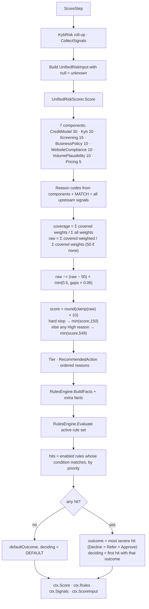
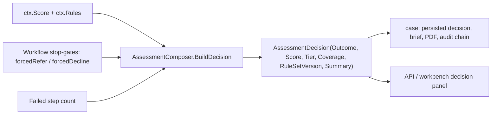

# Step 13 · `score` — Unified risk score & policy rules

| | |
|---|---|
| Step id | `score` |
| Agent | Decision (`decision`) |
| Stage | 3, after `terms`; the only step marked **critical** in its descriptor |
| Depends on | every evidence step: `verification`, `presence`, `screening`, `website`, `prohibited`, `mcc`, `match`, `bank`, `financials`, `plausibility`, `credit`, `terms` (all soft — the step runs with whatever completed) |
| Can hard-stop | No (it *reports* hard stops raised by evidence) |
| Consumed by | `case` (decision, brief, PDF, audit), Decision agent, API/UI decision panel |
| Implementation | `src/MerchantIntelligence.Platform/Scoring/UnifiedRiskScorer.cs`, `src/MerchantIntelligence.Platform/Rules/RulesEngine.cs`, `RuleSetRepository.cs`, `src/MerchantIntelligence.Platform/Resources/default-rules.json`, `AssessmentComposer.CollectSignals` / `KybRisk` / `BuildDecision`; wrapper `src/MerchantIntelligence.Platform/Agents/Decision/ScoreStep.cs` |

---

## 1. Why this step exists

### Functional purpose
Two things, in one step:
1. **Unified risk score** — blend every upstream result into a single 0–1000 number (higher = better), with a tier, per-component breakdown, ordered reason codes, explicit coverage gaps and hard stops.
2. **Policy rules** — evaluate the *active, versioned* rule set over a flat fact bag (score facts + raw application facts + extra facts) to reach `Approve` / `Refer` / `Decline`, naming the deciding rule.

### Business question answered
*"Taking everything together, how risky is this merchant, how much do we actually know, and what does our written policy say we do?"*

### Underwriting rationale
Score and policy are deliberately separated. The score is a **stable, explainable aggregation** (like a bureau score) that changes only when the scorer code changes; the **rules are business-owned, versioned and editable at runtime** (`RuleSetRepository.Active`), so compliance can tighten thresholds — e.g. lower the auto-approve volume — without a code release. The outcome that reaches the analyst is always *rules* outcome; the scorer's own `RecommendedAction` is advisory and shown for comparison.

### Compliance relevance
* Every decision cites the rule set version and deciding rule id → reproducible, auditable adverse-action reasoning.
* Coverage is a first-class output: an application is never auto-approved on thin evidence (coverage < 60 % → `LOW_COVERAGE_REFER`).
* Hard stops (sanctions, prohibited business, MATCH) cannot be outscored — the score is capped at 150 and the rules decline.

---

## 2. Inputs

### 2.1 `UnifiedRiskInput` — how evidence is normalised
`ScoreStep` builds the input with **tri-state semantics**: `null` = not known (coverage gap), never "false".

| Input | Built from | Null when |
|---|---|---|
| `Application` | `ctx.Application` | — |
| `CreditDecision` | `ctx.Credit` | credit failed/skipped |
| `KybRisk` | `AssessmentComposer.KybRisk(verification, screening, website)` | all three absent/unavailable |
| `BusinessVerified` | `Status ∈ {Verified, PartialMatch}` | no registry reachable |
| `EntityAgeMonths` | verification | unknown |
| `SanctionsMatch`, `PepMatch` | screening flags | no list loaded |
| `AdverseMedia` | screening flag | no list loaded **or** media not checked |
| `ProhibitedVerdict` | `ctx.Prohibited.Verdict` | step not run |
| `WebsiteComplianceScore` | `ctx.Website.Score` | not run |
| `VolumePlausibilityScore` | `ctx.Plausibility.PlausibilityScore` | not run |
| `TermsRiskBand` | `ctx.Terms.RiskBand` | not run |
| `MatchFound` | `ctx.Match.Found` **only if** `Availability == Available` | MATCH not configured / errored |
| `Signals` | `CollectSignals` — every flag from verification, screening, website (**failed** checks only, prefixed `WEB_`), prohibited, mcc, bank, financials, plausibility, de-duplicated by (source, code) | — |

### 2.2 Extra rule facts
`country`, `mccVerdict`, `nsfCount`, `ownersDeclared` are added on top of the standard facts.

---

## 3. Internal flow



### 3.1 Component scoring (each 0–100)

| Component | Weight | Score | Reason codes |
|---|---|---|---|
| **CreditModel** | 0.30 | `P(Approved) × 100` | `MODEL_DECLINE` (High if P(approve) < 0.2, else Medium), `MODEL_CANCEL_RISK` (Medium) |
| **Kyb** | 0.20 | KybRisk High 20 / Medium 55 / Low or null 90; −25 if `BusinessVerified == false`; −10 if entity age < 12 months | `KYB_HIGH_RISK` (High), `BUSINESS_UNVERIFIED` (High), `NEW_ENTITY` (Medium) |
| **Screening** | 0.15 | 100; sanctions → 0 (+hard stop); PEP −40; adverse media −25 | `SANCTIONS_MATCH` (High), `PEP_MATCH` (Medium), `ADVERSE_MEDIA` (Medium) |
| **BusinessPolicy** | 0.10 | Allowed 100 / HighRisk 60 / Restricted 35 / Prohibited 0 (+hard stop) | `HIGH_RISK_BUSINESS` (Medium), `RESTRICTED_BUSINESS` (High), `PROHIBITED_BUSINESS` (High) |
| **WebsiteCompliance** | 0.10 | website score | `WEBSITE_NON_COMPLIANT` (Medium) below 60 |
| **VolumePlausibility** | 0.10 | plausibility score | `VOLUME_IMPLAUSIBLE` (Medium) below 50 |
| **Pricing** | 0.05 | band A 95 / B 80 / C 60 / D 35 / E 15 | `HEAVY_RESERVE_REQUIRED` (Medium) for D/E |

Plus `MATCH_LISTED` (High + hard stop) when `MatchFound == true`, and every upstream `RiskSignal` not already present by code.

Note the Kyb component: when `KybRisk` is null but `BusinessVerified` is known, the base is 90 (the "Low or null" branch). Coverage for the component is then true even though the roll-up was unknown — analysts should read the `Kyb` detail string (`KYB overall risk n/a`) rather than the number.

### 3.2 Aggregation
```text
coverage  = Σ weight(covered) / Σ weight(all)                      e.g. 0.70 if CreditModel missing
raw       = Σ weighted(covered) / Σ weight(covered)               (renormalised; 50 if nothing covered)
raw      -= (raw − 50) × min(0.5, gaps × 0.03 × 2)               each gap pulls 6 % of the way to the midpoint, max 50 %
score     = round(clamp(raw, 0, 100) × 10)
if hardStops        → score = min(score, 150)
elif any High reason→ score = min(score, 549)
```
Tiers: ≥ 800 VeryLow · ≥ 650 Low · ≥ 450 Medium · ≥ 250 High · else VeryHigh.
`RecommendedAction` (advisory): hard stop → Decline; score ≥ 650 ∧ coverage ≥ 60 % ∧ no High reason → Approve; score < 250 → Decline; else Refer.
Reason codes are ordered by severity (High first) then code.

### 3.3 Rules engine
* Rule sets are JSON (`version`, `defaultOutcome`, `rules[]` with `id`, `priority`, `outcome`, `enabled`, `when`). Conditions are `{fact, op, value}` leaves combined with `all` / `any` / `not`. Ops: `eq neq gt gte lt lte contains notcontains in exists`.
* Validation at load: unique ids, one combinator per node, non-empty `all`/`any`, known op, value required except `exists`.
* Evaluation: **every** matching rule is a hit; the outcome is the most severe among hits (`Decline` > `Refer` > `Approve`); the deciding rule is the lowest-priority-number hit with that outcome. Missing facts never match (except `exists`).

### 3.4 Default policy (`default-rules.json` v1.0, default outcome **Refer**)

| Rule | Priority | Outcome | Condition |
|---|---|---|---|
| `HARD_STOP_SANCTIONS` | 1 | Decline | `hardStops contains SANCTIONS_MATCH` |
| `HARD_STOP_PROHIBITED` | 1 | Decline | `hardStops contains PROHIBITED_BUSINESS` |
| `HARD_STOP_MATCH` | 1 | Decline | `matchFound eq true` |
| `LOW_SCORE_DECLINE` | 10 | Decline | `score lt 250` |
| `HIGH_SEVERITY_REFER` | 20 | Refer | `highSeverityReasons gt 0` |
| `LARGE_VOLUME_REFER` | 20 | Refer | `annualVolume gt 5,000,000` |
| `HIGH_TICKET_REFER` | 20 | Refer | `highestTicket gt 10,000` |
| `LOW_COVERAGE_REFER` | 25 | Refer | `coveragePercent lt 60` |
| `PEP_EDD` | 30 | Refer | `reasonCodes contains PEP_MATCH` |
| `NEW_ENTITY_HIGH_VOLUME` | 30 | Refer | `reasonCodes contains NEW_ENTITY` ∧ `annualVolume gt 1,000,000` |
| `AUTO_APPROVE` | 100 | Approve | `score gte 650` ∧ `coveragePercent gte 60` ∧ `highSeverityReasons eq 0` |

Because Refer beats Approve, `AUTO_APPROVE` only wins when *no* Refer/Decline rule matched. A score of 700 with a PEP owner → `PEP_EDD` Refer.

### 3.5 Fact bag
`score, tier, recommendedAction, coveragePercent, hardStops[], reasonCodes[], highSeverityReasons, mediumSeverityReasons, coverageGaps[], matchFound (falls back to Application.MatchFound), mcc, annualVolume, averageTicket, highestTicket, existingRelationship, kybRisk, businessVerified, entityAgeMonths, sanctionsMatch, pepMatch, adverseMedia, prohibitedVerdict, websiteComplianceScore, volumePlausibilityScore, termsRiskBand, creditDecision, approveProbability` + extras `country, mccVerdict, nsfCount, ownersDeclared`.

---

## 4. Outputs

* `ctx.Score` — `UnifiedRiskScore(Score, Tier, RecommendedAction, Components[7], ReasonCodes[], CoverageGaps[], HardStops[], CoveragePercent)`.
* `ctx.Rules` — `RulesEvaluation(Outcome, Hits[], DecidingRule, RuleSetVersion, Facts)`.
* `ctx.Signals`, `ctx.ScoreInput`, `ctx.KybRisk` (if not already set by `terms`).

Timeline summary: `Score 712/1000 (Low) · rules → Refer via PEP_EDD · coverage 100%`.

---

## 5. Downstream: how the final decision is composed



`BuildDecision` rules:
* Score or rules missing (step failed/skipped) → **Refer** ("unified score or rules engine failed…"), or **Decline** if a stop-gate forced it before the score ran. A failed score step never yields Approve.
* A stop-gate `forcedDecline` overrides any non-Decline rules outcome.
* `forcedRefer` (refer-on-failure policy with ≥ 1 failed step) downgrades an Approve to Refer.
* Otherwise the rules outcome stands; failed steps are appended to the summary as coverage gaps.

---

## 6. Missing input, failures and coverage

| Situation | Effect |
|---|---|
| A component's evidence not run / unavailable | Component uncovered; weight removed from the denominator; score pulled 6 % toward 500 per gap (max 50 %); `CoverageGaps` lists the name; coverage % falls |
| Coverage < 60 % | `LOW_COVERAGE_REFER` fires; scorer's own action is never Approve |
| Screening lists failed to load | Screening component uncovered (15 %) and `Screening` appears in `CoverageGaps`; **no reason code is raised**, and coverage can still exceed 60 %, so `AUTO_APPROVE` remains possible. The brief's "Screening" outcome shows Unavailable/High-severity text — analysts must read it |
| MATCH not configured | `matchFound` fact is `Application.MatchFound` = false → `HARD_STOP_MATCH` cannot fire; the gap is visible only in the `match` step outcome, **not** in `CoverageGaps` (MATCH is not a score component) |
| Active rule set invalid | Repository rejects it at save time; the previously active version stays active |
| Scorer/rules throw | Step Failed → `ctx.Score`/`ctx.Rules` null → decision Refer with explanatory summary |

Coverage arithmetic example: credit and terms missing → covered weight 0.65 → coverage 65 % (auto-approve still possible); credit, terms and plausibility missing → 55 % → Refer.

---

## 7. Analyst interpretation

| Observation | Read as | Action |
|---|---|---|
| Score ≥ 650 but rules Refer | Cannot be `HIGH_SEVERITY_REFER` (a High reason would have capped the score at 549); it is volume, ticket, coverage, PEP or new-entity policy | Read `DecidingRule` and resolve that specific condition |
| Score exactly 549 or 150 | Cap engaged | Look for the High reason / hard stop rather than the components |
| `RecommendedAction` Approve but rules Refer | Policy is stricter than the score (volume, ticket, PEP, new entity) | Apply policy; the score is context only |
| High coverage, low score, no High reasons | Broadly weak profile (model, KYB Medium, weak website/plausibility) | Terms-based approval or decline on merit |
| Many `coverageGaps` | Evidence missing, not merchant risk | Obtain evidence and re-run before judging |
| Component `Kyb` = 90 with detail `KYB overall risk n/a` | Roll-up unknown; only registry verification informed it | Do not treat as a clean KYB |
| Rules outcome from `DEFAULT` | No rule matched — typically score 250–649 with no High reasons | Ordinary manual review |

### Limitations
* Weights and tier cut-offs are code constants, not configurable per portfolio.
* Missing-evidence penalty pulls *toward 500*, so a very strong profile with gaps looks weaker and a very weak profile with gaps looks better — coverage % must always be read with the score.
* Signals from upstream steps only add reason codes and (if High) the 549 cap; they never adjust component points. Two High findings weigh the same as one.
* Rules match on exact fact names; a typo in a custom rule silently never matches (validation checks ops, not fact names).

---

## 8. Worked examples

**A. Clean SMB** — credit P(approve) 0.84; KYB Low, verified, 60 months; screening clear; policy Allowed; website 82; plausibility 88; terms band A.
Components: 84·0.30 + 90·0.20 + 100·0.15 + 100·0.10 + 82·0.10 + 88·0.10 + 95·0.05 = 25.2+18+15+10+8.2+8.8+4.75 = **89.95** → coverage 100 %, no gaps → **score 900, VeryLow**. No High reasons; volume $600k, ticket $400. Hits: `AUTO_APPROVE` → **Approve** via AUTO_APPROVE.

**B. Same merchant, screening lists offline and MATCH not configured** — Screening uncovered (15 %). Covered weight 0.85; raw = (25.2+18+10+8.2+8.8+4.75)/0.85 = 88.2; one gap → raw −= (88.2−50)×0.06 = 2.3 → 85.9 → **score 859**, coverage 85 %, `CoverageGaps = [Screening]`. `AUTO_APPROVE` still fires — nothing in the default policy references `coverageGaps` by name, only the 60 % floor. The analyst must notice from the brief that sanctions were **not checked** and MATCH is unknown before boarding; a stricter portfolio policy would add a rule such as `coverageGaps contains Screening → Refer`.

**C. Prohibited vertical** — prohibited verdict `Prohibited` → BusinessPolicy 0, hard stop; other components strong (raw 78). Score = min(780, 150) = **150, VeryHigh**. Rules: `HARD_STOP_PROHIBITED` (1) and `LOW_SCORE_DECLINE` (10) and `HIGH_SEVERITY_REFER` (20) all hit; most severe outcome Decline, deciding rule `HARD_STOP_PROHIBITED` → **Decline**.

**D. Borderline** — P(approve) 0.55, KYB Medium (55) unverified (−25 → 30, `BUSINESS_UNVERIFIED` High), screening clear, HighRisk policy (60), website 65, plausibility 58, band C (60).
raw = 16.5+6+15+6+6.5+5.8+3 = 58.8 → 588 → High reason cap min(588, 549) = **549, Medium**. Hits: `HIGH_SEVERITY_REFER` → **Refer**. Analyst: the registry mismatch is the lever — a verified entity would lift Kyb to 55 (+5 weighted), remove the cap and give ≈ 638, still Refer via DEFAULT (no rule matches below 650), which is the right answer for a HighRisk vertical with questionable volume.
