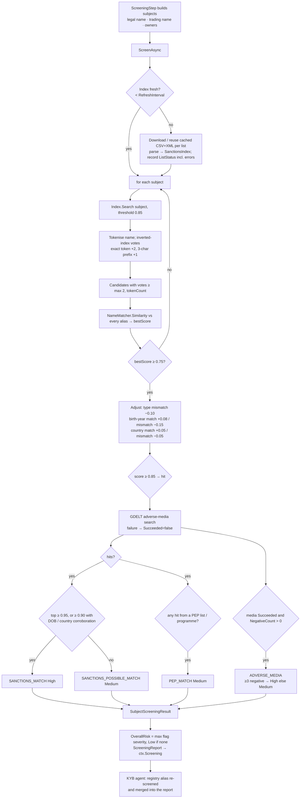
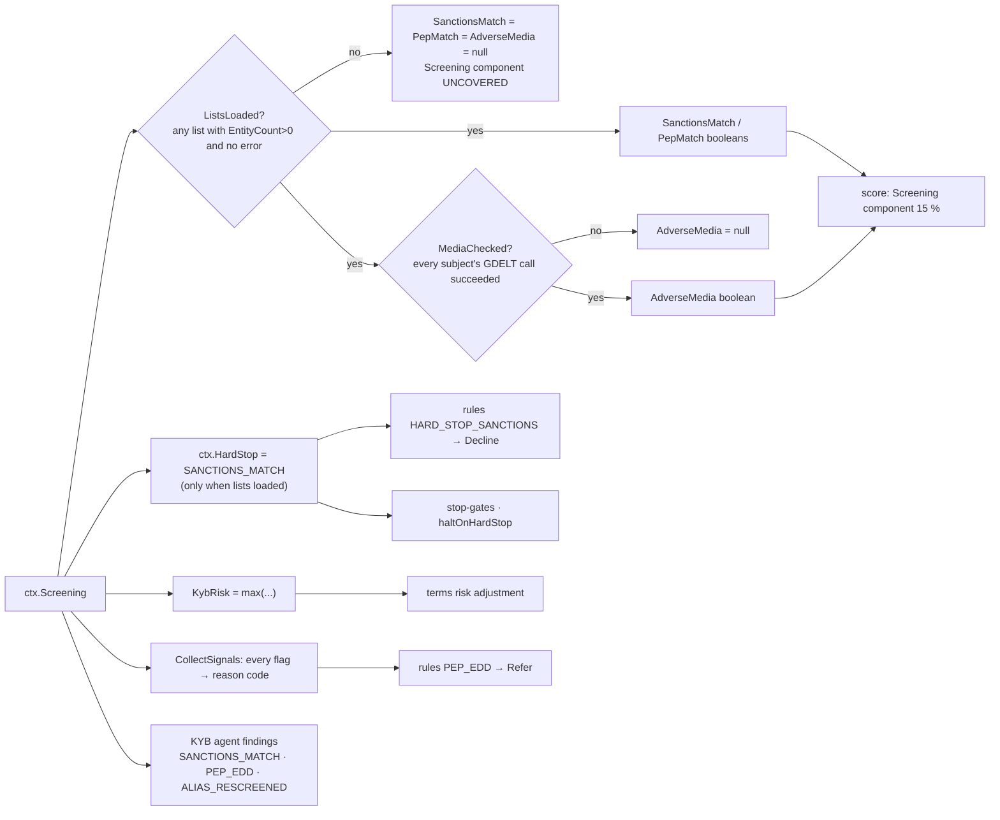

# Step 5 · `screening` — Sanctions, PEP and adverse-media screening

| | |
|---|---|
| Step id | `screening` |
| Agent | KYB (`kyb`) |
| Stage | 1, runs in parallel with `presence` and `match` after `verification` |
| Depends on | `verification` (ordering only — the inputs come from intake; the dependency lets the KYB agent re-screen the registry alias afterwards) |
| Parameters | `includeTradingName` (default `true`), `includeOwners` (default `true`) |
| Can hard-stop | **Yes** — `SANCTIONS_MATCH` |
| Consumed by | KYB agent review, `KybRisk` roll-up (`terms`, `score`), Screening score component (15 %), rules `HARD_STOP_SANCTIONS` / `PEP_EDD`, stop-gates, analyst brief |
| Implementation | `src/MerchantIntelligence.Kyb/Sanctions/SanctionsScreeningService.cs`, `SanctionsIndex.cs`, `SanctionsListSources.cs`; wrapper `src/MerchantIntelligence.Platform/Agents/Kyb/ScreeningStep.cs` |

---

## 1. Why this step exists

### Functional purpose
Check the business, its trading name and every declared beneficial owner / principal against consolidated **sanctions lists**, optionally **PEP** (politically exposed person) data, and recent **negative news**, producing fuzzy-matched hits with an explanation of why each hit scored as it did.

### Business question answered
*"Is anyone we would be doing business with — the company or the people behind it — someone we are legally forbidden to serve, someone who requires enhanced due diligence, or someone currently in the news for fraud, laundering or similar?"*

### Compliance relevance
* **Sanctions** (OFAC, UN, EU, UK HMT …) are strict-liability: an acquirer that settles funds to a designated person or an entity they own ≥ 50 % commits a violation regardless of intent. This is why a confirmed match is a **hard stop** that no score can override.
* **PEPs** are not prohibited, but AML regulation (FinCEN CDD, FATF Recommendation 12, EU AMLD) requires enhanced due diligence — senior sign-off, source-of-wealth checks, ongoing monitoring. The system therefore *refers* rather than declines.
* **Adverse media** is a recognised risk indicator in FATF guidance and card-brand underwriting standards; it is advisory and always needs human reading of the articles.

### KYB vs KYC
This is the step where the **KYC of the people** happens: each `BeneficialOwner` is screened as an individual with DOB and nationality. The entity (KYB) is screened as an organisation. Both live in one report so the acquirer's file shows entity and owner screening side by side, as examiners expect.

### Fraud relevance
Names on sanctions/PEP lists are rarely used by fraudsters, but the GDELT adverse-media search surfaces recent lawsuits, indictments, chargeback scandals and "scam" coverage that never reach a formal list.

---

## 2. Inputs

### Subjects built by `ScreeningStep`

| Subject | Built from | `IsIndividual` | Role label |
|---|---|---|---|
| Legal name | `Business.LegalName`, `Business.Country` | false | `Business` |
| Trading name (if differs and `includeTradingName`) | `Business.TradingName` | false | `Trading name` |
| Each owner (if `includeOwners`) | `Owner.FullName`, `DateOfBirth`, `Nationality`, `Role` | true | owner's role or `Beneficial owner` |
| Registry alias (added later by the KYB **agent**) | `Verification.BestMatch.Record.LegalName` when it differs from both declared names | false | `Registry alias (<source>)` |

`ScreeningSubject(Name, DateOfBirth?, Country?, IsIndividual, Role?)` — DOB and country are **corroborators**; they are optional but they are what turns a possible name match into a confirmed one, so complete owner data materially improves precision.

### Lists (`ISanctionsListSource`) — all free, no keys

| List | Enabled | Source | Notes |
|---|---|---|---|
| **OpenSanctions `sanctions`** | always | `data.opensanctions.org/datasets/latest/sanctions/targets.simple.csv` | Consolidation of OFAC, EU, UK, UN, and ~100 other programmes with aliases, DOBs, countries |
| **OFAC SDN** (raw) | `Sanctions:IncludeRawGovernmentLists` = `true` (default) | `sanctionslistservice.ofac.treas.gov/…/SDN.CSV` | Authoritative US list, parsed directly |
| **UN Security Council consolidated** (raw) | same option | `scsanctions.un.org/resources/xml/en/consolidated.xml` | Individuals and entities |
| **OpenSanctions `peps`** | `Sanctions:IncludePeps` = **`false` by default** | same host, `peps` dataset | ~180 MB download, hundreds of MB RAM — `PEP_MATCH` can only fire when this is on |

Lists are downloaded to `Sanctions:CacheDirectory` (default `data/sanctions`), reused for `RefreshInterval` (24 h), and rebuilt into an in-memory `SanctionsIndex`. Each list's status (`ListName`, `EntityCount`, `LoadedAt`, `Error`) is recorded in the report so the analyst knows what the subjects were screened *against*.

### Adverse media (`IAdverseMediaProvider`)
**GDELT DOC 2.0** (`api.gdeltproject.org`, keyless, rate-limited), enabled by `Sanctions:EnableAdverseMedia` (default `true`). Query per subject:

```text
"<subject name>" (fraud OR laundering OR indicted OR indictment OR lawsuit OR scam OR embezzlement
                  OR bribery OR sanctions OR arrested OR convicted OR ponzi OR chargeback
                  OR counterfeit OR investigation)
timespan=3months · maxrecords=25 · sort=hybridrel
```
An article is "negative" when its **title** contains one of those terms. A GDELT rate-limit / error is captured as `AdverseMediaResult(Succeeded=false, Error=…)` — *not* as zero articles.

---

## 3. Internal flow



### 3.1 Matching detail
* Names are normalised (diacritics, punctuation, case) and tokenised **without** stripping legal suffixes — for sanctions, "Ltd" vs "LLC" is real signal.
* The inverted index (exact-token and 3-character-prefix postings) keeps the search fast over hundreds of thousands of entities; only candidates with enough "votes" are fuzzily scored.
* `NameMatcher.Similarity` is the same token-set + Jaro-Winkler blend used in `verification` (see that page, §3.1); it is robust to word order, initials and transliteration variants.
* Every hit carries `Reasons` — human-readable lines like *"Name similarity 92 % vs 'Viktor Anatolyevich BOUT'"*, *"Birth year 1967 matches listing"*, *"Country US differs from listing (RU)"*. These are what the analyst uses to disposition.
* Up to 10 hits per subject, best first.

### 3.2 Confirmed vs possible
A **confirmed** match (`SANCTIONS_MATCH`) requires either a near-exact name (≥ 0.95) or a strong name (≥ 0.90) plus at least one corroborating attribute (birth year or country *matches listing*). Anything else above 0.85 is `SANCTIONS_POSSIBLE_MATCH`. This asymmetry is deliberate: a false hard stop on a common name would wrongly decline a legitimate merchant, while a possible match still forces analyst review through the Medium severity and KybRisk.

---

## 4. Outputs

```csharp
ScreeningReport(
    IReadOnlyList<SubjectScreeningResult> Subjects,   // per subject: PotentialMatch, Hits, AdverseMedia, Flags
    IReadOnlyList<SanctionsListStatus> Lists,         // what was loaded, how many entities, errors
    RiskTier OverallRisk,                             // max flag severity; Low when no flags
    IReadOnlyList<KybScreeningFlag> Flags)
```

| Flag | Severity | Trigger |
|---|---|---|
| `SANCTIONS_MATCH` | High | confirmed match (see §3.2) — **hard stop** |
| `SANCTIONS_POSSIBLE_MATCH` | Medium | hit(s) ≥ 0.85 not meeting confirmation criteria |
| `PEP_MATCH` | Medium | any hit whose list name contains "peps" or programme contains "PEP" |
| `ADVERSE_MEDIA` | Medium (< 3 negative) / High (≥ 3) | negative-title articles in the last 3 months |

Timeline summary: `4 subject(s) screened · 1 potential match(es) · overall Medium`.

---

## 5. Downstream impact



### Unified score — `Screening` component (weight 0.15)

```text
start 100
SanctionsMatch  → 0, hard stop SANCTIONS_MATCH (High)   → unified score capped at 150, Decline
PepMatch        → −40, reason PEP_MATCH (Medium)
AdverseMedia    → −25, reason ADVERSE_MEDIA (Medium)
clamp 0–100
```
`SANCTIONS_POSSIBLE_MATCH` does **not** reduce the component numerically; it reaches the score as a Medium reason code (via `CollectSignals`) and lifts `KybRisk` to Medium, which reduces the *Kyb* component to 55. A High `ADVERSE_MEDIA` flag (≥ 3 articles) caps the unified score at 549 through the high-severity rule.

### Rules (default set)
* `HARD_STOP_SANCTIONS` (priority 1): `hardStops contains SANCTIONS_MATCH` → **Decline**.
* `PEP_EDD` (priority 30): `reasonCodes contains PEP_MATCH` → **Refer**.

### Workflow control
* `ctx.HardStop` returns `SANCTIONS_MATCH` as soon as the report contains a confirmed match **and lists actually loaded**. With `haltOnHardStop: true` in the workflow definition, all remaining evidence steps are skipped with *"hard stop … already established"*; the default workflow has it `false` so the full picture is still gathered.
* Stop-gates on `screening` may trigger on `HardStop` or on specific flag codes (`RaisesFlags` includes `screening`).

### KYB agent
Re-screens the registry legal name if it differs (see `verification` page) and adds observations `SANCTIONS_MATCH` ("Hard stop – policy declines regardless of score") and `PEP_EDD` ("Enhanced due diligence is required").

---

## 6. Missing input, failures and coverage — read carefully

| Situation | What the report shows | How the score treats it |
|---|---|---|
| No owners declared | Only business (and trading name) screened | Owner KYC is silently absent — analysts should check `ownersDeclared` fact; FinCEN CDD expects ≥ 25 % owners |
| Owner without DOB / nationality | Name-only matching | More `SANCTIONS_POSSIBLE_MATCH`, fewer confirmations — add data and re-run |
| `IncludePeps=false` (default) | No PEP list loaded → `PEP_MATCH` cannot fire | Absence of a PEP flag is **not** evidence of no PEP exposure |
| GDELT rate-limited / fails for any subject | `AdverseMedia.Succeeded=false`, brief says *"Adverse media NOT checked (…) – media result is unknown, not clear"*; outcome severity lifted to Medium | `AdverseMedia=null`; next action *"Re-run adverse-media screening"* |
| Every list download fails / cache empty | `Lists` all with errors, `EntityCount=0`; subjects trivially have zero hits | `ListsLoaded=false` → all three booleans `null`, Screening component **uncovered** (coverage drops ≥ 15 points), no hard stop possible. Never read as "clear". |
| Step throws / times out | `Failed`, `ctx.Screening=null` | Component uncovered; brief "Sanctions / PEP / media: Not run" (High severity outcome, next action *"Re-run sanctions screening before any approval"*) |
| Only trading name differs | Both names screened | Normal |

Analyst rule of thumb: **"Clear"** in the brief means *lists loaded, media checked, no flags*. **"Lists clear · media unavailable"** is a coverage gap.

---

## 7. Analyst interpretation and remediation

| Finding | Read as | Do |
|---|---|---|
| `SANCTIONS_MATCH` | Confirmed designation | Decline; do not onboard; follow internal OFAC escalation (possible blocking/reporting obligations). Open `Entity.SourceUrl` to document. |
| `SANCTIONS_POSSIBLE_MATCH` | Fuzzy name hit, uncorroborated | Read `Reasons`; compare DOB, nationality, programme, listing date; request owner ID document; document the false-positive disposition in the case notes (audit trail). |
| `PEP_MATCH` | Owner (or namesake) is a PEP | Confirm identity; if genuine PEP: EDD — source of wealth/funds, senior approval, ongoing monitoring. Refer outcome is by design. |
| `ADVERSE_MEDIA` Medium | 1–2 negative-title articles | Read them; check whether about *this* entity/person; note in file. |
| `ADVERSE_MEDIA` High | ≥ 3 articles | Treat as material; likely Refer; consider decline if articles concern fraud/chargebacks. |
| `ALIAS_RESCREENED` with hits | Registry name hit while declared name did not | Strong indicator of deliberate name variation — escalate. |
| Media unavailable | GDELT down | Re-run before final approval. |

### False positives / negatives
* **Common names** (Mohammed Ali, John Smith, "Global Trading LLC") generate possible matches; DOB and nationality on owners are the main defence. The 0.7 single-token cap in `TokenSetRatio` prevents "Ali" alone from scoring high.
* **Transliteration** (Bout / But / Butt) is handled by Jaro-Winkler on normalised strings, but ordering of patronymics can still push scores under 0.85 → false negative. Where the merchant is high-risk, analysts should search OpenSanctions manually with alternate spellings.
* **GDELT title matching** is crude: "Investigation into new coffee trend" contains "investigation" and counts as negative; conversely a damning article whose title lacks the keywords is neutral.
* **Ownership-based sanctions (OFAC 50 % rule)** are not evaluated — an entity owned by a sanctioned person but not itself listed will pass unless the owner is declared and screened.
* Screening is point-in-time; lists change daily and there is no post-boarding re-screen in this workflow.

---

## 8. Worked examples

**A. Routine SMB, full data.** Subjects: "Bright Bean Coffee Roasters LLC" (US), owner "Maria Delgado" (1979-04-12, US). Lists: OpenSanctions 62 k, OFAC 12 k, UN 1 k loaded. No candidates pass the vote threshold; GDELT returns 0 articles. Report: 2 subjects, 0 matches, `OverallRisk Low`. Score: Screening component 100 → 15 points; brief "Sanctions / PEP / media: Clear".

**B. Namesake owner.** Owner "Viktor Bout" with DOB 1985, nationality US. Index candidate "Viktor Anatolyevich BOUT" (OFAC, DOB 1967, RU). Name similarity 0.92; type ok; birth year mismatch −0.15 → 0.77; country mismatch −0.05 → 0.72 < 0.85 → **no hit**. Report clear; the DOB did its job.

**C. Same owner, no DOB or nationality supplied.** Score stays 0.92 ≥ 0.85 → hit; 0.92 < 0.95 and no corroboration → `SANCTIONS_POSSIBLE_MATCH` (Medium). KybRisk Medium → Kyb component 55; reason code added; Screening component unchanged at 100; brief "Possible match … need analyst disposition". Analyst obtains ID, records DOB 1985, re-runs → clear.

**D. Confirmed hit.** Business "Rosoboronexport" (RU). Name similarity 1.0, country matches (+0.05) → 1.0 → `SANCTIONS_MATCH` High. `ctx.HardStop=SANCTIONS_MATCH`; Screening component 0; unified score capped at 150, tier VeryHigh; rule `HARD_STOP_SANCTIONS` → Decline. With `haltOnHardStop: true` the Financial and Decision evidence steps would be skipped.

**E. Lists failed to download** (network egress blocked). `Lists` show three errors, 0 entities. All subjects "clear" trivially. `ListsLoaded=false` → Screening **uncovered**, coverage 85 %; brief: "Sanctions / PEP / media: Unavailable" (High severity) with the narrative *"this must not be read as clear"* and next action *"Re-run sanctions screening before any approval"*. Coverage alone (85 %) would not block auto-approve, so the analyst must act on that outcome — the system deliberately does not fabricate a "clear".
