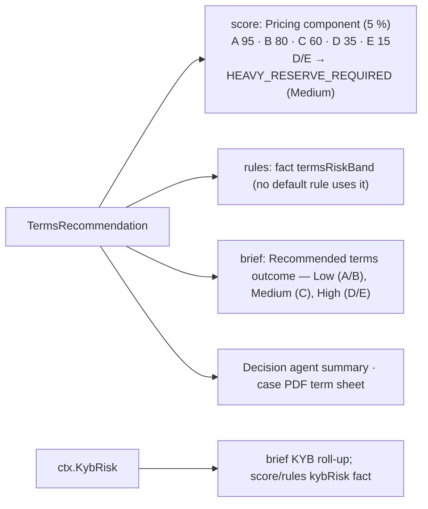

# Step 12 · `terms` — Reserve, settlement & pricing recommendation

| | |
|---|---|
| Step id | `terms` |
| Agent | Decision (`decision`) |
| Stage | 3, first Decision step; runs after every KYB and Financial step it lists (all soft dependencies) |
| Depends on | `verification`, `presence`, `screening`, `website`, `plausibility`, `credit`; intake deal attributes |
| Can hard-stop | No |
| Consumed by | `score` (`Pricing` component, 5 %), rules (`termsRiskBand`), `case` / brief / PDF, Decision agent summary |
| Implementation | `src/MerchantIntelligence.Underwriting/Pricing/ReservePricingRecommender.cs`, `src/MerchantIntelligence.Underwriting/Benchmarks/IndustryBenchmarks.cs`; wrapper `src/MerchantIntelligence.Platform/Agents/Decision/TermsStep.cs`; `AssessmentComposer.KybRisk` |

---

## 1. Why this step exists

### Functional purpose
Translate everything learned about the merchant into **concrete commercial terms** an acquirer would board them on: a risk band A–E, a reserve (none / rolling / capped / upfront), settlement delay, interchange-plus mark-up and fees, monthly and single-transaction caps, plus the modelled credit exposure. It also computes the KYB risk roll-up (`ctx.KybRisk`) that the brief reuses.

### Business question answered
*"If we approve, on what terms — and how much of our money is at risk while we wait for goods to be delivered and chargebacks to expire?"*

### Merchant-acquiring context
An acquirer is a **creditor** to its merchants: it pays out sales before the cardholder has received the goods and before the 120-day chargeback window has closed. If the merchant fails, the acquirer refunds cardholders. Reserves (money withheld from settlements), delayed settlement and caps are how that exposure is collateralised; pricing compensates for expected losses and servicing cost. Underwriting is therefore rarely "approve/decline" alone — most risk is managed through terms.

### Underwriting rationale
The step is a **deterministic, explainable pricing model**: a composite risk score in \([0,1]\) built from the credit model's decline/cancel probability plus additive adjustments for deal attributes and evidence outcomes, banded A–E, then mapped to reserve and pricing tables. Every adjustment is emitted as a `PricingFactor` so the analyst can see exactly why terms hardened.

---

## 2. Inputs

| Field | From | Effect |
|---|---|---|
| `Application` (6 credit features) | `ctx.Application` | Re-scored by the champion predictor for P(decline)/P(cancel); volume, tickets and MATCH flag drive exposure, reserve and caps |
| `DeliveryDays` | `Intake.DeliveryDays` (null → industry benchmark default) | Pre-delivery exposure |
| `CardNotPresentShare` | `Intake.CardNotPresentShare` (0–1) | CNP risk |
| `KybHighRisk` | `AssessmentComposer.KybRisk(...) == High` | +0.20 |
| `WebsiteComplianceScore` | `ctx.Website?.Score` | Hardens terms below 60 |
| `VolumePlausibilityScore` | `ctx.Plausibility?.PlausibilityScore` | Hardens terms below 60 |
| `OffersSubscriptions`, `OffersFreeTrials` | intake | Recurring-billing dispute risk |
| MCC risk tier | `MccCatalog.Find(mcc).RiskTier` (Medium if unknown) | +0.05 / +0.15 |
| Benchmark (`ChargebackRate`, `DeliveryDays`) | `IndustryBenchmarks.Resolve(mcc)` — exact MCC → category → All industries | Exposure model |

### KYB risk roll-up (`ctx.KybRisk`)
```text
v = verification unless no registry was reachable  (then treated as absent)
s = screening    unless no list loaded             (then treated as absent)
w = website
if v, s, w all absent → null (unknown)
tiers = v.Flags severities ∪ {s.OverallRisk} ∪ severities of w.Checks with Status = Fail
KybRisk = tiers empty ? Low : max(tiers)
```
Unavailable evidence is excluded rather than counted as Low; if everything is unavailable the roll-up is **null**, and `KybHighRisk` becomes `false` — the pricing model then has no KYB adjustment (a coverage gap, not a clean bill).

---

## 3. Internal flow

```mermaid
flowchart TD
    A[TermsStep] --> K[ctx.KybRisk = KybRisk(verification, screening, website)]
    K --> P[ReservePricingRecommender.Recommend]
    P --> B[Resolve industry benchmark for MCC]
    P --> M["Champion predict → risk = P(decline) + 0.5·P(cancel)  (MODEL_RISK)"]
    M --> T["+ MCC tier: High 0.15 / Medium 0.05 (MCC_RISK_TIER)"]
    T --> D["deliveryDays ≥ 30: + min(0.2, days/300) (FUTURE_DELIVERY)"]
    D --> C["CNP share > 0.5: + 0.05·share (CARD_NOT_PRESENT)"]
    C --> R["free trials +0.10 / subscriptions +0.05 (RECURRING_BILLING)"]
    R --> KY["KYB High: +0.20 (KYB_HIGH_RISK)"]
    KY --> W["website < 60: +(60−score)/400 (WEBSITE_NON_COMPLIANT)"]
    W --> V["plausibility < 60: +(60−score)/400 (VOLUME_IMPLAUSIBLE)"]
    V --> E["existing relationship: −0.10 (EXISTING_RELATIONSHIP)"]
    E --> CL[clamp 0..1 → band A/B/C/D/E]
    CL --> X[Exposure model]
    X --> RS[BuildReserve]
    X --> PR[BuildPricing]
    RS & PR --> OUT[TermsRecommendation]
```

### 3.1 Band thresholds
```text
risk < 0.15 → A   < 0.30 → B   < 0.50 → C   < 0.70 → D   else → E
```

### 3.2 Exposure model
```text
dailyVolume = AnnualVolume / 365
exposure = dailyVolume × deliveryDays                                 (unfulfilled sales)
         + dailyVolume × 120 × benchmark.ChargebackRate × multiplier   (expected chargebacks, 120-day window)
         + HighestTicket                                                (one large disputed sale)
multiplier: A 1×, B 1.5×, C 2.5×, D 4×, E 6×
```

### 3.3 Reserve table (`BuildReserve`)
| Band | Rolling % | Hold days |
|---|---|---|
| A | 0 | 0 |
| B | 5 | 90 |
| C | 10 | 180 |
| D | 15 | 180 |
| E | 20 | 180 |

* MATCH found → at least 20 % / 180 days.
* `steady = dailyVolume × pct × days` (steady-state balance held).
* `cap = max(exposure, steady × 0.5)` when pct > 0 — the rolling reserve is capped at modelled exposure so low-risk merchants are not over-collateralised. Type = `None` / `Capped` (cap < steady) / `Rolling`.
* Band E or MATCH found → **upfront** reserve `min(exposure × 0.25, 30 days of volume)`; type becomes `Upfront+Rolling` / `Upfront+Capped`.
* `EstimatedSteadyStateBalance = min(steady, cap)`.

### 3.4 Pricing table (`BuildPricing`)
| Band | IC+ mark-up (bps) | Settlement | Chargeback fee | Monthly cap | Single-txn cap |
|---|---|---|---|---|---|
| A | 20 | T+1 | $15 | 2.0 × avg month | 1.5 × highest ticket |
| B | 35 | T+2 | $15 | 1.5 × | 1.5 × |
| C | 60 | T+2 | $20 | 1.25 × | 1.1 × |
| D | 95 | T+3 | $25 | 1.1 × | 1.1 × |
| E | 150 | T+5 | $25 | 1.0 × | 1.1 × |

Adjustments: High-risk MCC +25 bps; volume < $100k +15 bps (fixed servicing cost); volume > $10M −10 bps (floor 10). Per-transaction fee $0.05 if ticket < $15, else $0.10 (A/B) or $0.20. Monthly fee $15 when volume < $250k.

---

## 4. Outputs

`TermsRecommendation(RiskBand, RiskScore, Reserve{Type, RollingPercent, RollingDays, CapAmount, UpfrontAmount, EstimatedSteadyStateBalance}, Pricing{InterchangePlusMarkupBps, PerTransactionFee, MonthlyFee, ChargebackFee, SettlementDelayDays, MonthlyVolumeCap, SingleTransactionCap}, EstimatedExposure, Factors[], BenchmarkSource)`

Timeline summary: `Band C · Capped reserve 10.0% / 180d · settlement T+2`.

Factor codes: `MODEL_RISK`, `MCC_RISK_TIER`, `FUTURE_DELIVERY`, `CARD_NOT_PRESENT`, `RECURRING_BILLING`, `KYB_HIGH_RISK`, `WEBSITE_NON_COMPLIANT`, `VOLUME_IMPLAUSIBLE`, `EXISTING_RELATIONSHIP`.

---

## 5. Downstream impact



The terms step never blocks an approval; it changes *what* is approved. A band D/E recommendation on an otherwise auto-approvable case still auto-approves **with** those terms — analysts should confirm the merchant will accept a reserve before boarding (this is exactly the `Cancelled` outcome the credit model learns).

---

## 6. Missing input, failures and coverage

| Situation | Behaviour |
|---|---|
| Credit step failed | Terms still re-run the champion predictor internally; if the champion is unavailable the step **fails**, `ctx.Terms=null`, `Pricing` component uncovered (5 %), brief omits terms |
| KYB evidence unavailable | `KybRisk` null → no `KYB_HIGH_RISK` factor. Terms are **softer than they should be**; read alongside the KYB coverage gaps |
| Website / plausibility not run | No hardening factor; same caveat |
| `DeliveryDays` blank | Industry default from the benchmark (e.g. Retail 5, Contracted Services 30) |
| MCC unknown to catalogue | Tier Medium (+0.05), benchmark "All industries" |
| MATCH unavailable | `MatchFound=false` → no forced 20 % reserve. If MATCH later confirms a listing, terms must be re-run |

---

## 7. Analyst interpretation and remediation

| Signal | Read as | Action |
|---|---|---|
| Band A/B, `None`/small rolling reserve | Standard SMB card-present profile | Board on recommended terms |
| `FUTURE_DELIVERY` large | Pre-delivery exposure (travel, furniture, events, contracted services) | Verify fulfilment capacity; consider delayed-funding rather than large reserve if KYB is strong |
| `VOLUME_IMPLAUSIBLE` + `WEBSITE_NON_COMPLIANT` | Terms hardened by evidence, not by model | Fix evidence (statements, policies) and re-assess before quoting — terms may drop two bands |
| `KYB_HIGH_RISK` | Any High KYB/website flag (registry mismatch, possible sanctions, failed high-severity website check) | Resolve the underlying flag; a possible-sanctions hit should be adjudicated before terms are even discussed |
| Upfront reserve (band E or MATCH) | Acquirer wants collateral before first settlement | Usually paired with Refer/Decline from rules; if approving anyway, ensure signed reserve agreement |
| Monthly cap ≈ declared volume | Band E caps growth at 1.0× | Explain to the merchant; caps are reviewed after seasoning |
| `EXISTING_RELATIONSHIP −0.10` | Portfolio history discount | Confirm the relationship is actually in good standing (the flag is self-declared) |

### False positives / negatives
* Benchmarks are per MCC category, so a low-chargeback niche inside a high-chargeback category is over-reserved; override with a portfolio-specific benchmark JSON.
* `CardNotPresentShare` defaults to 1.0 when not supplied — omitted intake fields **harden** terms (+0.05), unlike most other missing inputs.
* The model risk term uses P(decline)+½P(cancel) from a champion trained largely on synthetic data; its calibration is only as good as the training set.
* Recurring-billing factors are self-declared (`OffersSubscriptions`, `OffersFreeTrials`); nothing in the website crawl feeds back into them automatically, so undeclared subscription billing is priced as if absent.

---

## 8. Worked examples

**A. Neighbourhood restaurant** — MCC 5812 (Low tier), volume $600k, ticket $45, highest $400, delivery 0 days, CNP 0.1, KYB Low, website 82, plausibility 88, no relationship.
Model: Approved 0.86, P(decline) 0.06, P(cancel) 0.08 → risk 0.10; Low tier adds nothing; CNP ≤ 0.5 adds nothing → 0.10 → **band A**.
Exposure = 1,644×0 + 1,644×120×0.005×1 + 400 ≈ $1,386 (Retail benchmark, chargeback rate 0.5 %). Reserve: **None**. Pricing: 20 bps, $0.10/txn, $0 monthly, T+1, monthly cap $100k, single-txn cap $600. `Pricing` component 95 → 4.75 of 5 points.
Had the same merchant declared 60 % card-not-present (+0.03) and scored 52 on plausibility (+0.02), risk would be 0.15 → band B with a capped 5 % reserve — small changes in declared deal shape move the band.

**B. Online furniture retailer** — MCC 5712, volume $3M, ticket $1,400, highest $8,000, delivery 45 days, CNP 1.0, free trials no, subscriptions no, KYB Low, website 48, plausibility 55.
Model: Cancelled 0.46 / Declined 0.22 → 0.22 + 0.23; + MCC Medium 0.05; + FUTURE_DELIVERY min(0.2, 0.15) = 0.15; + CNP 0.05; + website (60−48)/400 = 0.03; + plausibility (60−55)/400 = 0.0125 → 0.74 → **band E**.
Exposure ≈ 8,219×45 + 8,219×120×0.005×6 + 8,000 ≈ $407k. Reserve 20 %/180 d, steady $296k, cap = max(407k, 148k) = $407k ≥ steady → Rolling; band E → upfront min(101.7k, 246.6k) = **$101.7k upfront + 20 % rolling**. Pricing 150 bps, $0.20/txn, T+5, monthly cap $250k, single-txn cap $8,800. `Pricing` component 15; `HEAVY_RESERVE_REQUIRED` (Medium). Rules: no hard stop, but High signals elsewhere (e.g. website fails) push to Refer. Analyst: the reserve is driven by 45-day delivery — request supplier contracts and delivery SLAs, re-crawl once policies are fixed, and re-run terms.
