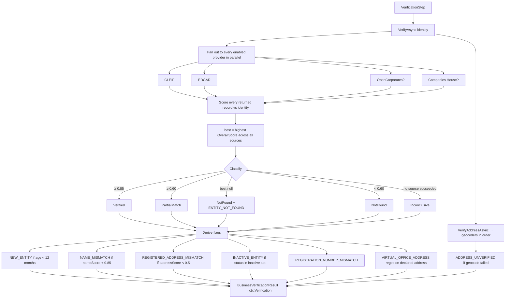
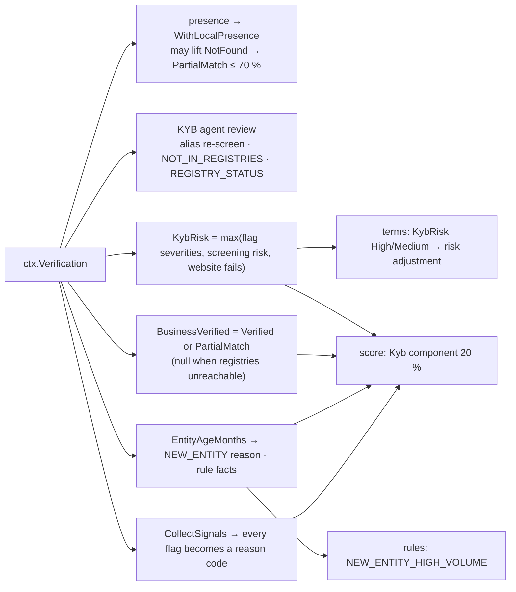

# Step 4 · `verification` — Business identity (registry) verification

| | |
|---|---|
| Step id | `verification` |
| Agent | KYB (`kyb`) |
| Stage | 1, first step of the KYB agent |
| Depends on | nothing |
| Consumed by | `presence` (adds local-presence flags to this result), KYB agent review (alias re-screening), `terms` and `score` (KybRisk roll-up, `BusinessVerified`, `EntityAgeMonths`), rules facts `entityAgeMonths` / `isNewEntity`, analyst brief |
| Required | No, but without it identity is unknown and the score drifts toward the midpoint |
| Implementation | `src/MerchantIntelligence.Kyb/Registry/BusinessVerificationService.cs`, `RegistryProviders.cs`, `Matching/NameMatcher.cs`; wrapper `src/MerchantIntelligence.Platform/Agents/Kyb/VerificationStep.cs` |

---

## 1. Why this step exists

### Functional purpose
Establish that the **legal entity named on the application actually exists**, is active, is the entity the applicant says it is, and sits where it says it does — using authoritative public registries rather than the applicant's own paperwork.

### Business / underwriting question answered
*"Is there a real, currently-registered legal person called `LegalName` at `Address`, and how long has it existed?"*

### Merchant-acquiring rationale
An acquirer extends unsecured credit to a merchant every time it settles funds before the chargeback window closes. The counterparty for that exposure is the legal entity. If the entity does not exist, is dissolved, or is a different company from the one the owner controls, the merchant agreement is unenforceable and reserves cannot be recovered. Entity age is the strongest single predictor of first-year merchant failure and bust-out fraud; card-brand and sponsor-bank programmes treat entities under 12 months as high-risk by default.

### Compliance relevance (KYB / CDD)
FinCEN's Customer Due Diligence rule, the EU 4th/5th AML Directives and card-brand KYC requirements all require the acquirer to *identify and verify* the business customer using reliable, independent sources. Public company registries are that source. This step is the entity half of the KYB program; the people half (beneficial owners) is screened in `screening`.

### Fraud relevance
Shell companies, dissolved entities revived on paper, registered-agent / PO-box addresses and name variations ("Acme Ltd" vs "Acme Holdings Ltd") are the standard toolkit of merchant fraud. The flags produced here (`NEW_ENTITY`, `INACTIVE_ENTITY`, `VIRTUAL_OFFICE_ADDRESS`, `NAME_MISMATCH`, `REGISTRATION_NUMBER_MISMATCH`) encode exactly those patterns.

---

## 2. Inputs

`BusinessIdentity` (intake `Business`):

| Field | Used for |
|---|---|
| `LegalName` | Registry full-text search term; name similarity scoring |
| `TradingName` | Fallback similarity (weighted × 0.95 — a DBA match is slightly weaker evidence) |
| `RegistrationNumber` | Exact match bonus (+0.15) or `REGISTRATION_NUMBER_MISMATCH` (High) |
| `TaxId` | Carried through; not matched against registries (no free US EIN registry) |
| `AddressLine`, `City`, `Region`, `PostalCode`, `Country` | Address similarity, geocoding, virtual-office heuristics, country penalty |

### External sources (`IBusinessRegistryProvider`)

| Provider | Enabled when | Coverage | Endpoint |
|---|---|---|---|
| **GLEIF LEI** | always | Entities holding a Legal Entity Identifier — mostly financial institutions, listed companies, larger corporates | `api.gleif.org/api/v1/lei-records?filter[fulltext]=` |
| **SEC EDGAR** | always | US public filers and their subsidiaries (name, state of incorporation, fiscal year, SIC) | `efts.sec.gov/LATEST/search-index` + `data.sec.gov/submissions/CIK….json` |
| **OpenCorporates** | `Kyb:OpenCorporatesApiToken` set | ~200 M companies across 140 jurisdictions incl. all US states | `api.opencorporates.com/v0.4/companies/search` |
| **UK Companies House** | `Kyb:CompaniesHouseApiKey` set | All UK companies | `api.company-information.service.gov.uk/search/companies` |

Address verification (`IAddressGeocoder`): **US Census Geocoder** (`geocoding.geo.census.gov`, keyless, US only); other geocoders may be registered. A geocoder that reports "only covers …" is skipped rather than counted as a failure.

Disabled providers are reported in `Sources` with `Succeeded=false` and error *"Not configured (API key missing)."* so the analyst can see why coverage is thin.

> **Coverage caveat that must be understood by every analyst:** with only the two keyless providers, a small private US LLC will almost never be found. `NotFound` for such a business means *"not in GLEIF or EDGAR"*, which is expected, not suspicious. This is why `presence` exists and why `OpenCorporates` should be configured in production.

---

## 3. Internal flow



### 3.1 Candidate scoring (`Score`)

```text
nameScore    = NameMatcher.Similarity(LegalName, record.LegalName)
               max'd with Similarity(TradingName, record.LegalName) × 0.95
addressScore = AddressMatcher.Similarity(FullAddress, record.Address)

overall = nameScore
if declared address and record address both present:
    overall = 0.7 × nameScore + 0.3 × addressScore
if registration numbers present and equal (normalised): overall = min(1, overall + 0.15)
if declared country ≠ record jurisdiction country:        overall ×= 0.85
```

**`NameMatcher.Similarity`** (shared with sanctions screening):
1. Normalise — Unicode decomposition, strip diacritics/punctuation, lower-case.
2. Tokenise and strip legal suffixes (ltd, llc, inc, gmbh, corp, plc …) so "Acme LLC" ≡ "ACME, Inc.".
3. `tokenSet` = fraction of tokens shared, allowing fuzzy token equality (Jaro-Winkler ≥ 0.85/0.9) and initials, with a length penalty (−0.15 per extra token, max 3) and a cap of 0.7 when only one token matched out of several.
4. `best` = max(Jaro-Winkler of joined tokens, Jaro-Winkler of alphabetically sorted tokens) — the sorted variant makes word order irrelevant.
5. Result = `max(tokenSet, 0.5·tokenSet + 0.5·best)` — whole-string JW alone is not trusted because it over-rewards a shared leading word.

**`AddressMatcher.Similarity`** canonicalises abbreviations (street→st, suite→ste, "One Apple Park Way"→"1 Apple Park Way"), drops single-character tokens, then applies the same token-set ratio.

### 3.2 Classification thresholds

| Status | Condition | Meaning for the underwriter |
|---|---|---|
| `Verified` | best overall ≥ 0.85 | Independent registry record matches name (and address) closely |
| `PartialMatch` | 0.60 ≤ best < 0.85 | Probably the same entity — name variant, moved address, or DBA |
| `NotFound` | best < 0.60 or no candidates, with ≥ 1 source succeeding | Not present in the sources searched — see coverage caveat |
| `Inconclusive` | every enabled source failed | Registries unreachable; **nothing is known** |

`ConfidencePercent` = best overall × 100 (0 when no candidate).

### 3.3 Flags

| Code | Severity | Trigger | Domain meaning |
|---|---|---|---|
| `NEW_ENTITY` | High | Incorporation < `Kyb:NewEntityThresholdMonths` (12) | Shell / bust-out risk; card brands treat as high-risk |
| `NAME_MISMATCH` | Medium | nameScore < 0.85 on best match | Possible different entity, or DBA declared as legal name |
| `REGISTERED_ADDRESS_MISMATCH` | Medium | addressScore < 0.5 | Operating vs. registered address differ — normal for many SMBs, suspicious with other flags |
| `INACTIVE_ENTITY` | High | Status contains inactive / dissolved / liquidation / closed / revoked / struck off / removed / dormant / retired / lapsed | Entity cannot legally contract |
| `REGISTRATION_NUMBER_MISMATCH` | High | Declared number ≠ registry number | Applicant quoting another company's number |
| `ENTITY_NOT_FOUND` | Medium | No candidate from any successful source | See coverage caveat |
| `VIRTUAL_OFFICE_ADDRESS` | Medium | Declared address matches `PO Box`, `PMB`, `Suite ####`, `registered agent`, `virtual office`, `mailbox`, `c/o` | No physical premises; combine with `presence` |
| `ADDRESS_UNVERIFIED` | Low | Geocoder returned an error (not a coverage message) | Address may be malformed or non-existent |
| `LOCAL_PRESENCE_*` | Low | Added later by `presence` (see that page) | Trading evidence |

---

## 4. Outputs

```csharp
BusinessVerificationResult(
    BusinessIdentity Input,
    VerificationStatus Status,             // Verified | PartialMatch | NotFound | Inconclusive
    double ConfidencePercent,
    RegistryMatch? BestMatch,              // record + nameScore + addressScore + overall
    int? EntityAgeMonths,                  // from best record's incorporation date
    AddressVerification? Address,          // provider, verified, matched address, lat/long, error
    IReadOnlyList<RegistrySourceResult> Sources,  // one per provider incl. disabled/failed
    IReadOnlyList<KybFlag> Flags,
    LocalPresenceResult? LocalPresence)    // populated by the presence step
```

Timeline summary: `Verified (93%) · GLEIF LEI · 2 flag(s)` or `Inconclusive (0%) · no source responded`.

---

## 5. Downstream impact



### Unified score — `Kyb` component (weight 0.20)

```text
base   = KybRisk High → 20 · Medium → 55 · Low → 90
if BusinessVerified == false : −25, reason BUSINESS_UNVERIFIED (High)
if EntityAgeMonths < 12     : −10, reason NEW_ENTITY (Medium)
clamp 0–100
```

* `BusinessVerified` is `true` for `Verified`/`PartialMatch`, `false` for `NotFound`, and **`null` when no registry responded** (`RegistriesReachable == false`) — so an outage is not scored as "unverified".
* `KybRisk` is the maximum severity across verification flags, screening overall risk and failed website checks. A single High flag here (`NEW_ENTITY`, `INACTIVE_ENTITY`, `REGISTRATION_NUMBER_MISMATCH`) makes KybRisk High → base 20 and reason `KYB_HIGH_RISK` (High) → unified score capped at 549, auto-approve blocked.
* Every verification flag is also added as a reason code with source `verification`; High ones cap the score.

### Rules
Facts: `entityAgeMonths`, `isNewEntity` (< 12 months). Default rule `NEW_ENTITY_HIGH_VOLUME` (new entity **and** `annualVolume > 1,000,000`) → Refer.

### KYB agent (autonomous action)
If the best registry record's legal name differs from both declared names, the agent **re-screens that alias** against sanctions and merges the hits into `ctx.Screening` (`ALIAS_RESCREENED`). This is the one place in the workflow where a step's output triggers extra evidence collection automatically.

### Terms
`KybRisk` High/Medium raises the pricing risk score → lower band, higher reserve.

---

## 6. Missing input, failures and coverage

| Situation | Status / result | Downstream |
|---|---|---|
| Legal name blank | Cannot happen — intake validation requires it | — |
| No address | Address checks skipped; `Address = null`; no address-related flags; scoring is name-only | `presence` skips too |
| Only keyless providers configured, small private business | `NotFound`, `ENTITY_NOT_FOUND` (Medium), disabled sources listed | `BusinessVerified=false` → −25 and `BUSINESS_UNVERIFIED` High → capped 549 → Refer. `presence` may lift to `PartialMatch`. |
| Every enabled provider throws / times out | `Inconclusive`, `Sources` all `Succeeded=false` | `RegistriesReachable=false` → `BusinessVerified=null`; brief says "Business identity: Unavailable — must not be read as verified"; KYB flags absent |
| Step throws / times out as a whole | `Failed` (default `onFail: Skip`), `ctx.Verification=null` | `Kyb` component still computed from screening/website (KybRisk), but `BusinessVerified=null`; brief "Business identity: Not run"; `presence` skips (dependency) |
| Geocoder failure | `ADDRESS_UNVERIFIED` Low | Informational |

---

## 7. Analyst interpretation and remediation

| Result | Read as | Do |
|---|---|---|
| `Verified` ≥ 85 %, no flags | Entity exists and matches | Record registry URL in file. |
| `PartialMatch` with `NAME_MISMATCH` | Likely a name variant / DBA | Confirm via certificate of formation; correct legal name on application. |
| `PartialMatch` lifted by local presence (≤ 70 %) | Trading evidence only | Request state registration documents — trading ≠ legal existence. |
| `NotFound`, keyless providers only | Expected for small private business | Obtain SOS certificate / EIN letter; configure OpenCorporates; check `presence`. |
| `NotFound` with OpenCorporates enabled | Genuinely absent | High concern — request incorporation documents, verify with state SOS directly. |
| `Inconclusive` | Registries down | Re-run later; do not approve on this evidence. |
| `NEW_ENTITY` | < 12 months old | Expect thin financials; require owner guarantee / higher reserve; pair with `plausibility` `YOUNG_BUSINESS_LARGE_VOLUME`. |
| `INACTIVE_ENTITY` | Dissolved / revoked | Decline or require reinstatement evidence. |
| `REGISTRATION_NUMBER_MISMATCH` | Wrong or borrowed number | Treat as potential misrepresentation; verify directly. |
| `VIRTUAL_OFFICE_ADDRESS` | Mailbox / agent address | Ask for operating address; check `presence`; CNP-only merchants legitimately use these. |
| `REGISTRY_STATUS` (agent) | Status not "active" but not in inactive set (e.g. "pending") | Confirm trading. |

### False positives / negatives
* **Common names** ("Apex Solutions") return unrelated GLEIF/EDGAR records with decent name scores; the address component (30 %) and country penalty usually keep them below 0.85, but analysts should open `BestMatch.Record.SourceUrl`.
* **Holding vs. operating company**: registry knows "Acme Holdings Inc", application says "Acme Inc" → `NAME_MISMATCH` although related. Legitimate; confirm group structure.
* **Recently moved businesses** trigger `REGISTERED_ADDRESS_MISMATCH`.
* **EDGAR subsidiaries** are matched by name only; incorporation date may be missing → no `EntityAgeMonths`.
* `NEW_ENTITY` depends on the registry exposing an incorporation date; GLEIF often does not, so a young entity can escape the flag.

---

## 8. Worked examples

**A. Public company.** *"Starbucks Corporation", 2401 Utah Ave S, Seattle WA.*
GLEIF returns the LEI record (name 1.0, address 0.9 → overall 0.97); EDGAR returns CIK 829224 (WA, incorporated 1985). Status `Verified` 97 %, age ≈ 480 months, no flags. Kyb component: 90 → 18 weighted points.

**B. Small LLC, keyless setup.** *"Bright Bean Coffee Roasters LLC", Portland OR.*
GLEIF: no records. EDGAR: no filer. OpenCorporates / Companies House: "Not configured". Status `NotFound`, flag `ENTITY_NOT_FOUND`. `presence` finds "Bright Bean Coffee" 40 m away on OSM → `PartialMatch` 63 %, `LOCAL_PRESENCE_CONFIRMED`. Score: `BusinessVerified=true`, KybRisk Medium (ENTITY_NOT_FOUND) → 55 → 11 points; brief asks for a certificate of formation.

**C. Borrowed identity.** *"Northwind Traders Inc", reg. no. 4471123.* OpenCorporates returns Northwind Traders Inc, reg. 8823001, status "DISSOLVED". Name 1.0 → `Verified` by name, but flags `REGISTRATION_NUMBER_MISMATCH` (High) and `INACTIVE_ENTITY` (High). KybRisk High → component 20, `KYB_HIGH_RISK`, score ≤ 549 → Refer; analyst should decline pending explanation.
