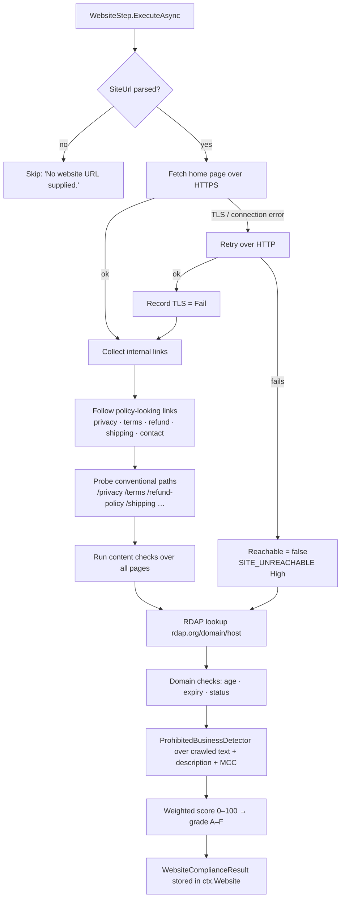
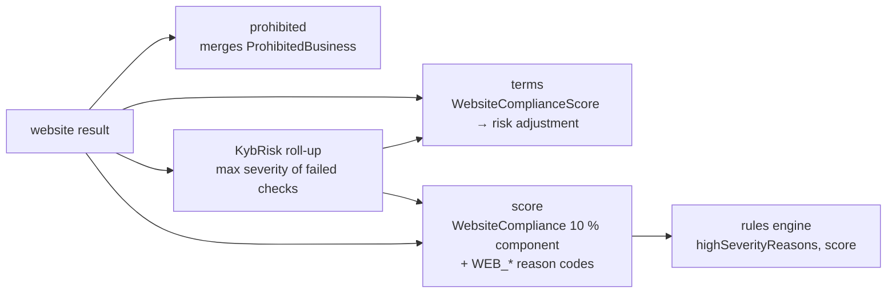

# Step 1 · `website` — Website compliance scan

| | |
|---|---|
| Step id | `website` |
| Agent | Pre-check (`precheck`) |
| Stage | 1 (runs concurrently with the KYB agent) |
| Depends on | nothing |
| Consumed by | `prohibited` (website text), `terms` (compliance score), `score` (10 % component + `WEB_*` signals), analyst brief / PDF |
| Required | No — skipped when no website URL is supplied |
| Implementation | `src/MerchantIntelligence.Kyb/Compliance/WebsiteComplianceScanner.cs`, wrapped by `src/MerchantIntelligence.Platform/Agents/PreCheck/WebsiteStep.cs` |

---

## 1. Why this step exists

### Functional purpose
The website is the only part of a card-not-present merchant that the acquirer, the cardholder and the card brands all see. This step fetches the declared site, follows its policy pages, and answers one question: **does the storefront look like a legitimate, card-brand-compliant business that cardholders can trust and that we can defend in a dispute?**

### Business / underwriting question answered
*"If a cardholder buys from this site today, can they find out who they are dealing with, what they will be charged, in which currency, how they get a refund, and how to reach the merchant?"* — and, just as importantly, *"does the site exist at all, is it new, is it about to lapse, and is it selling what the application says it sells?"*

### Merchant-acquiring rationale
Visa and Mastercard core rules require an e-commerce merchant's website to display, at minimum:

* legal / trading name and customer-service contact details,
* a complete description of goods and services,
* the transaction currency,
* refund / return / cancellation policy,
* delivery policy (timing and any export restrictions),
* privacy policy and terms of sale,
* accepted card brand marks,
* secure transport (TLS) for the checkout.

Missing disclosures are a classic driver of *"item not as described"* and *"credit not processed"* chargebacks, are flagged in card-brand acquirer audits, and, when a merchant fails, they are what the acquirer is fined for. The scan therefore acts as a **cheap, early, automated card-brand audit**.

### Compliance / fraud relevance
* **Domain age** — sites registered days or weeks before the application are the single most common indicator of bust-out and transaction-laundering merchants.
* **Domain status / expiry** — `clientHold`, `pendingDelete`, or an imminent expiry indicates an abandoned or disputed domain.
* **Placeholder content** — "lorem ipsum", template text and empty product grids indicate a storefront built to pass onboarding, not to trade.
* **Prohibited content** — the same keyword taxonomy used by the `prohibited` step is run over the crawled text so that a merchant declaring "gift shop" but selling CBD or vapes is caught here (see `PROHIBITED_CONTENT`).

---

## 2. Inputs

| Input | Source | Used for |
|---|---|---|
| `Business.WebsiteUrl` | intake | Target of the crawl. Normalised by `AssessmentContext.ParseUrl`: a scheme-less value gets `https://`; a host without a dot is rejected and the step is skipped. |
| `BusinessDescription` | intake | Passed to the embedded prohibited-business detector so website text and self-declared text are classified together. |
| `MerchantCategoryCode` | intake | Corroborates prohibited-category matches (an MCC in a restricted category multiplies the match score). |
| `Business.LegalName` | intake | `LEGAL_NAME_DISCLOSED` check — is the legal name (or a fuzzy match of it) visible anywhere on the site? |

External sources: the merchant website itself (HTTP/HTTPS), and the RDAP registry at `https://rdap.org/domain/{domain}` for registration, expiry, registrar and EPP status codes. No API keys are required.

---

## 3. How the domain process works

An underwriter reviewing a website manually would:

1. Open the home page over HTTPS and confirm the certificate is valid.
2. Look for footer links to *Privacy*, *Terms*, *Refunds/Returns*, *Shipping/Delivery*, *Contact*.
3. Check that a phone number / e-mail / postal address is present.
4. Check prices carry a currency, the checkout shows accepted card marks, and there is a real cart or checkout.
5. WHOIS the domain for age, expiry and registrar.
6. Note whether the legal entity name appears anywhere.
7. Skim product pages for anything the acceptable-use policy forbids.

The scanner performs exactly these seven actions, deterministically, and turns each into a coded check with a severity.

---

## 4. Internal flow



### 4.1 Fetching
* `https://` first; if the TLS handshake or connection fails and plain `http://` succeeds, the site is treated as reachable but the `TLS` check is recorded as **Fail (High)**.
* Only the same host is crawled. Pages are fetched with a bounded timeout; anything that fails is simply absent from `PagesAnalyzed`.
* Link discovery looks for anchor text / hrefs containing policy keywords, then falls back to probing conventional paths (`/privacy`, `/privacy-policy`, `/terms`, `/terms-of-service`, `/refund`, `/returns`, `/shipping`, `/delivery`, `/contact`…).

### 4.2 Content checks
Each check produces a `ComplianceCheck(Code, Title, Status, Detail, Severity, Evidence)` where `Status ∈ {Pass, Warn, Fail, Skipped}`.

| Code | What is looked for | Severity | Typical Fail cause |
|---|---|---|---|
| `TLS` | HTTPS negotiated for the home page | High | Certificate invalid / HTTP-only site |
| `SITE_UNREACHABLE` | Any page fetched at all | High | DNS failure, timeout, 5xx |
| `PRIVACY_POLICY` | A privacy page or privacy section | Medium | None found |
| `TERMS_CONDITIONS` | Terms of service / sale | Medium | None found |
| `REFUND_POLICY` | Refund / return / cancellation policy text | High | None found — the top chargeback defence gap |
| `DELIVERY_POLICY` | Shipping / delivery timescales | Medium | None found for a physical-goods site |
| `EXPORT_RESTRICTIONS` | Statement of countries served / not served | Low | Absent — Warn rather than Fail for service businesses |
| `CUSTOMER_SERVICE_CONTACT` | Phone, e-mail, or postal address pattern | High | No contact channel |
| `CURRENCY_DISCLOSURE` | Currency symbol / ISO code next to prices | Low | Prices without currency |
| `CARD_ACCEPTANCE_MARKS` | Visa / Mastercard / Amex names or secure-checkout indicators | Low | Absent |
| `CHECKOUT_PRESENT` | Cart / checkout / "buy now" elements | Medium | Brochure site claiming e-commerce volume |
| `LEGAL_NAME_DISCLOSED` | Legal name (fuzzy) appears on site | Medium | Only a brand / DBA visible |
| `PLACEHOLDER_CONTENT` | "lorem ipsum", "coming soon", template text | Medium | Unfinished template |
| `DOMAIN_AGE` | RDAP `registration` event | Medium | Fail < 90 days, Warn < 365 days, Pass otherwise |
| `DOMAIN_EXPIRING` | RDAP `expiration` event | Low | Warn when expiry is within 60 days (only emitted in that case) |
| `DOMAIN_STATUS` | EPP status codes | High | Any status containing `hold` or `redemption` (`clientHold`, `serverHold`, `redemptionPeriod`) |
| `PROHIBITED_CONTENT` | Prohibited-category keyword hits in crawled text | High | Site sells a prohibited / restricted category |

A check is **Skipped** when its evidence cannot be evaluated (e.g. domain checks when RDAP returns an error; content checks when the site is unreachable). Skipped checks are excluded from the score — they are neither a pass nor a fail.

### 4.3 Scoring and grading
Each check has a weight derived from severity — High = 3, Medium = 2, Low = 1. A Pass earns the full weight, a Warn earns half, a Fail earns zero.

```text
score = round( Σ earned_weight / Σ weight_of_non-skipped_checks × 100 )

grade: A ≥ 90 · B ≥ 75 · C ≥ 60 · D ≥ 40 · F < 40
```

Because Skipped checks are removed from the denominator, an unreachable site does not "pass" the content checks — only `SITE_UNREACHABLE` and any RDAP-derived checks remain, so the grade is an F on the evidence available.

### 4.4 Domain intelligence (RDAP)
RDAP is the IETF successor to WHOIS and needs no key. The scanner reads:

* `registration` event → `Registered` → age in days,
* `expiration` event → `Expires`,
* `status[]` → EPP status codes,
* registrar entity name.

Failures (rate-limited, TLD not served by rdap.org, private registrations) populate `DomainInfo.Error` and cause the three domain checks to be **Skipped**, not passed.

### 4.5 Prohibited content
The crawled text of every page is concatenated with the business description and run through `ProhibitedBusinessDetector.Analyze(websiteText, description, mcc)`. The resulting `ProhibitedBusinessResult` is stored on the website result **and** later merged with the description-only analysis by the `prohibited` step (see that page). A `Prohibited` or `Restricted` verdict here yields the `PROHIBITED_CONTENT` check as Fail/High.

---

## 5. Outputs

```csharp
WebsiteComplianceResult(
    Uri WebsiteUrl,
    bool Reachable,
    int Score,                       // 0–100
    string Grade,                    // A–F
    IReadOnlyList<ComplianceCheck> Checks,
    DomainInfo? Domain,
    ProhibitedBusinessResult ProhibitedBusiness,
    IReadOnlyList<Uri> PagesAnalyzed)
```

Step summary line shown in the timeline: `Grade B (81/100) · 2 failed check(s) · 5 page(s)` or `Website unreachable`.

### Findings / reason codes emitted downstream
* Every check with `Status == Fail` becomes a `RiskSignal("website", "WEB_" + code, detail, severity)` via `AssessmentComposer.CollectSignals` — e.g. `WEB_REFUND_POLICY`, `WEB_TLS`, `WEB_DOMAIN_AGE`.
* `WEBSITE_NON_COMPLIANT` (Medium) is added by the unified scorer when `Score < 60`.
* Pre-check agent advisories: `NO_WEBSITE` when the URL is missing, `WEBSITE_UNREACHABLE` when the fetch failed.

---

## 6. Downstream impact



| Consumer | Effect |
|---|---|
| **`prohibited`** | The website's `ProhibitedBusiness` is combined with the description-only verdict; the stricter verdict wins. |
| **`terms`** | `WebsiteComplianceScore` is a pricing input; a low score raises the computed risk and therefore band / reserve. |
| **KYB risk roll-up** (`AssessmentComposer.KybRisk`) | Severities of failed website checks are pooled with registry flags and screening risk; a single High fail (e.g. `REFUND_POLICY`) can rate KYB **High**, which in turn scores the `Kyb` component at 20/100 and emits `KYB_HIGH_RISK`. |
| **`score`** | `WebsiteCompliance` component, weight 0.10, value = `Score`. Every `WEB_*` Fail signal becomes a reason code; a High-severity one caps the unified score at 549 and blocks auto-approval. |
| **Rules** | Through `highSeverityReasons`, `score`, `coveragePercent`. |
| **Case / brief** | Failed checks and their evidence URLs are listed in the explainability narrative and PDF. |

---

## 7. Missing input, failures and coverage

| Situation | Step status | Result | Effect on score |
|---|---|---|---|
| No `WebsiteUrl`, or value cannot be parsed to a dotted host | `Skipped` — "No website URL supplied." | `ctx.Website = null` | `WebsiteCompliance` component uncovered → coverage −10 pp, score drifts toward 500; `mcc` also skips. Advisory `NO_WEBSITE`. |
| Site unreachable | `Succeeded` (the scan ran) | `Reachable=false`, `SITE_UNREACHABLE` Fail/High, content checks Skipped, domain checks attempted | Component covered with a very low score; `WEB_SITE_UNREACHABLE` is a High reason → score capped at 549, `Refer`. Advisory `WEBSITE_UNREACHABLE`. |
| RDAP failure | `Succeeded` | `Domain.Error` set; `DOMAIN_*` checks Skipped | Domain age not assessed — analysts should WHOIS manually. |
| Scanner throws (unexpected) | `Failed` under the step's `onFail` policy (default `Skip`) | `ctx.Website = null` | Treated as not run — coverage gap; with `onFail: Refer` the outcome is forced to Refer. |

A skipped or failed website scan is **never** interpreted as compliant.

---

## 8. Analyst interpretation and remediation

| Observation | Meaning | Recommended action |
|---|---|---|
| Grade A/B, no High fails | Storefront meets card-brand disclosure norms | No action; note in file. |
| `WEB_REFUND_POLICY` | Merchant cannot demonstrate refund terms → weak chargeback defence | Request the policy be published before boarding; condition of approval. |
| `WEB_TLS` | Checkout not secured | Decline until fixed (PCI DSS requirement). |
| `WEB_DOMAIN_AGE` (< 90 days; Warn under a year) with large declared volume | New domain, high volume: bust-out pattern | Cross-check with `plausibility` (`YOUNG_BUSINESS_LARGE_VOLUME`), require statements, consider higher reserve. |
| `WEB_DOMAIN_STATUS` | Domain on hold / pending delete | Ask merchant to resolve registrar dispute; do not board until status clears. |
| `WEB_PLACEHOLDER_CONTENT` | Template site, not trading | Request live product pages; treat as pre-revenue for plausibility. |
| `WEB_LEGAL_NAME_DISCLOSED` | Site shows only a brand | Confirm DBA registration; ensure legal name appears in terms/footer. |
| `WEB_PROHIBITED_CONTENT` | Site sells a restricted/prohibited category | See `prohibited` page; Prohibited is a hard stop. |
| `Website unreachable` | Site down at scan time | Retry later; if persistent, request evidence the business trades (screenshots, app-store listing). |

### False positives / negatives
* **Single-page / JavaScript-rendered stores** (Shopify themes with client-side routing, SPA checkouts): the fetcher does not execute JavaScript, so policy links rendered by script may be missed → false Fails. Analyst should verify manually.
* **Regional phrasing**: "Returns" vs "Refunds", "Impressum" vs "Contact" — the keyword lists are English-centric.
* **Marketplaces / service businesses**: `CHECKOUT_PRESENT` and `DELIVERY_POLICY` may legitimately be absent (invoice-based B2B).
* **Cloaked content**: a site that shows compliant text to crawlers but different content to customers will pass. Pair with `mcc` and `plausibility`.

---

## 9. Worked example

Application: *Bright Bean Coffee Roasters LLC*, MCC 5499, `https://brightbean.example`, declared volume $600k.

1. HTTPS fetch succeeds; home + `/shop`, `/refund-policy`, `/privacy`, `/contact` analysed (5 pages).
2. Checks: TLS Pass, Privacy Pass, Terms **Fail** (Medium), Refund Pass, Delivery Pass, Export Warn, Contact Pass, Currency Pass, Marks Pass, Checkout Pass, Legal-name **Fail** (Medium — only "Bright Bean" appears), Placeholder Pass, Domain age Pass (registered 2019), Expiry Pass, Status Pass, Prohibited Pass.
3. Weights (High 3 / Medium 2 / Low 1): TLS 3, Privacy 2, Terms 2, Refund 3, Delivery 2, Export 1, Contact 3, Currency 1, Marks 1, Checkout 2, Legal name 2, Placeholder 2, Domain age 2, Prohibited 3 = 29 (expiry and status checks are only added when they trigger). Earned = 29 − 2 (Terms) − 2 (Legal name) − 0.5 (Export warn) = 24.5 → **84 → Grade B**.
4. Signals: `WEB_TERMS_CONDITIONS`, `WEB_LEGAL_NAME_DISCLOSED` (both Medium). No High → no cap.
5. `WebsiteCompliance` component: 84 × 0.10 = 8.4 weighted points; `terms` receives 84 (no website penalty).

Analyst brief: *"Publish terms of sale and show the legal entity name in the footer as a condition of approval."*

---

## 10. Configuration and limitations

* No configuration keys; the scanner relies only on public HTTP and rdap.org.
* Crawl depth is intentionally shallow (home page + policy pages) to keep the step to a few seconds.
* No JavaScript execution, no screenshots, no image OCR — logo-only card marks are not detected.
* RDAP coverage varies by TLD; ccTLDs may return no data.
* Keyword taxonomies are embedded resources; extending language coverage requires a resource change.
