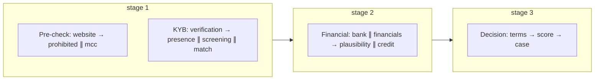

# Agents and steps

Code: `src/MerchantIntelligence.Platform/Agents/<PreCheck|Kyb|Financial|Decision>/`. Each folder has
`<Name>Agent.cs` (the review), one `*Step.cs` per owned check, and a `*Registration.cs` that adds
them to DI. The per-check functional detail (inputs, finding codes, score effect) is in
[../full-assessment.md §6](../full-assessment.md#6-the-thirteen-steps).

## The four agents

The agent set is **fixed** at four. Which steps each owns, and whether it runs, is workflow data.

| Id | Name | Mandate | Default steps | Review (`ReviewAsync`) adds |
|----|------|---------|---------------|-----------------------------|
| `precheck` | Pre-check | Is the application complete and internally consistent? | `website`, `prohibited`, `mcc` | Advisories `NO_WEBSITE`, `WEBSITE_UNREACHABLE`, `NO_BANK_STATEMENT`, `NO_FINANCIALS`, `NO_OWNERS`, `THIN_DESCRIPTION`, `THIN_PROFILE` each with its coverage/confidence effect; observations for MCC inconsistency and non-acceptable business class |
| `kyb` | KYB & screening | Who is the merchant and are they screenable? | `verification`, `screening`, `match`, `presence` | Compares registry legal/trading names with the declared ones and **re-screens new aliases** (`ALIAS_RESCREENED`, merged into screening); reports registry status, sanctions/PEP hits, `MATCH_UNAVAILABLE` as coverage — never as clear |
| `financial` | Financial & credit | Do the numbers hold together? | `bank`, `financials`, `plausibility`, `credit` | `STATEMENT_VS_DECLARED`, `NSF_EVENTS`, `MULTIPLE_PROCESSORS`, `VOLUME_EXCEEDS_REVENUE`, `LOSS_MAKING`, `MODEL_VS_PLAUSIBILITY` |
| `decision` | Decision & case | Turn evidence into terms, a score and a case | `terms`, `score`, `case` | Hard stops, forced Refer, `COVERAGE_GAPS`, `BRIEF` of all upstream findings. Cannot override score, hard stops, rules or case creation |

Reviews are plain C# over structured step results. They emit `AgentFinding`s (code, severity,
message, action) into the `AgentReport` that appears in `AssessmentResult.agents[]`, the NDJSON
stream (`{"type":"agent"}`), the `/assess` agents tab and the PDF.

## The 14 steps

| Id | Name | `dependsOn` (default) | Required | Params | Domain service |
|----|------|-----------------------|----------|--------|----------------|
| `website` | Website compliance scan | – | | | `WebsiteComplianceScanner` (Kyb) |
| `prohibited` | Prohibited & restricted business | `website` | | | `ProhibitedBusinessDetector` (Kyb) |
| `mcc` | MCC validation | – | | | `MccValidationService` (MccValidation) |
| `verification` | Business identity verification | – | | | `BusinessVerificationService` (Kyb) |
| `screening` | Sanctions / PEP / adverse-media | – | | `includeTradingName`, `includeOwners` (bool, default true) | `SanctionsScreeningService` (Kyb) |
| `match` | MATCH / terminated-merchant inquiry | – | | | `IMatchProvider` (Platform) |
| `presence` | Local business presence | `verification` | | | `LocalPresenceService` (Kyb) |
| `bank` | Bank statement cash-flow | – | | | `BankStatementParser` + `CashFlowAnalyzer` (Underwriting) |
| `financials` | P&L / balance sheet | – | | | `ProfitAndLossAnalyzer` (Underwriting) |
| `plausibility` | Declared volume plausibility | `bank`, `financials` | | | `VolumePlausibilityAnalyzer` (Underwriting) |
| `credit` | Credit decision & explainability | `match` | | | `DecisionPredictor` + `DecisionExplainer` |
| `terms` | Reserve & pricing recommendation | `verification`, `presence`, `screening`, `website`, `plausibility`, `credit` | | | `ReservePricingRecommender` (Underwriting) |
| `score` | Unified risk score & policy rules | every other evidence step | **yes** | | `UnifiedRiskScorer` + `RulesEngine` (Platform) |
| `case` | Case creation & audit | `score` | | `priority` (Low/Normal/High/Critical, default from tier) | `CaseService` + `AuditTrail` (Platform) |

Notes

* `dependsOn` is a **data** dependency: the step cannot produce a meaningful result without that
  input. It always wins over the scheduling the workflow asks for: an agent's `stepOrder`
  (`Parallel`, or `Ordered` by `slot` — equal slots run together) is a preference the planner
  corrects when it contradicts a dependency, with a warning; the designer snaps such a drop back
  and explains why. Agent-to-agent order comes from `transitions[]` (`Always` / `Success` / `Fail`)
  plus any cross-agent `dependsOn`; a `stopGate` on a step can end its agent early (agent or
  workflow scope) and force Refer / Decline. Details: [Assessment workflow](Assessment-Workflow.md).
  A workflow may override `dependsOn` per step, but a dependency on a disabled step makes the
  dependant *degraded* (warning) rather than blocked.
* `score` is the only *required* step; validation fails if it is disabled. `case` is optional and
  runs after `score`.
* Steps whose input is missing skip themselves with an explanatory message (`website` without a
  URL, `bank` without an upload, `presence` without an address). Skips are coverage gaps, not
  failures.
* Hard stops set on the context: `SANCTIONS_MATCH` (screening), `PROHIBITED_BUSINESS`
  (prohibited), `MATCH_LISTED` (match). With `haltOnHardStop=true` remaining non-required steps are
  skipped; without it they still run so the analyst sees the full picture.

## Default execution shape

Financial waits for stage 1 only because `credit` depends on `match` (owned by KYB); Decision waits
for everything because `terms`/`score` consume all upstream results.

## Adding a step

1. Create `Platform/Agents/<Agent>/<New>Step.cs` implementing `IAssessmentStep`; give it a unique
   id, `DependsOn`, `Consumes`, and param descriptors.
2. Store its result on `AssessmentContext` (add a typed property) and record status through the
   context helpers so streaming and the run log pick it up.
3. Register it in the agent's `*Registration.cs` and add it to that agent's `DefaultSteps`.
4. Add the id to `default-workflow.json` (and to the step's agent) — `Upgrade` adds it to stored
   workflows as disabled.
5. Consume the result in `UnifiedRiskScorer` / `AssessmentComposer` / the PDF if it should affect
   the score or the report; add tests in `tests/.../WorkflowTests.cs` and the relevant module tests.
