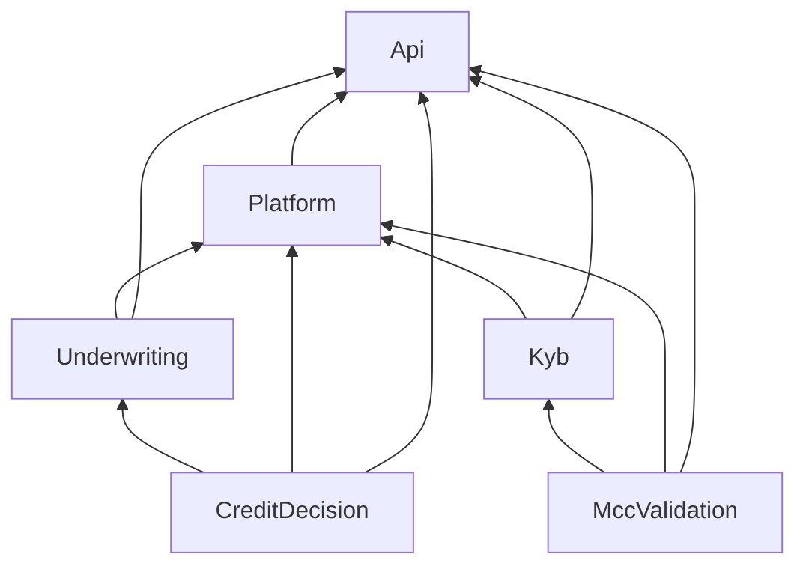
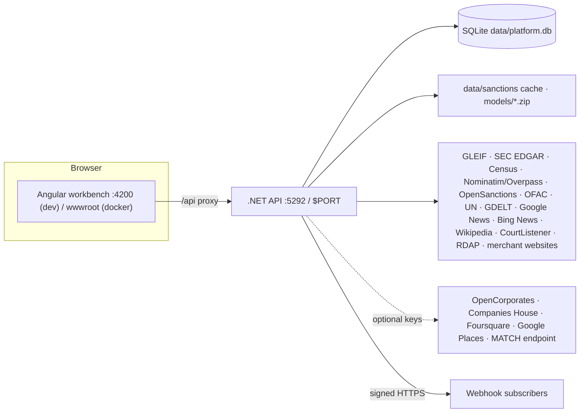

# Architecture

## Solution layout

```
MerchantIntelligence.sln
src/
  MerchantIntelligence.CreditDecision            ML.NET LightGBM credit model (train, predict, synthetic data)
  MerchantIntelligence.CreditDecision.Trainer    console: writes models/credit-decision.zip
  MerchantIntelligence.MccValidation             MCC catalog, SIC→MCC crosswalk, EDGAR client, website fetch/extract, text classifier, evidence providers
  MerchantIntelligence.MccValidation.DataPipeline console: downloads EDGAR text, trains models/mcc-classifier.zip
  MerchantIntelligence.Kyb                       registry verification, local presence, sanctions/PEP screening, website compliance, prohibited business
  MerchantIntelligence.Underwriting              Shapley explainer, reserve/pricing, volume plausibility, bank & P&L statement parsing
  MerchantIntelligence.Platform                  unified score, rules engine, cases + audit, webhooks, model ops, MATCH boundary,
                                                 full assessment, workflow engine, the four agents
  MerchantIntelligence.Api                       ASP.NET Core Web API + Swagger; serves the SPA from wwwroot in Docker
web/workbench                                    Angular 18 + Material workbench (one page per capability)
tests/MerchantIntelligence.Tests                 xUnit unit + WebApplicationFactory integration tests
models/                                          trained model zips + filer-domains.json
docs/                                            full-assessment.md (functional spec) and this wiki
```

## Dependency direction



* The domain libraries (`CreditDecision`, `MccValidation`, `Kyb`, `Underwriting`) know nothing about
  each other's orchestration; each exposes plain services registered via an `Add*` extension method.
* `Platform` is the only project that composes them. It owns the workflow engine
  (`Platform/Workflows`), the four agents and their steps (`Platform/Agents/<Agent>/`), and the
  cross-cutting concerns (score, rules, cases, audit, webhooks, model ops).
* `Api` is thin: controllers map HTTP to services; `Program.cs` wires DI, CORS, the website
  `HttpClient` (15 s timeout, `MerchantIntelligenceBot/1.0` UA, 4 MB cap) and static SPA hosting.

## Runtime topology



Everything runs in one process. There is no queue, no background worker other than the sanctions
refresh timer, and no call to any LLM or hosted model API.

## Persistence

`PlatformDatabase` (SQLite, path `Platform:DatabasePath`, `:memory:` in tests) creates these tables
on start-up:

| Table | Used by |
|-------|---------|
| `assessment_workflows` | `WorkflowRepository` – versioned `WorkflowDefinition` JSON, one active |
| `rule_sets` | `RuleSetRepository` – versioned policy rules, one active |
| `cases`, `case_notes` | `CaseService` – analyst queue |
| `audit_events` | `AuditTrail` – append-only, SHA-256 hash-chained (`GET /api/platform/audit/verify`) |
| `webhooks`, `webhook_deliveries` | `WebhookDispatcher` |
| `decision_log`, `model_registry` | `ModelOpsService` – champion/challenger, drift, retrain/promote |

Assessment results are persisted by `AssessmentService` alongside these. On Render's free tier
there is no disk, so all of this resets on redeploy (see [Configuration](Configuration.md)).

## Where "agents" fit

The four agents are **deterministic executors** inside a `Microsoft.Agents.AI.Workflows` graph
(Microsoft Agent Framework, the successor of AutoGen + Semantic Kernel). The framework is used for
its graph runtime — executors, fan-out/fan-in edges, streamed events — not for its LLM agent types.
`IChatClient`, prompts and tool-calling are not referenced anywhere in the solution. See
[Assessment workflow](Assessment-Workflow.md).

## Key design rules

1. **Missing evidence never clears a merchant.** A failed or skipped check is a coverage gap; a
   source that cannot be reached is *Unavailable*; MATCH without credentials is `NotConfigured`.
2. **Reviews cannot change outcomes.** Agent `ReviewAsync` emits findings only; score, hard stops,
   rules and case creation are owned by the `score` / `case` steps.
3. **Everything is reproducible.** Same inputs and same list snapshots give the same result; every
   adjustment carries a code and a description so the UI and PDF can explain it.
4. **Configuration is data.** Workflows and policy rules are versioned JSON with publish, rollback
   and audit — not code.
