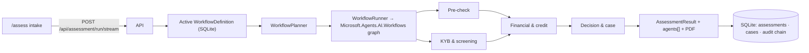

# MerchantIntelligence Wiki

Merchant acquiring pre-boarding suite: one intake → a Profile agent that classifies the merchant (legal form, size segment,
which checks apply) → 14 deterministic evidence checks grouped under four rule-based agents → Approve / Refer / Decline with full explainability, a PDF memo and an audit trail.
No LLM or generative model is involved anywhere; the only ML components are two small ML.NET
classifiers (credit decision, MCC text).

| Page | What you will find |
|------|--------------------|
| [Architecture](Architecture.md) | Solution layout, projects, dependency direction, runtime topology, persistence |
| [Assessment workflow](Assessment-Workflow.md) | How a run executes: `WorkflowDefinition` (agents, transitions, ordered/parallel steps, stop-gates) → planner → Agent Framework graph → streamed events |
| [Agents and steps](Agents-and-Steps.md) | The five agents, the 16 steps, dependencies, what each review adds |
| [Scoring and decisions](Scoring-and-Decisions.md) | Unified 0–1000 score, weights, hard stops, policy rules, reserve & pricing bands |
| [KYB and compliance](KYB-and-Compliance.md) | Registry verification, local presence, sanctions/PEP, website compliance, prohibited business |
| [MCC validation](MCC-Validation.md) | Evidence providers, website crawl, EDGAR classifier, aggregation |
| [Underwriting](Underwriting.md) | Shapley explainability, statement parsing, volume plausibility |
| [Data sources](Data-Sources.md) | Every external source, whether it needs a key, licence caveats |
| [API reference](API-Reference.md) | All endpoints grouped by controller |
| [Web UI](Web-UI.md) | Angular workbench routes and how they map to the API |
| [Configuration](Configuration.md) | `appsettings` keys, environment variables, secrets, Render deployment |
| [Development](Development.md) | Build, test, run, retrain models, CI, repo skills |
| [Glossary](Glossary.md) | Acquiring / compliance terms used in the code and UI |

The detailed per-check functional specification (intake fields, every finding code, decision
derivation, PDF layout) lives in [../full-assessment.md](../full-assessment.md); this wiki links to it
rather than repeating it.

## Ten-second tour

Live instance: <https://merchant-intelligence-3gtq.onrender.com/assess> (Render free tier, cold start 30–60 s).
