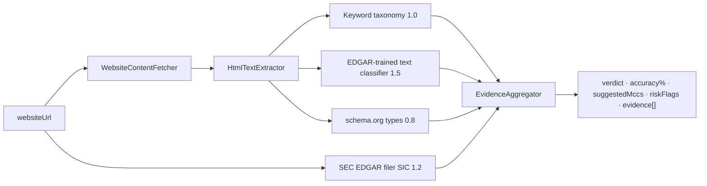

# MCC validation

Project: `src/MerchantIntelligence.MccValidation`. API: `POST /api/mcc-validation/validate`,
`GET /api/mcc-validation/catalog`. UI: `/mcc`; also step `mcc` of the Pre-check agent.

Question answered: *is the declared Merchant Category Code consistent with what the website
actually sells?*

## Pipeline



### Website fetch — `Web/WebsiteContentFetcher.cs`

`FetchAsync(url, maxPages = 4)` downloads the homepage with the shared `HttpClient`
(`WebsiteContentFetcher.HttpClientName`, configured in `Api/Program.cs`: 15 s timeout,
`Mozilla/5.0 (compatible; MerchantIntelligenceBot/1.0)`, 4 MB buffer), then up to three more
same-host pages whose path matches
`about|company|who-we-are|our-story|products?|services?|shop|menu|what-we-do|solutions?`.
Non-2xx and non-HTML responses are skipped. Plain HTTP GET — no headless browser, no JavaScript
execution, no robots.txt check.

### Text extraction — `Web/HtmlTextExtractor.cs`

`Extract(html, baseUri, maxChars = 20_000)` (HtmlAgilityPack) returns title, meta/og description,
h1–h3 headings, schema.org `@type`s from JSON-LD, visible body text (skipping `script style
noscript svg template iframe head nav footer`) and same-host internal links (no fragments, mailto,
tel, javascript). `ToClassifierText()` concatenates title → description → headings → body so the
strongest signals come first.

### Evidence providers — `Validation/EvidenceProviders.cs`

| Provider | Weight | Evidence | Fails soft when |
|----------|--------|----------|-----------------|
| Website keyword taxonomy | 1.0 | Deterministic keyword match of page text against `Resources/mcc-catalog.json` keywords per MCC | no keywords hit |
| ML text classifier (EDGAR-trained) | 1.5 | ML.NET TF-IDF + maximum-entropy multiclass model (`models/mcc-classifier.zip`); abstains ("No signal") when top probability < `MinProbability` = 0.10 | model missing → provider unavailable |
| schema.org structured data | 0.8 | JSON-LD `@type` (Restaurant, Hotel, Pharmacy, AutoRepair…) mapped to MCCs | no JSON-LD |
| SEC EDGAR filer (SIC crosswalk) | 1.2 | Domain found in `models/filer-domains.json` → SIC → MCC via `Resources/sic-to-mcc.json` | domain not a known filer |

### Aggregation — `Validation/EvidenceAggregator.cs`

Each provider's candidate scores are normalised to its own max, multiplied by the provider weight,
summed per MCC and divided by the total weight of *informative* providers →
`suggestedMccs[]` with 0–1 scores. Then:

```
declaredSupport      = score of the declared MCC
sameCategorySupport  = Σ scores of MCCs in the same catalog category
accuracy             = clamp(0.7 × declaredSupport + 0.3 × sameCategorySupport)
verdict = no informative provider → Insufficient
        | accuracy ≥ 0.55 → Consistent
        | accuracy ≥ 0.25 or sameCategorySupport ≥ 0.5 → Questionable
        | otherwise → Inconsistent
```

Risk flags: `UNKNOWN_MCC`, `HIGH_RISK_MCC` (declared MCC in a high-risk tier), `HIDDEN_HIGH_RISK`
(evidence points to a high-risk MCC the merchant did not declare), `MCC_MISMATCH` (a different MCC
scores ≥ 0.25 and beats the declared one), `PROVIDER_UNAVAILABLE`, `INSUFFICIENT_EVIDENCE`.

## Known limitations

* **EDGAR training data is public-company text.** The classifier is trained on SEC 10-K
  "Item 1. Business" sections plus filer homepages, labelled through a SIC→MCC crosswalk. Its
  vocabulary is corporate and skewed to finance/biotech/tech; a small local merchant's site (menu,
  hours, "order online") rarely clears the 10 % threshold, so it correctly abstains and the keyword
  and schema.org providers carry the verdict. Example: a local grill declared as 5812 gets
  *Consistent* from keywords + `Restaurant` schema type while the classifier reports "No signal".
  This is a coverage gap of the training corpus, not a defect. Lowering the threshold is not
  recommended (9 % over ~130 classes is noise).
* **Weak labels.** SIC and MCC do not align one-to-one; the crosswalk is curated by hand.
* **Static HTML only.** JavaScript-rendered storefronts yield little text.
* **Filer index is a snapshot.** A miss in `filer-domains.json` means "not in snapshot", not
  "not a filer". The KYB registry step's live EDGAR name search is the authoritative check.

## Improving SMB coverage (design notes, not implemented)

Options that keep the no-LLM constraint:

1. A static **places-category → MCC crosswalk** (Foursquare / OSM categories, e.g. *Dining and
   Drinking > Restaurant* → 5812, `shop=bakery` → 5462) emitted as a fifth evidence provider from
   the local-presence result, plus an `MCC_CATEGORY_MISMATCH` advisory.
2. A second ML.NET model trained on **SMB website text** labelled via Foursquare Open Source
   Places / OSM categories (Apache-2.0 / ODbL), using the existing fetcher/extractor in
   `DataPipeline`, blended with the EDGAR model.
3. A **merchant segment** (public filer vs SMB vs unknown) derived from registry results and intake
   size, used to re-weight providers. SEC filer status should be tri-state (`Yes | No | Unknown`)
   so an unreachable EDGAR is never read as "not a filer".

## Retraining the EDGAR classifier

```bash
EDGAR_USER_AGENT="YourCompany you@example.com" \
  dotnet run -c Release --project src/MerchantIntelligence.MccValidation.DataPipeline -- download --limit 2000
dotnet run -c Release --project src/MerchantIntelligence.MccValidation.DataPipeline -- train
```

`download` caches under `data/edgar/` and writes `data/edgar/training.jsonl` (`{text, mcc, source}`
per line — append your own labelled merchant rows before `train`); `train` reports micro/macro
accuracy and top-3 and saves `models/mcc-classifier.zip`. SEC requires a descriptive User-Agent
and ≤ 10 req/s; the client throttles.
