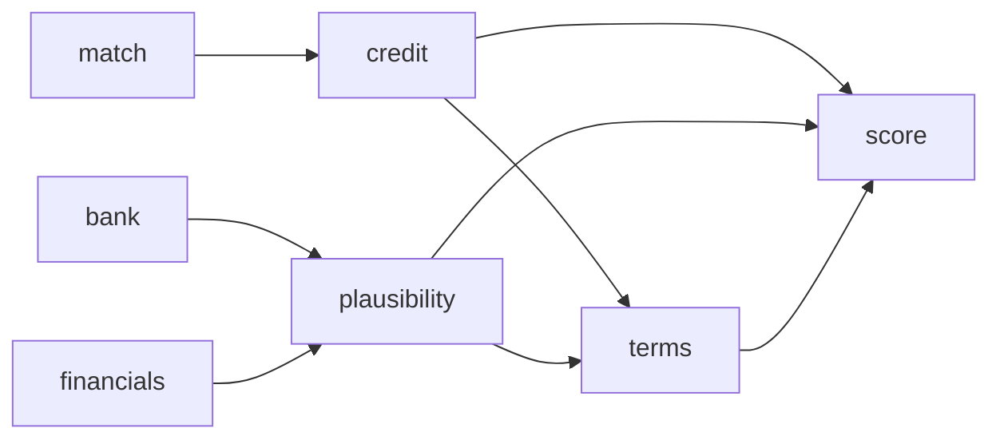

# Underwriting

Projects: `src/MerchantIntelligence.CreditDecision` (model) and `src/MerchantIntelligence.Underwriting`
(everything that explains or builds on it). API: `/api/credit-decision`, `/api/underwriting`.
UI: `/underwriting`. Acceptance procedure: `.agents/skills/underwriting-api-testing/SKILL.md`.
Reserve & pricing is documented in [Scoring and decisions](Scoring-and-Decisions.md#3-reserve--pricing-terms).

## Credit decision model — `CreditDecision/`

ML.NET **LightGBM multiclass** model predicting `Approved` / `Declined` / `Cancelled` with
per-class probabilities. Six features:

| Feature | Type |
|---------|------|
| `merchantCategoryCode` | int |
| `annualVolume` | decimal |
| `averageTicket` | decimal |
| `highestTicket` | decimal |
| `matchFound` | bool |
| `existingRelationship` | bool |

* `SyntheticDataGenerator` produces labelled applications following common acquiring heuristics
  (high-risk MCCs, MATCH hits, volume/ticket outliers, existing relationships) with noise — **no
  real underwriting history ships with the repo**.
* `ModelTrainer` trains and saves `models/credit-decision.zip`; the `Trainer` console app wraps it
  (`--data history.csv` to train on real decisions: columns
  `MerchantCategoryCode,AnnualVolume,AverageTicket,HighestTicket,MatchFound,ExistingRelationship,Decision`).
* `DecisionPredictor` loads the zip (`CreditDecision:ModelPath`) and serves `POST /api/credit-decision/predict`.
* Model ops (`Platform/ModelOps`): every prediction is logged; realised outcomes can be recorded;
  PSI drift per feature; champion vs. shadow challenger comparison; retrain on labelled decisions
  topped up with synthetic rows; promote without restart (`/api/platform/models/*`, UI `/models`).

## Decision explainability — `Explainability/DecisionExplainer.cs`

Exact **Shapley values** over the six features: for every coalition, features outside it are
replaced by a *typical low-risk small merchant* baseline, and the change in probability of the
explained class is attributed per feature. Also produced: adverse-action reason codes
(`HIGH_RISK_MCC`, `LOW_RISK_MCC`, `VOLUME_TOO_LOW`, `VOLUME_EXPOSURE`, `VOLUME_APPROPRIATE`,
`HIGH_AVERAGE_TICKET`, `MODERATE_AVERAGE_TICKET`, `TICKET_SPREAD`, `CONSISTENT_TICKETS`,
`MATCH_LISTED`, `NO_MATCH_RECORD`, `EXISTING_RELATIONSHIP`, `NO_EXISTING_RELATIONSHIP`) and a
narrative. Endpoint `POST /api/underwriting/explain`; used by the `credit` step.

## Volume plausibility — `Plausibility/VolumePlausibilityAnalyzer.cs`

Checks declared annual volume and tickets against `Resources/industry-benchmarks.json`
(per-MCC ticket ranges, revenue per employee, chargeback rate, delivery days) and against
intake facts (headcount, locations, years in business, prior-year revenue, catalogue size) and the
parsed bank statement. Score 0–100 plus flags:

`IMPLAUSIBLY_FEW_TRANSACTIONS`, `TICKET_FAR_ABOVE_INDUSTRY`, `TICKET_ABOVE_INDUSTRY`,
`EXTREME_TICKET_SPREAD`, `VOLUME_EXCEEDS_HEADCOUNT_CAPACITY`, `VOLUME_HIGH_FOR_HEADCOUNT`,
`HEADCOUNT_IMPLAUSIBLE_FOR_VOLUME`, `HEADCOUNT_HIGH_FOR_VOLUME`, `HEADCOUNT_ABOVE_INDUSTRY_CEILING`,
`HEADCOUNT_HIGH_FOR_LOCATIONS`, `STARTUP_WITH_LARGE_VOLUME`, `YOUNG_BUSINESS_LARGE_VOLUME`,
`VOLUME_EXCEEDS_REVENUE`, `AGGRESSIVE_GROWTH_ASSUMPTION`, `DECLARED_FAR_ABOVE_STATEMENTS`,
`DECLARED_ABOVE_STATEMENTS`, `DECLARED_BELOW_STATEMENTS`, `THIN_CATALOGUE_LARGE_VOLUME`,
`ROUND_NUMBER_DECLARATION`.

Endpoint `POST /api/underwriting/volume-plausibility`; step `plausibility` (depends on `bank`,
`financials`). Its score is the `VolumePlausibility` component (weight 0.10) of the unified score.

## Bank statement analysis — `Financials/BankStatementParser.cs`, `CashFlowAnalyzer.cs`

Parses CSV or text-based PDF statements (scanned/image PDFs are **not** OCR'd — a warning is
returned) into transactions, then derives monthly inflows/outflows, card-processor settlements
(Stripe, Square, PayPal, Adyen, …) and implied annual card volume, NSF/overdrafts, returned items,
loan payments, payroll, owner draws, negative-balance days, volatility and seasonality.

Flags: `SHORT_STATEMENT_HISTORY`, `FREQUENT_NSF`, `NSF_PRESENT`, `NEGATIVE_BALANCE_DAYS`,
`NEGATIVE_CASH_FLOW`, `HIGH_DEBT_SERVICE`, `THIN_LIQUIDITY`, `VOLATILE_INFLOWS`, `SEASONAL_BUSINESS`,
`LUMPY_DEPOSITS`, `NO_CARD_DEPOSITS`, `MULTIPLE_PROCESSORS`, `HIGH_OWNER_DRAWS`.

Endpoints `POST /api/underwriting/bank-statement` (multipart `file`) and `bank-statement/csv`;
step `bank`. The Financial agent reconciles implied card volume with the declared figure
(`STATEMENT_VS_DECLARED`).

## P&L / balance sheet — `Financials/ProfitAndLossAnalyzer.cs`

Parses line items from CSV, text or PDF → gross and net margin, interest coverage, current ratio,
leverage. Flags: `LOSS_MAKING`, `THIN_GROSS_MARGIN`, `WEAK_DEBT_COVERAGE`, `ILLIQUID`,
`NEGATIVE_EQUITY`, `HIGH_LEVERAGE`, `CARD_VOLUME_EXCEEDS_REVENUE`.

Endpoints `POST /api/underwriting/financial-statement` (multipart) and `financial-statement/text`;
step `financials`.

## How the pieces feed the decision

`credit` supplies `P(approve)` (weight 0.30) and Shapley contributions; `plausibility` supplies its
score (0.10); `terms` supplies the band (0.05) plus the reserve/pricing shown in the memo.
